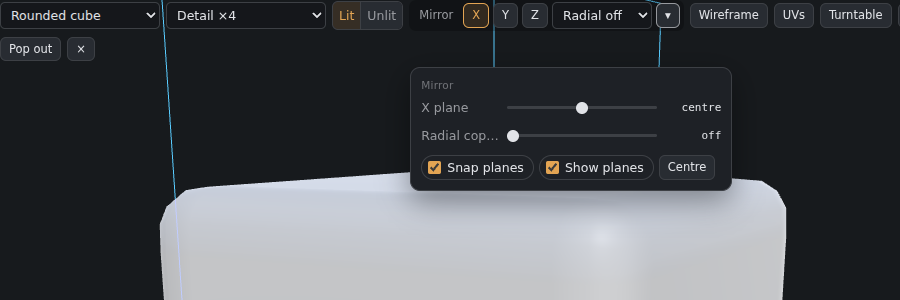
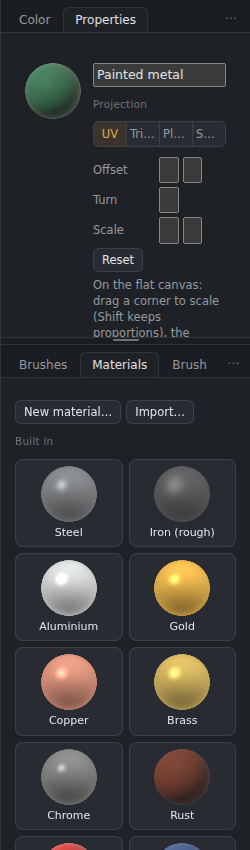
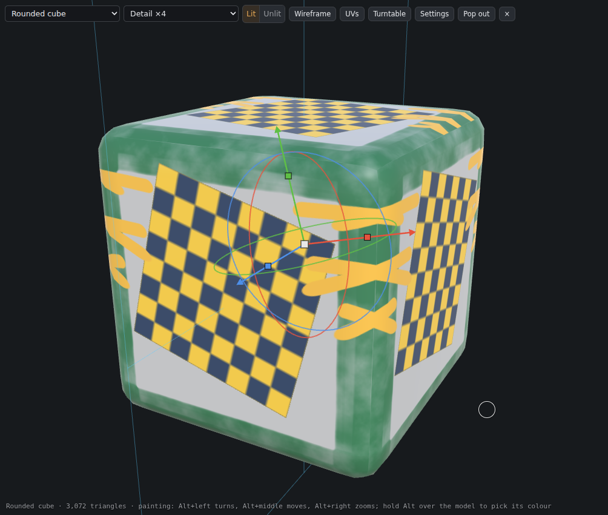
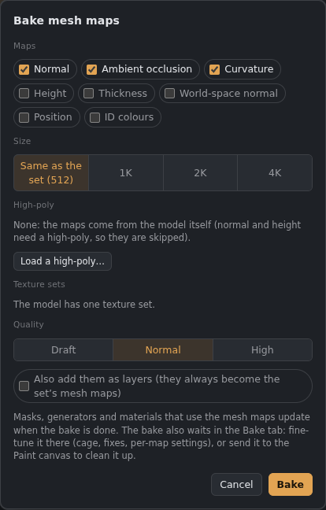
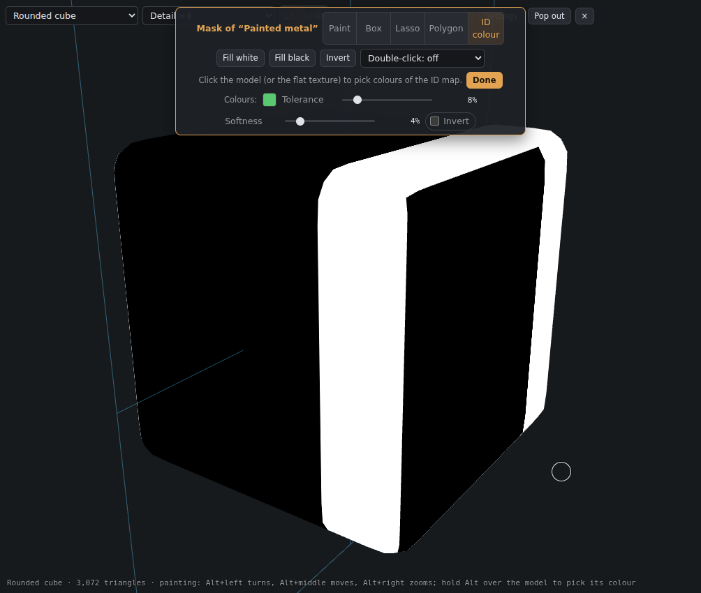

# 3D Paint

The **3D Paint** tab (top right, next to Paint) is for painting straight onto a model, in the spirit of Substance Painter. It has its own textures, separate from the Paint tab, and saves as its own project file.

*The model fills the painting area; Colour, Material, Brushes and Materials sit in a column beside it; the 3D Paint panel, Maps and Layers are on the right.*

The column beside the view works like the rest of the dock: drag its tabs out (to float them or put them with other panels), or drag other tabs into it.

## Getting started
**File › New** can start a new 3D Paint project straight away: choose **Start in: 3D Paint** at the top of the New document window. The width you type is the texture size, and the model you have loaded stays.

1. Click **3D Paint** at the top right.
2. Pick a model in the **3D Paint** panel: one of the shapes, or **Import a model** (OBJ, glTF, GLB or FBX). You can also drop a model file on the view.
3. Paint with a left drag. New texture sets start with a greyish-white, non-metal **Base material** (a fill layer) and an empty **Paint** layer.

Each texture set has the PBR maps **base colour, roughness, metallic, height and normal**. The Layers panel works as in Paint: layers, groups, masks, fill layers, layer styles and a blend mode per map.

## Moving around
Choose the style under **Navigation**:

| | Substance Painter (default) | 3D-Coat |
|---|---|---|
| Paint | left drag | left drag on the model |
| Turn | Alt + left drag | right drag, or left drag off the model |
| Move | Alt + middle drag, or middle/right drag | middle drag, or Shift + right drag |
| Zoom | Alt + right drag, or the wheel | Ctrl + right drag, or the wheel |

Double-click empty space to frame the model again. The same navigation works in Paint's 3D view.

## Picking colours and shades
- **Hold Alt over the model** (without clicking) to pick its colour there. Alt + drag still turns the model.
- **Left / Right arrow keys** step through the shade strip in the Color panel while you paint. Clicking a shade still works, and the strip stays put while you step.

## Layouts
**3D** shows only the model, **3D + 2D** shows the flat texture beside it, and **2D** shows only the flat texture. You can paint in all of them.

Since 0.35 a small strip at the bottom of the painting area switches between **3D**, **Split** and **2D** in one click, and the **UV** button shows or hides the model's UV layout over the flat texture. In Split the views start the same size and the divider between them drags; the flat texture keeps its own zoom.

## Texture sets
A model with several materials gets one **texture set** per material, each with its own maps and layers, like Substance Painter. Click a set in the list to paint it. Only the active set takes paint; the others keep showing their own textures on the model.

The **eyeball** on a set hides the parts of the model that use it (saved with the project); the Bake mesh maps window leaves hidden sets unticked, so you can bake in groups.

If you switch to a model that doesn't have a set's material, the set is kept (greyed out) so your work isn't lost.

The **×** on a set deletes it, after asking. If its material is still on the model, that part starts again with a new, empty set.

Entering 3D Paint switches to the **Texturing** workspace; going back to Paint brings your previous workspace back.

## Mirror and radial painting
The mirror sits in the **3D view's top bar**: **X**, **Y** and **Z** turn the mirror planes on, the menu next to them sets **radial** copies, and **▾** opens the plane positions, the radial axis, snapping and showing the planes.

- **X / Y / Z** paints the other side at the same time. The **plane** sliders move a mirror off centre. With **Snap planes** on, they snap to the centre and to small steps. **Show planes** draws them on the model.
- **Radial copies** repeats every stroke around an axis (for example 6 copies around Y). It works together with the mirrors.

Mirror painting also works in Paint's 3D view (Settings in the 3D view).

## Stencils (projection painting)
Stencils have their own tab, **Stencils**, right next to Brushes. A stencil is a picture laid over the view:
- **Mask**: the brush paints only where the picture is light.
- **Colour**: the brush paints the picture's own colours onto the model.

Pick one of the built-in stencils (Grunge, Scratches, Dots, Stripes) or **Load image…**. **Show** sets how visible it is, **Repeat** tiles it.

To place it, hold **S** over the view:
- **S + left drag** turns it.
- **S + right drag** scales it.
- **S + middle drag** moves it.

**Invert** (or **X** over the model) swaps black and white.

## Selecting parts of the model
Under **Select on the model**, choose **Object**, **Material**, **UV island**, **Face** or **Loop**, then **double-click** the model:
- **Shift + double-click** adds to the selection.
- **Ctrl + double-click** removes from it.
- **Ctrl + D** deselects.

The selection is tinted on the model and shows on the flat texture too. Painting stays inside it. **Selection to mask** gives the active layer a mask made from it.

A **loop** is the ring of quads crossing the edge you click nearest to. Faces and loops follow the model as you imported it, even when the view shows it subdivided.

## Materials
The **Materials** tab sits beside Brushes. Click a material (Steel, Gold, Copper, Rust, Rubber, Plastic, your own…) to add it as a **material layer** on top of the selected layer, or **drag it onto the Layers panel** and drop it between two layers to put it exactly there (a line shows where it will land). Smart materials drag the same way, and a **smart mask dropped onto a layer** becomes that layer's mask.

A new material covers the whole model and has **no mask**. If a selection is active, the selection becomes its mask. The first time you paint, fill or draw a gradient on it, a **black mask** is added for you: paint white to show the material where you want it, like Substance Painter.

**From textures…** turns a material you downloaded (ambientCG, Poly Haven, ShareTextures, cgbookcase, 3DTextures.me, TextureCan…) into one of yours in one step: pick its **folder**, its **images** or the **.zip**. The images are sorted by their names (Color, Roughness, Metalness, NormalGL, Displacement, AO, and packed ARM files), a DirectX normal is turned the right way, and the pictures are scaled to 1K, 2K, 4K or kept full size.

**New material…** makes a material layer and shows it in the **Properties** panel (the tab beside Colour), which edits whichever material layer (or mask row) is selected. Double-clicking a material layer's thumbnail brings it forward.

- **Channels:** base colour, roughness, metallic, height, normal, emissive and opacity. Each one is a colour or value, an **Image** (with **Tile** and **Turn**), or a **Mesh map**: one of the texture set's baked maps (AO, curvature, thickness…), laid over the model as baked.
- **Height** makes bump detail on the model (the normal follows it), with a **Bump strength** slider.
- **Projection:**
  - *UV* follows the model's UVs.
  - *Triplanar* projects images from three sides and blends them, so there are no seams. **Blend** sets how soft the joins are.
  - *Planar* projects straight from one direction, like a slide projector: good for decals and logos. **Repeat** tiles it; **Front faces only** keeps it off the parts facing away.
  - *Spherical* wraps it around from a centre point.
- **Moving, turning and scaling a projection:** with the layer selected, a **gizmo** sits on the model for Triplanar, Planar and Spherical. The arrows move it, the rings turn it, the small boxes scale it along one axis and the middle box scales it evenly. For *UV*, a frame shows on the flat canvas: drag a corner to scale (Shift keeps the proportions), the round handle to turn, and inside with the Move tool (or Ctrl) to move. **Offset**, **Rotation** and **Scale** are also in Properties, with **Reset**. Each drag is one undo step.

  
- **Save to Materials** keeps the material, with its images, on this computer for other layers and projects. In the Materials tab, **⤓** exports one as a **.gmat** file and **Import…** brings one in.

The layer stays live: every change shows straight away on the model, and becomes one undo step when you pause.

**Smart materials** (a whole folder of layers with generated masks, such as Gun metal, Moss or Dust) and **smart masks** are in the Materials tab too: see [Smart materials, smart masks and anchor points](Smart-materials-and-anchors.md).

## Baking mesh maps here
**Bake mesh maps…** (3D Paint panel, under *Mesh maps*) bakes without leaving 3D Paint, like Substance Painter's window:
- **Maps:** Normal, Ambient occlusion, Curvature, Height, Thickness, World-space normal, Position and ID colours.
- **Size:** the texture set's, or 512 to 4K.
- **High-poly:** optional. Load one to bake its detail into the normal and height; without one, the maps come from the model itself (normal and height are skipped).
- **Texture sets:** each is baked on its own part of the model; untick the ones to leave alone.
- **Quality** (the number of rays) and *also add them as layers*.

The results become each set's mesh maps, and everything that reads them (mask rows, generators, material channels) updates straight away. The bake also waits in the **Bake tab**: **Fine-tune in the Bake tab** opens it there to change settings, add a cage or paint skew and offset fixes, then **Send to 3D Paint** again. **Send to the Paint canvas** puts the active set's bake in the painting as layers, to clean up intersections by hand.

## Mesh maps (from the Bake tab)
In the Bake tab, tick **Bake each material separately**, then press **Send to 3D Paint**. The model comes over, and each material's baked maps land in its own texture set as that set's **mesh maps** (listed in the 3D Paint panel), like Substance Painter's. Masks, generators and [smart materials](Smart-materials-and-anchors.md) read them.
- The bakes are **not** added to the layer stack. The baked normal shades the model by itself (your painted normal and height sit on top of it, and it goes into exported normal maps), so the high-poly detail shows straight away.
- **Add as layer** puts any mesh map in the layer stack.
- Tick *also add them as layers* before sending to get AO (Multiply) and curvature (Overlay) layers automatically.
- Material channels can use them (**Mesh map** in the Properties panel), and **right-click a layer › Mask from mesh map** makes its mask from AO, curvature, thickness or height.

## Mask mode
Masks can hold rows (generators, noise, mesh maps, ID colours, filters…) and layers without a mask can have a live mask: see [Masks and effects](Masks-and-effects.md).

**Alt + click a layer's mask** to see it on the model in black and white, without lighting. A bar appears at the top:

- **Paint:** nothing paints the mask until this is on (white shows the layer, black hides it).
- **Box**, **Lasso** and **Polygon** select what you can see of the model under the shape you draw. Drag inside the shape to move it; the selection follows when you let go. **Shift** adds, **Ctrl** takes away. For the polygon, click the corners, then double-click, click the first point or press **Enter**. On the flat texture they are the usual selection tools.
- **ID colour** (like Substance Painter's colour selection): click the model (or the flat texture) to pick colours of the texture set's baked **ID** map. Those colours turn white in the mask, the rest black. **Tolerance** sets how close a colour counts, **Softness** the edge, **Invert** swaps them; click a colour swatch to remove it. It stays with the layer, so you can come back and change it.
- **Fill white** / **Fill black** (inside the selection, if there is one) and **Invert**.
- **Double-click:** choose Object, Material, UV island, Face or Loop, then double-click the model. That part turns white in the mask; **Ctrl + double-click** turns it black.
- **Done**, **Esc**, Alt + click again, or clicking the layer's own thumbnail goes back to the material.

## From Paint
In the Paint tab, **right-click a layer › Send layer to 3D Paint** sends just that layer (or group), flattened with its effects. **File › Send to 3D Paint** sends the whole painting (every map it shares with 3D Paint). Hide the background first to keep transparency.

It arrives as a **sticker**: a material layer whose pictures are projected onto the model from **where you are looking**, only on the faces turned towards you, and see-through wherever the painting was empty. Its gizmo sits on the model: the arrows move it, the rings turn it, the boxes scale it. It stays movable until you choose **right-click › Convert to pixels**.

## Editing a layer in the Paint canvas
Right-click a layer › **Edit in the Paint canvas** sends its content (every map) to the Paint tab as a linked layer, so you can use every Paint tool on it. When you're done, right-click it there › **Send back to 3D Paint**: it replaces the original layer's content and keeps its name, mask, opacity and blend mode. Its effects and styles become part of the pixels, and a material layer becomes a plain paint layer. One undo step in 3D Paint takes it back.

## Saving and exporting
- **Ctrl + S** in the 3D Paint tab (or **Save project**) saves a **.gouache3d** project: the model with its materials, every texture set with its layers, the camera and the mirror settings. Open it with **File › Open** or **Open project…**.
- **Export textures…** exports **every texture set** at once (untick it for just the active one), each named after its set. A baked AO fills the ORM or occlusion file (see [Files, saving and export](Files-and-export.md)).
- Your Paint document is saved separately, as before.

## Seeing the mesh maps (C)
Press **C** in 3D Paint to see the texture set's baked mesh maps on the model one by one (ambient occlusion, curvature, ID, thickness…), unlit. **Shift+C** goes back one; **Esc** or the label in the corner returns to the material.

Press **M** to return to the **Lit** material view from a mesh map, mask, Unlit or Ray traced view. Your paint channel, tool and camera stay where they were. This shortcut does not run while typing in a field or while a dialog is open.

## Mask right-click menu and layer deletion

Right-click a layer's **mask thumbnail** to open **Generators** or **Anchor points**, or add **Levels** or **Invert**. Each effect is an editable mask row above the existing mask pixels and rows, with settings in Properties. Levels adjusts the mask's tonal range; Invert swaps light and dark. Anchor points offers **Add anchor point to this layer**, or **From “name”** to add an existing anchor as a mask input. The anchor input defaults to Height; Properties can switch it to Shape or Colour. Folder masks can use generators, filters and existing anchors; create anchor points on a layer.

In 3D Paint, **Delete** and **Backspace** remove selected layers, including when a mask or a model selection is active. **Undo** restores the layers and their masks. Text fields keep their normal editing keys; **Alt+Delete** keeps its fill shortcut. At least one layer remains in a texture set.

## Decals, textures and the material library
See [Textures, decals and the material library](Textures-and-decals.md): click a decal and then the model to place bolts, vents, labels and more; use grunge maps in masks and materials; start from ready-made leathers, metals, fabrics and more.

## The bottom shelf

In 3D Paint the asset panels live in a shelf along the bottom: **Materials**, **Textures**, **Decals**, **Stencils** and **Brushes** are a list on the left, and the tiles of the chosen category fill the rest. Drag the bar above it to resize, or fold it with the arrow. In Materials, the chips at the top choose All, Yours, Library, Smart materials or Smart masks, and S / M / L set the tile size.

The shelf also has an **Environments** category: a thumbnail for each HDRI (click to light the model), **Load your own…** for a .hdr or .exr, and **Simple sky** to turn the HDRI off. In the Bake tab, a model with several materials gets a **Materials to bake** list with an eyeball for each; a closed eye leaves that material out of the bake.

## The 3D Paint layout (0.37)

3D view on the left, flat texture on the right (drag the divider). The material editor has a column of its own: **Properties**, **Brush**, **Color** and **Shader** are tabs there. On the far right, **Texture sets** sit over **Layers** (with Maps, Channels, History and Bake Maps as tabs), with the layer buttons at the top of the list. The slim bar at the top has size, opacity, flow, hardness and what the brush paints; the rest of the brush settings are in the **Brush** tab. The 3D view's bar has shading, mirror, view and perspective; the **⋯** button opens wireframe, spin, screenshot, render, turntable, settings and pop out.

## Small changes in 0.37.1

- **F** frames the model in the middle. **Ctrl + drag a material onto the model** adds it only where the ID colour under the pointer is.
- **Stencils:** tick *Use a stencil* in the Brushes panel, then drop a picture on the box.
- The material editor starts with **Tint & adjust**; each channel folds open.
- Bake Maps and Shader are tabs next to the texture sets.

## Small changes in 0.37.2

- Preferences has tabs; Reset buttons for lighting, shader, brush and material adjustments.
- Colour buttons open a picker with Hue, Saturation and Lightness sliders.
- Ctrl + dragging a material over the model shows the ID map.

## Small changes in 0.40

- **Tab** hides all the panels so the view fills the window; Tab again brings them back (this works in every tab).
- The flat view can show the model **lit**, laid out flat like Substance Painter's UV view. The **Lit** button is next to **UV** at the bottom of the viewport.
- The **Layers** panel has a **channel drop-down**: choose which channel you see and paint. The blend mode and opacity shown are for that channel.
- New viewer options in the Shader panel: the **Panner** shader and **Post processing** (see 3D view).

Tile controls now reach **1000**, including material image tiling and projection settings. Layer names stay beside their thumbnails, and mask buttons keep their normal height as the Layers panel is resized.
