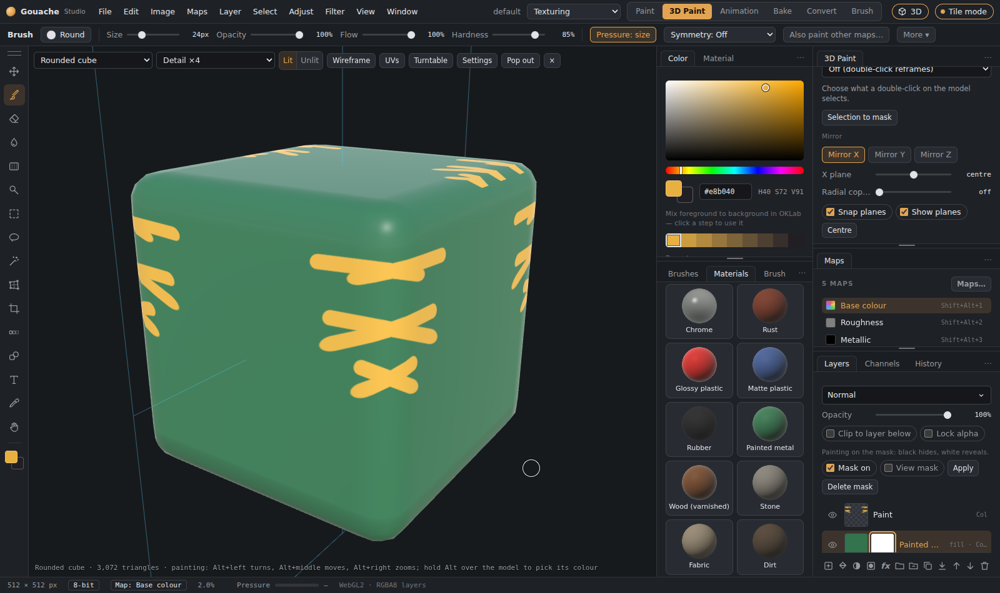

# 3D Paint

The **3D Paint** tab (top right, next to Paint) is for painting straight onto a model, in the spirit of Substance Painter. It has its own textures, separate from the Paint tab, and saves as its own project file.

*The model fills the painting area; Colour and Brushes sit in a column beside it; the 3D Paint panel, Maps and Layers are on the right.*

## Getting started
1. Click **3D Paint** at the top right.
2. Pick a model in the **3D Paint** panel: one of the shapes, or **Import a model** (OBJ, glTF, GLB or FBX). You can also drop a model file on the view.
3. Paint with a left drag. The model starts with a **Base material** (a fill layer) and an empty **Paint** layer.

Each texture set has the PBR maps **base colour, roughness, metallic, height and normal**. The Layers panel works as in Paint: layers, groups, masks, fill layers, layer styles and a blend mode per map.

## Moving around
Choose the style under **Navigation**:

| | Substance Painter (default) | 3D-Coat |
|---|---|---|
| Paint | left drag | left drag on the model |
| Turn | Alt + left drag | right drag, or left drag off the model |
| Move | Alt + middle drag, or middle/right drag | middle drag, or Shift + right drag |
| Zoom | Alt + right drag, or the wheel | Ctrl + right drag, or the wheel |

Double-click empty space to frame the model again. The same navigation works in Paint's 3D view.

## Picking colours and shades
- **Hold Alt over the model** (without clicking) to pick its colour there. Alt + drag still turns the model.
- **Left / Right arrow keys** step through the shade strip in the Color panel while you paint. Clicking a shade still works, and the strip stays put while you step.

## Layouts
**3D** shows only the model, **3D + 2D** shows the flat texture beside it, and **2D** shows only the flat texture. You can paint in all of them.

## Texture sets
A model with several materials gets one **texture set** per material, each with its own maps and layers, like Substance Painter. Click a set in the list to paint it. Only the active set takes paint; the others keep showing their own textures on the model.

If you switch to a model that doesn't have a set's material, the set is kept (greyed out) so your work isn't lost. Its **×** button deletes it.

## Mirror and radial painting
Under **Mirror**:
- **Mirror X / Y / Z** paints the other side at the same time. The **plane** sliders move a mirror off centre. With **Snap planes** on, they snap to the centre and to small steps. **Show planes** draws them on the model.
- **Radial copies** repeats every stroke around an axis (for example 6 copies around Y). It works together with the mirrors.

Mirror painting also works in Paint's 3D view (Settings in the 3D view).

## Stencils (projection painting)
A stencil is a picture laid over the view:
- **Mask**: the brush paints only where the picture is light.
- **Colour**: the brush paints the picture's own colours onto the model.

Pick one of the built-in stencils (Grunge, Scratches, Dots, Stripes) or **Load image…**. **Show** sets how visible it is, **Repeat** tiles it.

To place it, hold **S** over the view:
- **S + left drag** turns it.
- **S + right drag** scales it.
- **S + middle drag** moves it.

## Selecting parts of the model
Under **Select on the model**, choose **Object**, **Material**, **UV island**, **Face** or **Loop**, then **double-click** the model:
- **Shift + double-click** adds to the selection.
- **Ctrl + double-click** removes from it.
- **Ctrl + D** deselects.

The selection is tinted on the model and shows on the flat texture too. Painting stays inside it. **Selection to mask** gives the active layer a mask made from it.

A **loop** is the ring of quads crossing the edge you click nearest to. Faces and loops follow the model as you imported it, even when the view shows it subdivided.

## Materials
Click a material (Steel, Gold, Copper, Rust, Rubber, Plastic and more) to add it as a fill layer. If a selection is active, it becomes the layer's mask; otherwise paint the mask to show the material where you want it.

## Saving and exporting
- **Ctrl + S** in the 3D Paint tab (or **Save project**) saves a **.gouache3d** project: the model with its materials, every texture set with its layers, the camera and the mirror settings. Open it with **File › Open** or **Open project…**.
- **Export textures…** exports the active set's maps (see [Files, saving and export](Files-and-export.md)).
- Your Paint document is saved separately, as before.
