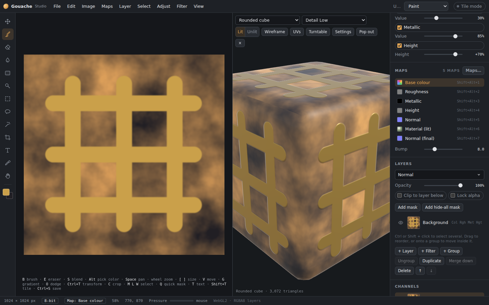
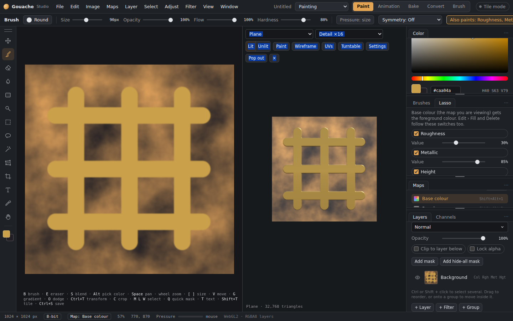
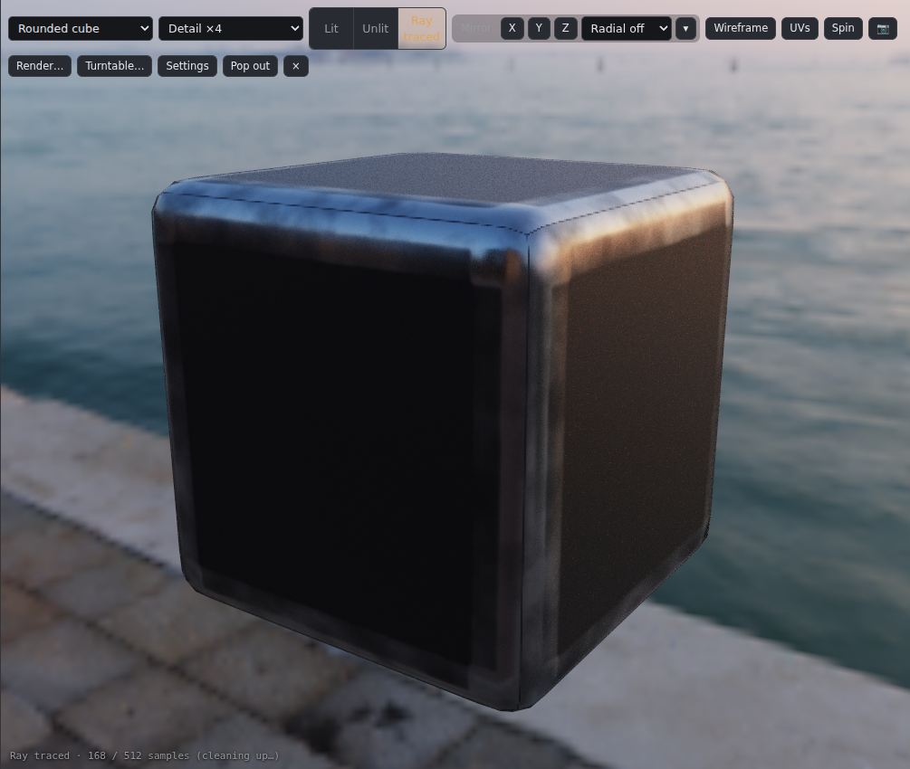
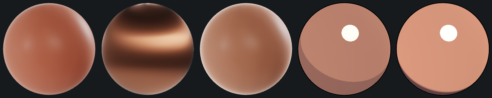
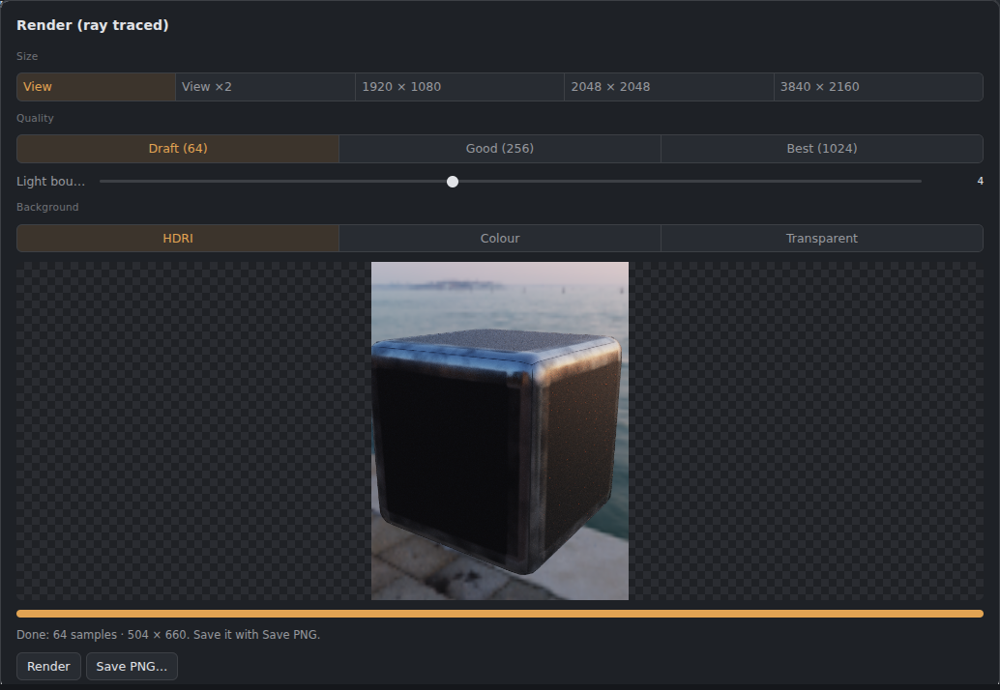
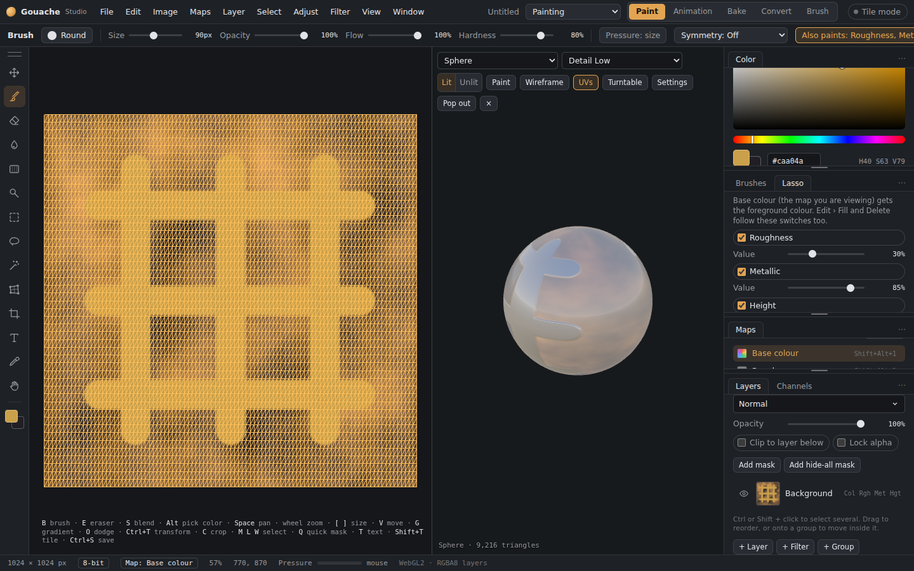
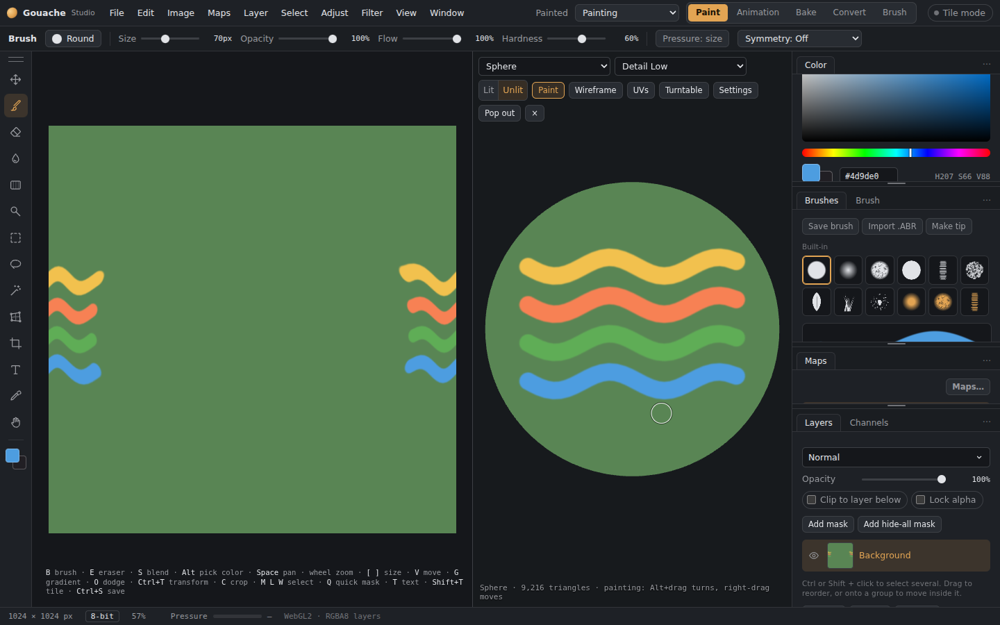

# 3D view

**View › 3D view** (F3), or the **3D** button at the top, puts a model beside the canvas. It shows your maps live: the map you're painting updates every frame, and the other maps a few times a second. Drag the divider to resize the panel.

## Models

*The 3D view docked beside the canvas.*

- **Built-in:** plane, cube, rounded cube, sphere, cylinder.
- **Import:** **OBJ**, **glTF / GLB** or **FBX** (binary FBX; for text FBX, export as glTF or OBJ). Pick *Import a model…* in the model list, or **drag the file onto the app**. A loading bar shows big files coming in.
- An imported model is **saved inside your .gouache file**.
- The corner of the view shows the model's triangle count. It warns you if the model has no UVs, since textures can't map onto a model without them.

## Detail (mesh density)

*A dense plane showing the height map as real displacement.*

The **Detail** menu at the top gives the model more triangles, from Low up to ×128, so **Height depth** can push the surface out finely. Imported models are split into smaller triangles the same way. Turning up Height depth on a low-detail model raises Detail to ×16 by itself. The highest levels are heavy on older or built-in graphics chips.

## Shading
- **Lit:** full PBR, using base colour, roughness, metallic, the finished normal, AO, emissive and opacity, lit by an **HDRI** (see Lighting).
- **Unlit:** base colour only (plus AO), the way hand-painted games usually look. This is the default for hand-painted documents.
- **Ray traced:** a path-traced picture with real shadows and light bouncing between surfaces. It adds a sample every frame and gets cleaner the longer you leave it; the bottom of the view says how far it is. Turning the model or painting starts it again.

## Lighting (HDRIs)
The model is lit by an **HDRI**, a 360° photo of real light, the way Substance Painter and Marmoset do it. Choose one in the **Shader** panel's **Environment** section (or **Settings › Lighting**). **Shift + right-drag** in the 3D view turns the lighting around the model, like Substance Painter (with 3D-Coat navigation: **Shift + Alt + right-drag**); with the simple sky it moves the sun.
- **Studio**, **Photo studio**, **Cloudy sky**, **Venice sunset** and **Evening sky** come with the app.
- **Load your own .hdr or .exr…** uses your own (EXR files saved with ZIP compression or none; PIZ isn't supported, so save those as .hdr).
- **Simple sky** is the old sky-and-sun light.

For an HDRI: **Turn** spins it around the model, **Brightness**, **Show it as the background** (with **Background blur**) and **Extra sun** adds a sun on top. **Exposure** and **Tone mapping** is a drop-down list: **Filmic** (gentle on bright highlights), **ACES** (the film-industry standard look, with a slight roll-off and richer contrast), **AgX** (keeps very bright, saturated colours from turning orange), **PBR Neutral** (keeps colours true, good for checking materials), **Soft** and **None (linear)**. They apply to all of them.

### HDRI credits
The HDRIs that come with Gouache Studio are from [Poly Haven](https://polyhaven.com), free to use (CC0). Thank you to their authors:
| HDRI | By |
|---|---|
| [Studio Small 09](https://polyhaven.com/a/studio_small_09) | Sergej Majboroda |
| [Brown Photostudio 02](https://polyhaven.com/a/brown_photostudio_02) | Sergej Majboroda |
| [Kloofendal 48d Partly Cloudy (Pure Sky)](https://polyhaven.com/a/kloofendal_48d_partly_cloudy_puresky) | Greg Zaal, Jarod Guest |
| [Venice Sunset](https://polyhaven.com/a/venice_sunset) | Greg Zaal |
| [Industrial Sunset 02 (Pure Sky)](https://polyhaven.com/a/industrial_sunset_02_puresky) | Jarod Guest, Sergej Majboroda |

## Shaders
The **Shader** panel (beside Colour and Properties) picks how the model is shaded, from a drop-down list. In 3D Paint each **texture set** has its own, so skin and armour can differ on one model. Each shader keeps its own settings:
- **Standard:** physically based (metal/roughness).
- **Skin:** light wraps round and shines through thin parts in the **Subsurface colour** (**Scatter**, **Strength**, **Softness**). With a baked **Thickness** map, thin parts like ears glow by themselves.
- **Brushed metal:** anisotropic highlights stretched along a **Direction** (**Stretch**), like brushed or spun metal.
- **Velvet:** a soft **Sheen** at grazing angles, with its colour and softness, and a **Rim**.
- **Panner (PBR):** slides the textures over the model, for water, conveyor belts or glowing energy. Set **Speed across** and **Speed up**, tick which maps slide, and choose **What slides**: the whole material, or one layer or folder (the rest stays still). It only shows in the 3D view; your painting and exports are not changed. **Restart** puts the texture back at the start.
- **Toon:** flat **Bands** of light, a **Shadow colour**, **Highlight**, **Rim light** and an **Outline** with its colour.
- **Cel:** two tones split at the **Shadow line** (with **Edge softness**), highlight, rim and outline.
- **Spec/Gloss:** the lit model, or just its **Diffuse** colour, **Specular** colour, **Gloss** or **Reflections**.

## Screenshots, renders and turntables
- **📷** saves the 3D view as a PNG: at the view's size, twice it, 1920 × 1080, 2048 × 2048 or 3840 × 2160, with a **transparent background** if you like. In Ray traced mode it saves the ray-traced picture.
- **Render…** opens a window that ray-traces a picture: **Size**, **Quality** (64, 256 or 1024 samples), **Light bounces** and **Background** (the HDRI, the background colour, or transparent). It shows the picture cleaning up; **Stop** at any time and **Save PNG…**.
- **Turntable…** records the model turning: **Spins**, **Seconds per spin**, **Frames per second**, **Size** and **Format**: **WebM** or **MP4** video, **GIF** (up to 640 px wide) or a **PNG sequence** (a folder of frames on the desktop, a zip in the browser; it can have a transparent background). **The light turns with the model** keeps the lighting fixed on the model; otherwise the model turns under still lights and its reflections move across it.

## Toolbar

*The UV overlay on the canvas while the 3D view shows a sphere.*

- **Model** and **Detail** menus, **Lit / Unlit / Ray traced**.
- **Wireframe:** shows the mesh edges.
- **UVs:** draws the model's UV layout **over your 2D canvas**, so you can see where to paint.
- **Spin:** a slow spin. **📷**, **Render…** and **Turntable…**: see above.
- **Settings:**
  - **Lighting:** the HDRI and its settings (see above).
  - **Tile repeat:** repeats seamless textures across the model.
  - **Height depth**, **Lens** (field of view).
  - **Background:** dark, grey or light.
  - **Cut out transparent areas:** for leaves, fences and other alpha cut-outs.
- **Pop out:** moves the 3D view into its own window, handy on a second monitor. **Dock** (or closing that window) brings it back.
- **×** closes the 3D view.

## Painting on the model
Press **Paint** in the 3D view's toolbar, then paint on the model with the Brush, Eraser, Dodge or Burn.
- The paint goes onto the active layer and the map you're editing, exactly as if you'd painted on the canvas. Other maps ticked under "Also paint", selections, masks, Lock alpha and undo all apply.
- The brush is round on screen, and its size is in screen pixels. Paint only lands on parts of the model you can see, not on the back or behind other parts. It carries across UV seams without a break.
- **Alt+drag** turns the model while Paint is on, **right-drag** moves it, and the **wheel** zooms.
- In the Bake tab, the same brush paints the skew and offset maps (see [Baker](Baker.md)).

*Painting straight onto the model. The stroke lands in the layer on the canvas too.*

## Camera
- **Drag:** orbit.
- **Right-drag**, middle-drag or **Shift+drag:** pan.
- **Wheel:** zoom.
- **Double-click:** frame the model again.

## Height depth on your models (0.28)
Height depth now pushes each point of a model out in one direction, so hard edges and UV seams no longer tear open, and models with several texture sets keep their textures when Detail is raised. How many triangles Detail may make depends on Preferences › Engine quality (two million on High).

## Post processing
At the bottom of the **Shader** panel, tick an effect to switch it on and open its sliders: **Bloom**, **Ambient occlusion** (soft contact shadows in creases and where things meet; **Strength**, **Radius** and **Smoothness**), **Depth of field** (move the **Focus distance** to what should stay sharp), **Sharpen**, **Colour grade** (exposure, contrast, saturation, warmth), **Vignette**, **Chromatic aberration** and **Film grain** (strongest in the mid-tones; **Grain size** and **Colour noise**, and a different pattern on every frame of a turntable). They are laid over the finished picture, so screenshots, the render window and turntables get them too. **Reset post processing** turns them all off.

**Filter look** (Shader panel, post processing): live screen filters on the 3D view: Greyscale, Sepia, Invert, Black and white, Duotone, Posterize, Night vision, Thermal, CRT scanlines and Blueprint, with a Strength slider.

## Animated film grain

In post-processing, enable Film grain and **Animate grain**, then choose its frame rate. Grain changes while the view is open and during turntable output. Disable Animate grain for a fixed grain pattern.

With the camera and model still, new grain frames reuse the rendered scene and its bloom and occlusion. Moving the camera or changing the material refreshes them. This also works in a detached 3D window.

## Studio lighting and shadow floor

The Shader panel and viewport Settings offer **Soft studio**, **Product** and **Neutral** presets. Adjust the key-light colour, Fill light and Rim light. **Mesh shadows** uses a cached directional shadow map; moving the camera reuses it. Lighting, displacement and opacity changes refresh it when needed.

Enable **Transparent shadow floor** to receive the mesh's shadow on an otherwise invisible floor. Its starting height follows the bottom of the mesh. **Floor height** moves it above or below that point; **Place floor under mesh** restores the automatic position. **Shadow direction** turns the key light around the model and **Light height** changes the shadow's length. **Floor shadow softness**, **Shadow opacity** and the colour swatch control its appearance separately from the mesh's shadow softness. The floor appears in the real-time Lit viewport and its PNG screenshots. The separate Ray traced view and Render window use their existing renderer.

The Skin shader has **Natural**, **Soft** and **Wax** presets, with Surface roughness, Scatter depth and Transmission controls alongside scatter colour, strength, softness and oil. An assigned Thickness map varies transmission across the surface. These are real-time approximations for viewing materials.
