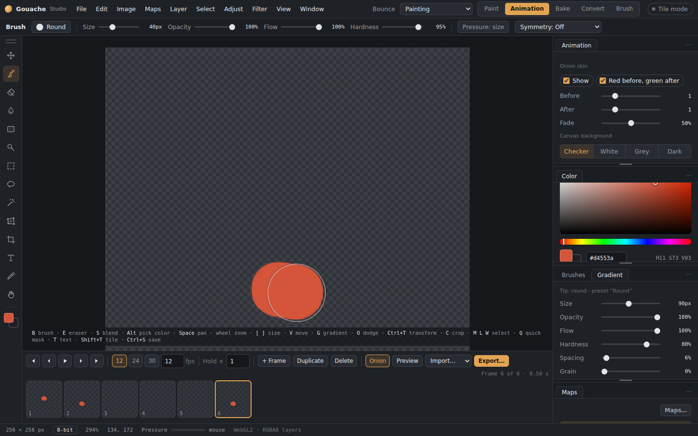

# Animation, flipbooks and sprite sheets

Switch **Paint ▾ / Animation** in the top-right corner. Animation mode shows only frames. Each frame is its own image, and you paint it with the usual tools. Your paint-mode layers wait untouched until you switch back.

## Timeline (under the canvas)

*Animation mode: the timeline under the canvas, with onion skin.*

- **Frames:** add, duplicate, delete, and drag to reorder. **,** and **.** step through frames; **Enter** plays.
- **Quick dupli…:** make many copies of the current frame in one go. Pick **4, 8, 12, 16, 24, 32 or 64**, or type any number, and choose whether they go right after this frame or at the end. One undo removes them all.
- **Tools…:** **Reverse**, **Ping-pong** (forward, then back), **Repeat…** and **Set the hold…**. They work on the frames you picked with Shift+click, or on all frames.
- **Seconds ruler:** above the frames, with a mark where each second starts. Click or drag on it to scrub through the animation.
- **Speed:** frame rate buttons for **12, 24, 30 and 60 fps**, or type any rate up to 240. Each frame has a **hold** (how many frames it lasts).
- **Tags:** Shift+click a range of frames and tag it (idle, run, attack…). A tag can **loop**, **play once** or **ping-pong**.
- **Onion skin:** earlier frames in red, later ones in green. Choose how many to show and how faint they are.
- **Preview window:** keeps playing while you paint.

## Importing frames
From the File menu:
- **Frames from a sprite sheet…:** slice it by rows × columns.
- **Frames from an image sequence…**
- **Frames from a GIF…**

## Export (File › Export sprite sheet / flipbook…)
- **Frame rate and in-betweens:** **Export at** another rate (2×, 4×, 24 to 240 fps) and choose **In-between frames**: **Off** repeats the nearest frame, **Blend** cross-fades between frames, **Motion** follows the movement so a swinging sword or a rising flame glides instead of fading. The window shows how many frames you get. GIF files can't play faster than 50 fps.
- **Live preview**, played from the sheet itself.
- **Grid:** presets (Fit, 2×2, 4×4, 8×8, 16×16) or any size, plus what to do with leftover cells.
- **Frames:** frame size (100/50/25%), padding, edge extrusion, power-of-two sizes, and tags as separate rows.
- **Data files:** JSON for Unity, Godot and Unreal, or a Godot **SpriteFrames** resource.
- **Other outputs:** a **PNG sequence** or an animated **GIF**.

Animations are saved in .gouache files. They're also stored inside PSDs exported by Gouache Studio, so they come back when you reopen them here.

Animation mode paints base colour only, so switch to Paint mode for the other maps.

## Frame shortcuts
- **Ctrl+F** new frame, **Ctrl+D** duplicate the frame, **Delete** removes the frame (when nothing is selected)
- **,** and **.** step to the previous and next frame
- **Space** plays and stops (hold Space and drag to pan, as before)
- **Ctrl+Shift+Left/Right** moves the frame earlier or later

## Effects and keyframes

Under the frames is the **Effects** area. Pick **+ Effect ▾** to open the effect picker: the effects are in sections down the left (Animated, Adjust, Blurs, Distort, Artistic, Photo and print, Patterns, Tiling), with a search box on top. Click a section, then the effect (Radial blur, Warp, Distort, Noise, Colour ramp, Halftone, Glass and the rest). The effect sits over every frame. Press the **◆** next to a slider to set a keyframe on the current frame; do it on another frame with a different value and the slider moves by itself in between. Choose how it moves (Linear, Ease in, Ease out, Ease in-out, Hold) with **New keys**. The diamonds on the strip show the keys. Exports use the effects as you see them.

**Erode / Dissolve and Glow** are in the effect list too. Animate Dissolve's Amount from 0 to 100% to make something burn or erode away. **Quick dupli** can step an effect: pick the effect and a slider, and it moves from the first value to the last across the copies.

## VFX menu

The **VFX…** menu on the timeline has generators for **Fire**, **Smoke**, **Sparks**, **Explosion**, **Lightning**, **Magic orb**, **Shockwave**, **Rain**, **Snow**, **Blood splat**, **Ripples**, **Slash**, **Impact burst**, **Dust puff**, **Energy beam**, **Bubbles**, **Portal**, **Sparkles** and **Muzzle flash**. The looping ones make frames that loop exactly; Explosion, Shockwave, Blood splat, Slash, Impact burst, Dust puff and Muzzle flash play once. Choose the number of frames, the colours (or pick your own two), and the sliders for that effect (size, turbulence, strength, speed, width, height, lean or wind, amount, softness, glow, flicker and more), with a live preview. Tick **Shape it with the painted frame** to have fire or smoke rise from your own drawing. **Spin this frame** turns the current picture a full circle over the frames you choose. **Make loop seamless** fades the last frames into the first so there is no jump. **Cut this frame into a grid** slices a sheet into frames.

Keyframes on an effect stay on the frames they belong to when you add, delete, duplicate or move frames.

**Muzzle flash** makes a short burst with irregular flame tongues and moving sparks. Choose **Directional flash**, **Outward burst** (flames and sparks radiate from the centre), or **Front-facing flash** (a compact burst viewed towards the barrel). Start with a **Preset**, then adjust **Reach / Burst radius**, **Flame spread**, **Flame breakup**, **Sparks**, **Flash duration** and **Smoke trail**. Smoke is optional and lingers after the bright gas fades. Rotation changes the direction or turns the radial pattern. The last frame is transparent. Export through the usual sprite sheet or PNG sequence options.

## VFX gallery and larger controls

Use **VFX gallery…** to browse effects, hover over a tile to play its preview, then select it to edit colours, size and animation. Anime and Stylized sections each offer an explosion, impact and smoke. Explosions and impacts end transparent; smoke loops.

Drag the top edge of the timeline to make it taller. Drag the divider beside effect settings to make those controls wider. The generator and gallery windows can also be stretched from their bottom-right corner.

The effect keyframe tracks have a horizontal scrollbar beside the settings. Selecting a frame keeps its keys visible, including the last frames of a long animation. Enlarging frame thumbnails also enlarges keyframe spacing. Short timelines can be scrolled vertically to reach every track.
