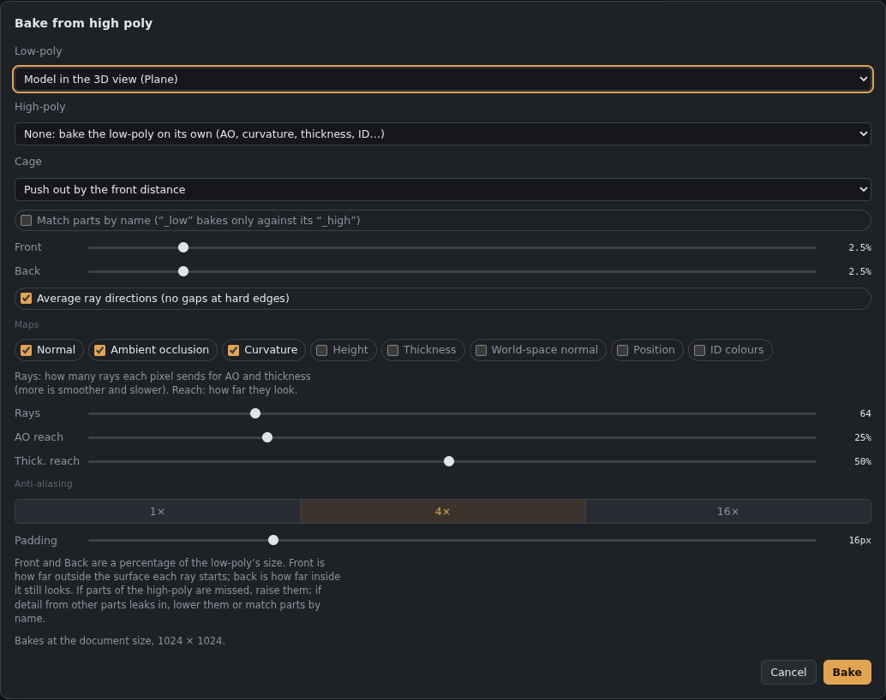

# Baker

**Maps › Bake from high poly…** copies the detail of a high-poly model onto the low-poly model's UVs. The results arrive as **new layers** in this document, at the document's size. For a bigger bake, change *Image › Image size* first.

## Models

*The Bake dialog.*

- **Low-poly:** the model in the 3D view, or load a file (OBJ, glTF, GLB, FBX). It must have UVs.
- **High-poly:** load a file. Or choose **None** to bake the low-poly on its own (see below).
- **Cage:** either *Push out by the front distance*, or load a **cage model**, which is your low-poly pushed outwards with the same vertices and triangles.

## Rays
Each pixel of the low-poly's UVs sends a ray from just outside the surface back through it and records where it first meets the high-poly.
- **Front:** how far outside the surface the ray starts, as a % of the model's size.
- **Back:** how far inside it still looks.
- **Average ray directions:** stops gaps and seams at hard edges.
- **Match parts by name:** `crate_low` bakes only against `crate_high`. This stops close parts from leaking into each other. The endings `_low/_high`, `_lo/_hi` and `_lp/_hp` are recognised, and the dialog lists the parts it matched.

If parts of the high-poly are missed, raise the distances. If detail from other parts leaks in, lower them or match parts by name.

## Maps
| Map | Where it goes |
|---|---|
| Normal (OpenGL) | New layer in the Normal map |
| Height (high-poly above = light) | New layer in the Height map |
| Ambient occlusion | New layer in the AO map |
| Curvature | *Baked maps* group (base colour) |
| Thickness (white = thick) | *Baked maps* group |
| World-space normal | *Baked maps* group |
| Position (gradient over the model's box) | *Baked maps* group |
| ID colours (vertex colours, material colours, or one colour per part) | *Baked maps* group |

Maps the document doesn't have yet are added for you. The **Baked maps** group is hidden: show it, or use its layers as masks with *Select › Load selection*.

## Low-poly on its own
Choose High-poly **None** to bake AO, **curvature from the model's own shape**, thickness, ID, world-space normal and position. Normal and height are skipped because they'd come out flat.

## Quality
- **Rays and reach:** more rays make AO and thickness smoother but slower. Reach is how far those rays look.
- **Anti-aliasing:** 1×, 4× or 16× samples per pixel.
- **Padding:** extends colour past the UV edges so seams don't show.

Baking runs on the graphics card in small pieces with a progress bar and **Cancel**, so the app stays responsive.

## Exporting for DirectX engines
Bakes are stored as OpenGL normals, like everything else in the app. Pick the engine preset in *File › Export textures for a game engine* and DirectX normals (Unreal) are flipped on export.
