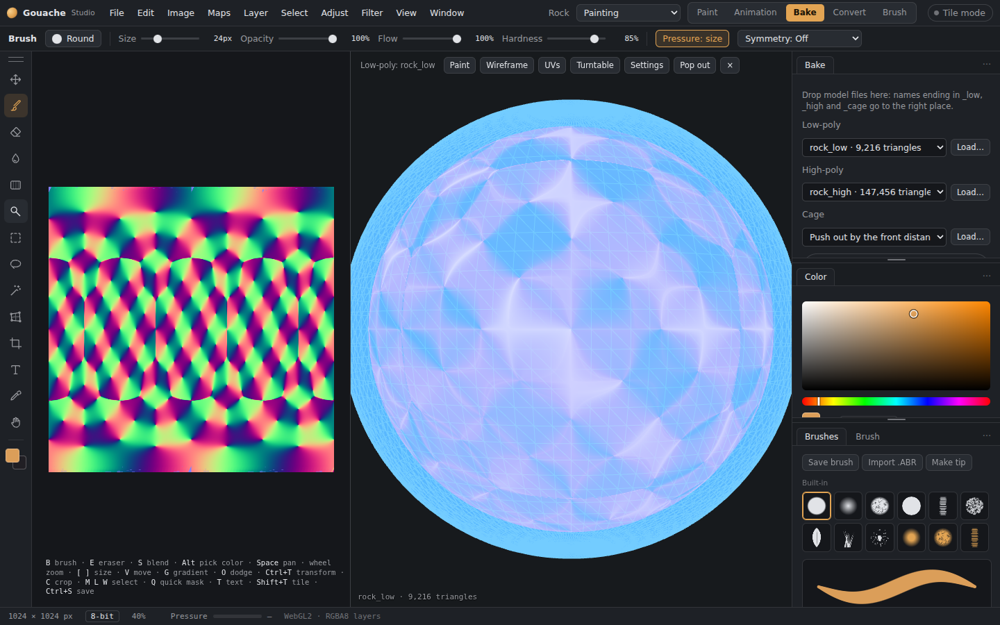
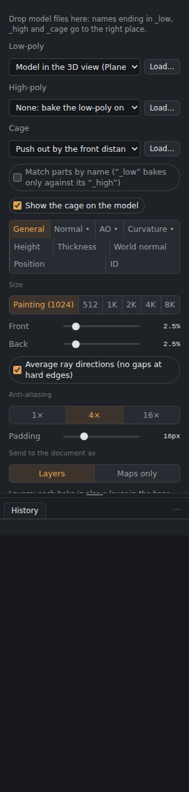
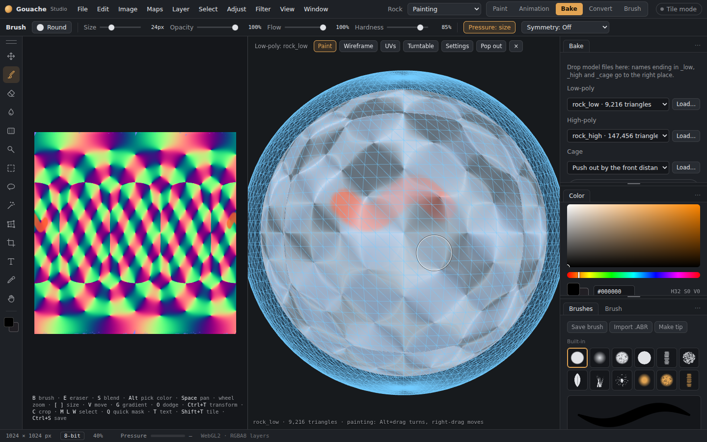

# Baker

The **Bake** tab (top right, or **Maps › Bake from high poly…**) copies the detail of a high-poly model onto the low-poly model's UVs, at the document's size. For a bigger bake, change *Image › Image size* first.

*The Bake tab: settings on the right, the bake on the model in the middle, the baked map on the left.*

## The Bake tab
- The **3D view** shows the low-poly large in the middle. While a bake runs you watch it fill in on the model, piece by piece, and you can turn the model as it goes. **Cancel** stops it at any point.
- The **canvas** on the left shows the baked map.
- **Show** chooses what you look at:
  - **Material (lit)** is a clay model with the baked normal and AO. You can tick *Use the document's base colour on the model*.
  - Any single baked map on its own.
  - The skew or offset map.
- The Bake tab has **its own canvas**, sized by **Size** in the General tab (the painting's size unless you choose another). Baking never touches your painting until you send the results, and the tab shows only its own panels.
- Bakes stay in the tab, so you can check them and bake again as often as you like. Tick the maps you want under **Send to the painting, or export**, then **Send to Paint** adds them as layers, or **Export…** saves them as PNG files (you choose a folder on the desktop; the browser gives a zip).
  - Tick **Send results to layers automatically** to have every bake go straight into the document.
  - **Replace the last baked layers** swaps the previous bake's layers for the new ones, instead of piling them up.

## Settings: one tab per map
Under the model rows, the tabs hold the settings. A dot marks the maps that will be baked; tick **Bake …** at the top of a tab to turn a map on or off.
- **General:** Front, Back, Average ray directions, Anti-aliasing, Padding, and how bakes are sent to the document (below).
- **Normal:** OpenGL style (green up). For DirectX engines, flip green when exporting (*File › Export textures*).
- **AO:** Rays, Reach and **Spread** (narrower keeps the shading to deep cavities).
- **Curvature:** see below.
- **Height**, **Thickness** (its own Rays and Reach) and **Other** (world-space normal, position, ID colours).

*The map tabs, here AO.*

## Curvature
Light on edges and corners, dark in creases, mid-grey on flat areas. **From** picks where it comes from:
- **The shape** (the default): measured on the high-poly itself, so it comes out right on mirrored and flipped UVs. Without a high-poly it's measured on the low-poly's corners.
- **Baked normal:** worked out from the normal map baked with it.
- **Normal map:** worked out from the document's own normal map, with no high-poly needed.

For the last two, **Flip green** swaps the edges and creases that run across the texture, in case a normal map's green points the other way.
- **Radius:** how far around each point it looks. Small gives thin, sharp edges; large gives broad, soft ones.
- **Strength**, and **Edges** and **Creases** to set the light and dark sides separately.
- **Also make edges-only and creases-only maps:** two extra layers, white where the edges (or creases) are, handy as masks.

## Sending bakes to the document
**Send to 3D Paint** sends the low-poly and the ticked maps to 3D Paint: each material's maps go to its own texture set (see [3D Paint](3D-Paint.md#mesh-maps-from-the-bake-tab)). With several materials, tick **Bake each material separately** before baking; a **Material** menu then shows each one's result.

**Send as** (General tab):
- **Layers** (the default): every bake is also a layer in the **base colour**, so bakes blend with each other there. For example, set the curvature layer to *Overlay* over the AO. AO, curvature and height also go into their own maps. The edges-only and creases-only layers sit, hidden, in the curvature group.
- **Maps only:** each bake only in its own map, as before.

Each map arrives as a **plain layer** (no folders), so you can set blend modes between them. Layers that would cover your colours (thickness, world-space normal, position, ID) start hidden. Bakes of a different size are scaled to the painting.

## Models

- **Loading models:** press **Load…** next to Low-poly, High-poly or Cage, or **drag model files** onto those rows. You can also drop them anywhere in the Bake tab: files named `…_low`, `…_high` and `…_cage` go to the right place by themselves. A loading bar shows big files coming in. FBX must be binary FBX (not text).
- **Low-poly:** the model in the 3D view, or a file (OBJ, glTF, GLB, FBX). It must have UVs.
- **High-poly:** load a file. Or choose **None** to bake the low-poly on its own (see below).
- **Cage:** either *Push out by the front distance*, or load a **cage model**, which is your low-poly pushed outwards with the same vertices and triangles.

## ID colours
In the **Other** tab, *ID colours from* chooses where the ID map's colours come from:
- **Separate meshes:** one colour per object in the file.
- **Materials:** one colour per material.
- **Vertex colours:** the colours painted on the high-poly's vertices (OBJ, glTF, FBX).
- **Polypaint:** ZBrush polypaint. Export the OBJ from ZBrush with Polypaint on.

The tab lists what the loaded model has.

## Rays
**Show the cage on the model** draws where the rays start as a see-through blue shell around the model. It follows Front, the offset map and a loaded cage model, so you can check the cage covers the high-poly.

Each pixel of the low-poly's UVs sends a ray from just outside the surface back through it and records where it first meets the high-poly.
- **Front:** how far outside the surface the ray starts, as a % of the model's size.
- **Back:** how far inside it still looks.
- **Average ray directions:** stops gaps and seams at hard edges.
- **Match parts by name:** `crate_low` bakes only against `crate_high`. This stops close parts from leaking into each other. The endings `_low/_high`, `_lo/_hi` and `_lp/_hp` are recognised, and the panel lists the parts it matched.

If parts of the high-poly are missed, raise the distances. If detail from other parts leaks in, lower them or match parts by name. To fix just one area, paint an offset map (below).

## Maps
| Map | Where it goes (as layers) | Maps only |
|---|---|---|
| Normal (OpenGL) | Normal map | Normal map |
| Height (high-poly above = light) | Height map and base colour | Height map |
| Ambient occlusion | AO map and base colour | AO map |
| Curvature (+ edges and creases) | Curvature map and base colour | Curvature map (edges and creases: base colour, hidden) |
| Thickness (white = thick) | Base colour, hidden | Base colour, hidden |
| World-space normal | Base colour, hidden | Base colour, hidden |
| Position (gradient over the model's box) | Base colour, hidden | Base colour, hidden |
| ID colours (Other tab: **separate meshes**, **materials**, **vertex colours** or **ZBrush polypaint**; Auto uses vertex colours, else materials) | Base colour, hidden | Base colour, hidden |

Each baked map arrives in **its own group** (“Baked normal”, “Baked AO”…), so they're easy to find in the layer stack. Maps the document doesn't have yet are added for you. Groups for maps that live in the base colour (thickness, world-space normal, position, ID) start hidden so they don't cover your colours: show one, or use it as a mask with *Select › Load selection*.

## Low-poly on its own
Choose High-poly **None** to bake AO, **curvature from the model's own shape**, thickness, ID, world-space normal and position. Normal and height are skipped because they'd come out flat.

## Quality
- **Rays and reach** (AO and Thickness tabs): how many rays each pixel sends. More rays are smoother but slower. Reach is how far those rays look.
- **Anti-aliasing:** 1×, 4× or 16× samples per pixel. A pixel's AO and thickness rays are shared out over its samples, so anti-aliasing smooths the edges without multiplying the time AO and thickness take.
- **Padding:** extends colour past the UV edges so seams don't show.

Baking runs on the graphics card in small pieces with a progress bar and **Cancel**, so the app stays responsive.

## Big high-polys
Before the first bake the high-poly is sorted into a **search tree** (*Sorting triangles…*), so each ray only tests the few triangles near it. This runs in the background, and the tree is kept for later bakes of the same models. The desktop app also saves it in the **disk cache** (see [Preferences and performance](Preferences-and-performance.md)), so baking the same high-poly after a restart skips this step. High-polys of about 20 million triangles work on a card like an RTX 4080; the app says so if one is too big for the card.

## Fixing the bake: skew and offset
Sometimes a bake comes out wrong in places. Floating details like screws, bolts and panel lines come out smeared or leaning, parts of the high-poly are missed, or detail from a nearby part leaks in. You fix those by painting two maps on the low-poly, the same idea as Marmoset Toolbag's projection tools.

Under **Fix the bake**, pick **Skew** or **Offset**, then paint with the Brush (the Eraser puts the neutral colour back):
- **Skew** (neutral is white): paint **black** over details that lean or smear. The rays there shoot straight out of the surface instead of along the averaged direction. White keeps the averaged direction, which avoids gaps at hard edges.
- **Offset** (neutral is grey): **lighter** reaches further, for parts of the high-poly that were missed. **Darker** reaches less far, for detail leaking in from nearby. **Estimate offset** makes a starting offset map for you by measuring how far the high-poly actually is at each pixel.

You can paint **on the model in the 3D view** or on the map on the canvas. The areas you paint show as a tint: orange for skew, orange or blue for offset.

After each stroke, the quick maps (normal, height, curvature, position, world-space normal, ID) **re-bake straight away where you painted**, so you see the fix at once. AO and thickness are slower, so they update on the next full **Bake**.

Every stroke can be undone. **Clear skew** and **Clear offset** start over. Both maps are saved in your .gouache file.

*Painting skew over part of a model. The orange tint shows where the rays now shoot straight out.*

## Exporting for DirectX engines
Bakes are stored as OpenGL normals, like everything else in the app. Pick the engine preset in *File › Export textures for a game engine* and DirectX normals (Unreal) are flipped on export.
