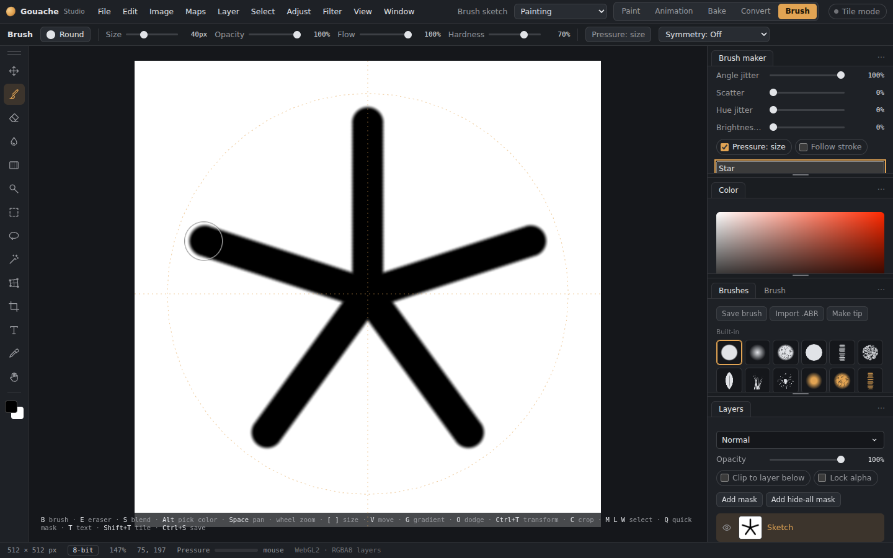

# Brush tab

The **Brush** tab (top right, next to Convert) is a place for drawing your own brush tips. It has **its own canvas**: your painting stays in Paint exactly as you left it (layers, undo steps, selection, colours), and the sketch stays here while you switch between tabs.

*The Brush tab: a tip being drawn, with the test stroke on the right.*

## Drawing a tip
- The canvas starts **white** with a **black** brush. Black paints, white doesn't, and grey is partly see-through.
- All the usual tools work: brushes and their presets, the eraser, blend, fills, selections, symmetry (in the brush panel) and undo.
- **Canvas** 256, 512 or 1024 starts a new canvas of that size; **Clear** wipes it (Undo brings it back).
- **Centre guides** show a cross and a circle to keep round tips centred.

## Test stroke
The **Test stroke** paints a wavy line with the tip you're drawing, using the settings below, and updates as you draw.

## The new brush
Set how the new brush will behave before you save it: **Spacing**, **Size jitter**, **Angle jitter**, **Scatter**, **Hue jitter**, **Brightness jitter**, **Pressure: size** and **Follow stroke**. Give it a **name** and press **Make brush**: it's saved under **Custom tips** in the brush library, ready in Paint. Your current painting brush isn't changed.

## Your tips
Every tip you've made is listed at the bottom:
- **Edit** puts the tip back on the canvas (with its settings). Change it, then press **Update “name”**, or **Save as new** to keep both.
- **Rename** and **×** (delete).

Saving (Ctrl+S) and exporting are for documents, so they're not used in the Brush tab. Starting or opening a document takes you back to Paint first; the sketch waits in the Brush tab.

The Brush workspace shows the **live brush tip** beside the **test stroke** at the top of Brush maker. Name/save controls and the new brush settings sit underneath; the painting brush library is below the drawing canvas. The previews stay visible when scrolling the creation controls. Saved tips are in the expandable **Your saved tips** section. Use **Reset this workspace** in the workspace dropdown to restore this arrangement if you have a custom layout.
