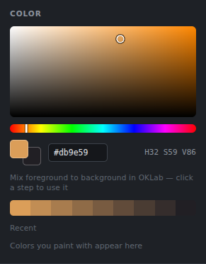

# Brushes and painting

## Brush tool (B)

*The brush panel.*

Pick a preset from the **Brush** panel, or change the settings:
- **Size, Opacity, Flow, Hardness.** Flow is how much paint each dab lays down. Opacity caps the whole stroke.
- **Spacing:** the distance between dabs.
- **Grain:** a paper-like break-up of the stroke.
- **Smoothing:** steadies wobbly lines.
- **Pen pressure:** can drive **Size** (down to *Min size*), **Opacity**, or **Build-up**, where overlapping dabs keep adding paint within one stroke. **Curve** makes the pressure response softer or firmer.
- **Tip shape & dynamics:** Angle, Roundness, Size jitter, Angle jitter, Scatter, Count, Follow stroke, Scatter both axes and Random flip.

**Built-in presets:** Round, Soft air, Chalk, Ink, Flat bristle, Sponge, Foliage, Grass and Splatter, plus the blend presets Blender, Wet mix and Bristle blend.

## Your own brushes
- **Save brush** stores the current settings in **My brushes**. That includes which extra maps the brush paints and their values (see [Maps and PBR](Maps-and-PBR.md)).
- **Import .ABR** loads Photoshop brush sets. Tips come across, and the settings that map cleanly are kept.
- **Tip from layer**, or **Layer › Make brush tip from layer**, turns the active layer into a brush tip.

Brush libraries are stored on your computer and come back each time you open the app.

## Eraser (E)
Uses the same settings as the brush. On a document with several maps, it can erase from other maps too; see *Also erase from* in the panel.

## Blend (S)
Smudges and mixes paint. **Strength** is how far the colour is dragged. **Paint load** adds some of the foreground colour as you blend, like a loaded brush.

## Dodge and burn (O)
Lightens (Dodge) or darkens (Burn). **Shift+O** switches between them.
- **Range:** affect shadows, midtones or highlights.
- **Exposure:** how strong each pass is.
- **Protect tones:** keeps colours from going grey or oversaturated.

## Colour

*The colour panel.*

- **Picker:** the square, the hue bar and a hex field.
- **Mix strip:** steps from the foreground colour to the background colour, mixed in OKLab so the in-between colours stay clean. Click one to use it.
- **Recent colours** remember what you've painted with.
- **Eyedropper:** the Eyedropper tool (I), or hold **Alt** while painting.
- **X** swaps the two colours; **D** resets them to black and white.

## Symmetry and cages
The brush panel's **Symmetry** buttons mirror your strokes left–right, top–bottom, both ways, or radially. To paint onto a slanted or curved part of the texture, lay a cage over it. See [Cage painting and symmetry](Cage-painting-and-symmetry.md).

## Painting on a mask or a single channel
- **Masks:** click a layer's mask thumbnail to paint the mask. Black hides, white shows.
- **Channels panel:** click a channel to view and paint only that channel. Ctrl+click adds more channels.

## Painting several maps at once

*"Also paint" in the brush panel: one stroke paints roughness, metallic and height too.*

In documents with more than one map, one stroke can paint base colour, roughness, height and others together. See [Maps and PBR](Maps-and-PBR.md).
