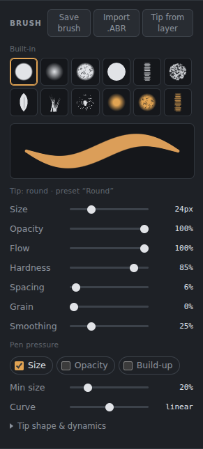
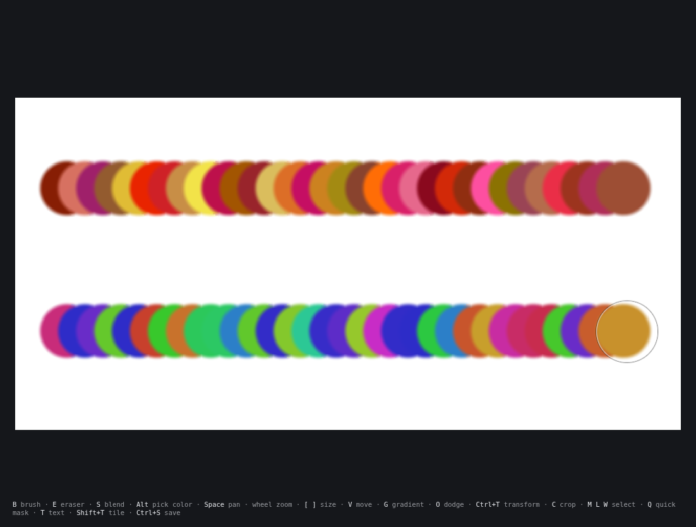
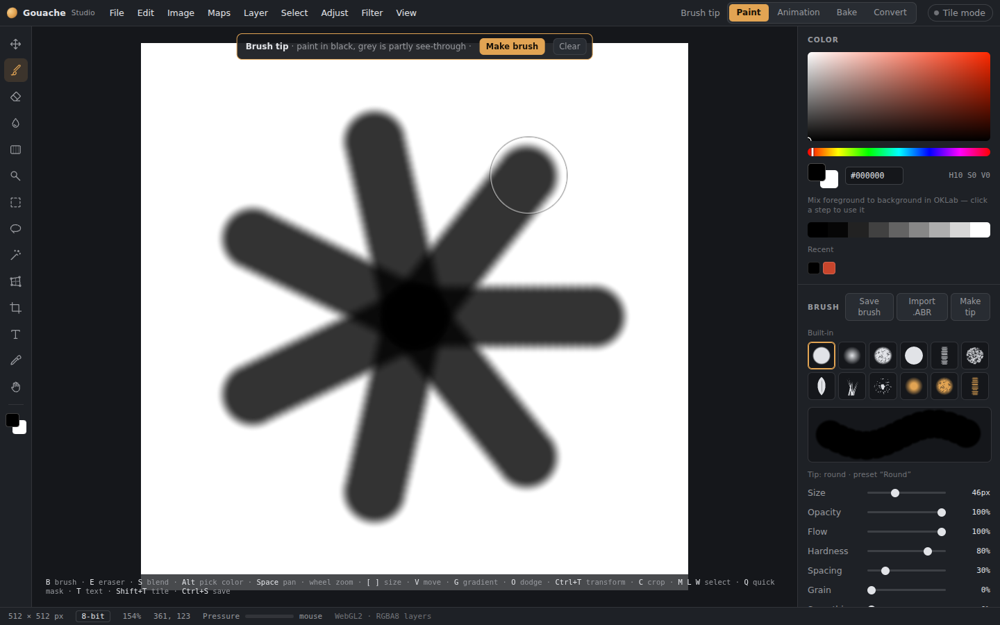
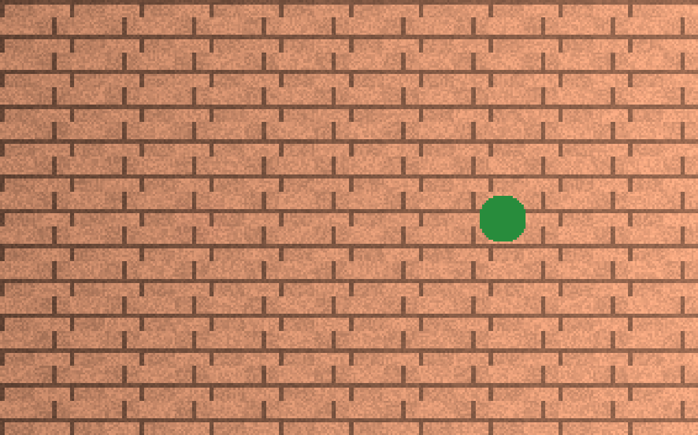
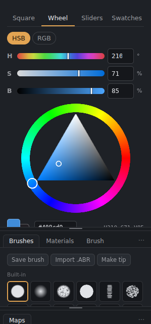
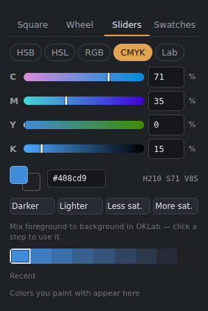
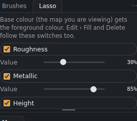

# Brushes and painting

## Brush tool (B)

*The brush panel.*

Pick a preset from the **Brush** panel, or change the settings:
- **Size, Opacity, Flow, Hardness.** Flow is how much paint each dab lays down. Opacity caps the whole stroke.
- **Spacing:** the distance between dabs.
- **Grain:** a paper-like break-up of the stroke.
- **Smoothing:** steadies wobbly lines.
- **Pen pressure:** can drive **Size** (down to *Min size*), **Opacity**, or **Build-up**, where overlapping dabs keep adding paint within one stroke. **Curve** makes the pressure response softer or firmer.
- **Tip shape & dynamics:** Angle, Roundness, Size jitter, Angle jitter, Scatter, Count, Follow stroke, Scatter both axes and Random flip.
- **Colour jitter** (in the same section): **Hue**, **Saturation** and **Brightness** vary the colour of every dab around your brush colour. Tick **Once per stroke** to change the colour only once per stroke instead. It is saved with the brush. On grey maps (roughness, height…) only Brightness applies.

*Hue jitter: every dab gets its own colour.*

**Built-in presets:** Round, Soft air, Chalk, Ink, Flat bristle, Sponge, Foliage, Grass and Splatter, plus the blend presets Blender, Wet mix and Bristle blend.

## Each tool keeps its own brush
The Brush, Eraser, Blend, Dodge/Burn, Healing brush and Clone stamp each remember their own brush and settings (size, opacity, tip, spacing, jitter…), also for next time. Switching tools no longer carries one brush across. Tick **All tools share the brush tip** (Tool settings) to keep the same tip (with its angle, roundness and flips) on every tool while the other settings stay per tool.

Brushes go up to **5000 px** (**]** and the Size slider); Preferences › **Largest brush size** allows more.

## Lazy mouse and the tip cursor
The brush cursor shows the tip's real shape (turn it off in Preferences), and the options bar shows the tip's shape next to the brush name.

- **Lazy mouse** (brush bar › More, or Tool settings): the brush follows the pointer on a string of that many pixels, so it only moves once the string is pulled tight. It's good for steady lines, on the canvas and on the model.
- **Preferences › Show the brush tip's shape as the cursor** outlines the actual tip, turned and squashed like the dabs.

## Brush library
The **Brushes** panel holds the brush library and, under it, the settings of the brush you picked (size, spacing, scatter and the rest), all in one panel. In 3D Paint the settings keep their own panel beside Colour.

Besides the built-in brushes there are **Basic media** (pencils, charcoal, pastel, dry brush, stipple, hatching, fur, oil paint, wash, marker, fine liner) and six sets of **particle and mark tips**: Dirt and scorch, Smoke and clouds, Lightning and sparks, Glints and stars, Swooshes and cracks, and Fire and flashes. The particle tips are 81 free (CC0) pictures from Kenney's Particle Pack and Smoke Particles ([kenney.nl](https://kenney.nl)); thank you, Kenney Vleugels. Paint with them as they are, or change size, spacing, scatter and angle jitter like any brush.

## Your own brushes
- **Save brush** stores the current settings in **My brushes**. That includes which extra maps the brush paints and their values (see [Maps and PBR](Maps-and-PBR.md)).
- **Import .ABR** loads Photoshop brush sets. Tips come across, and the settings that map cleanly are kept.
- **Make tip** (or **Edit › Make brush tip…**) turns what you drew into a brush tip, like Photoshop's *Define Brush Preset*: give it a name and choose the **visible canvas** or the **active layer**. Dark paints and white doesn't; on a see-through layer, whatever is painted becomes the tip. With a selection, only the selected part is used. **Layer › Make brush tip from layer** does the same from the active layer in one click.
- **Brush tab:** a whole tab for drawing tips, with a live test stroke and your saved tips (see [Brush tab](Brush-tab.md)).
- **Brush tip template:** *File › New document*, template **Brush tip**, gives a white 512 × 512 canvas with a black brush and a banner: paint in black, then press **Make brush** (or **Clear** to start again).

*The Brush tip template.*

Brush libraries are stored on your computer and come back each time you open the app.

## Eraser (E)
Uses the same settings as the brush. On a document with several maps, it can erase from other maps too; see *Also erase from* in the panel.

## Blend (S)
Smudges and mixes paint. **Strength** is how far the colour is dragged. **Paint load** adds some of the foreground colour as you blend, like a loaded brush.

## Healing brushes (J)
Fix flaws, seams and specks without leaving a smear, like Photoshop's healing brushes. The tool has two modes (in the options bar or Tool settings):
- **Spot:** paint over the flaw. When you let go, it is replaced with clean texture from nearby, found by itself.
- **Healing:** **Alt+click** where to copy from (a cross marks it), then paint where it should go. **Aligned** keeps the same distance between the source and the brush for every stroke; untick it to start from the source each time.

Either way the borrowed texture keeps its detail, but its colour and brightness are bent to match the edges of what you painted, so it blends in. While you paint, the stroke shows as a faint grey trail; the healing happens when you let go.

On a layer with several maps (a material, or a layer with height and roughness), **every map is healed together** with the same source. The stroke follows the **selection** and **symmetry** like any brush. In 3D Paint it works on the model too: Alt+click on the model (without dragging) sets the source, and the **mirror** heals both sides.

*The left flaw was painted over once with the Spot healing brush; the right one is untouched.*

## Clone stamp (Y)
Copies one part of the picture onto another, like Photoshop's clone stamp. **Alt+click** where to copy from (a cross marks it), then paint: the copy appears as you paint. Unlike the healing brush it is not blended into its surroundings, so it copies exactly. **Opacity** sets how strongly it covers; **Aligned** works as for the healing brush, and the two tools share the same source.

Like the healing brush, it copies **every map of the layer** together, follows the **selection** and **symmetry**, and works on the model in 3D Paint (Alt+click the model to set the source; the **mirror** clones both sides).

## Dodge and burn (O)
Lightens (Dodge) or darkens (Burn). **Shift+O** switches between them.
- **Range:** affect shadows, midtones or highlights.
- **Exposure:** how strong each pass is.
- **Protect tones:** keeps colours from going grey or oversaturated.

## Colour

*The Wheel tab: a hue ring with a triangle, and HSB sliders above it.*

*The Sliders tab, here in CMYK.*

- **Four ways to pick** (tabs at the top of the panel; drag the panel taller if needed):
  - **Square:** the saturation/brightness square and the hue bar.
  - **Wheel:** a hue ring with a triangle inside, like Photoshop's colour wheel. The triangle turns with the hue: its corners are the pure colour, white and black. Above it, **HSB** or **RGB** sliders with number boxes.
  - **Sliders:** **HSB**, **HSL**, **RGB**, **CMYK** or **Lab**, each with a gradient bar and a number box.
  - **Swatches:** your own colour set. Click one to use it, **+** adds the current colour, right-click removes one, **Reset** brings back the built-in set.
- **Darker, Lighter, Less sat., More sat.:** small steps from the current colour, whichever way you pick.
- A **hex** field, and the foreground and background colours (click the background one to swap).
- **Mix strip:** steps from the foreground colour to the background colour, mixed in OKLab so the in-between colours stay clean. Click one to use it, or step with the **Left / Right arrow keys**. Past either end they keep going, lighter or darker in the same colour.
- **Recent colours** remember what you've painted with.
- **Eyedropper:** the Eyedropper tool (I), or hold **Alt** while painting.
- **X** swaps the two colours; **D** resets them to black and white.

## Symmetry and cages
The brush panel's **Symmetry** buttons mirror your strokes left–right, top–bottom, both ways, or radially. To paint onto a slanted or curved part of the texture, lay a cage over it. See [Cage painting and symmetry](Cage-painting-and-symmetry.md).

## Painting on a mask or a single channel
- **Masks:** click a layer's mask thumbnail to paint the mask. Black hides, white shows.
- **Channels panel:** click a channel to view and paint only that channel. Ctrl+click adds more channels.

## Painting several maps at once

*"Also paint" in the brush panel: one stroke paints roughness, metallic and height too.*

In documents with more than one map, one stroke can paint base colour, roughness, height and others together. See [Maps and PBR](Maps-and-PBR.md).
