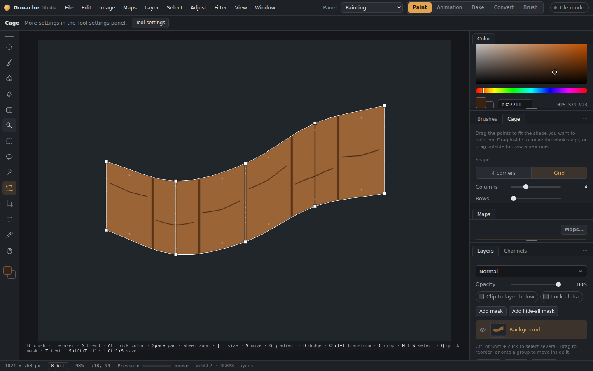
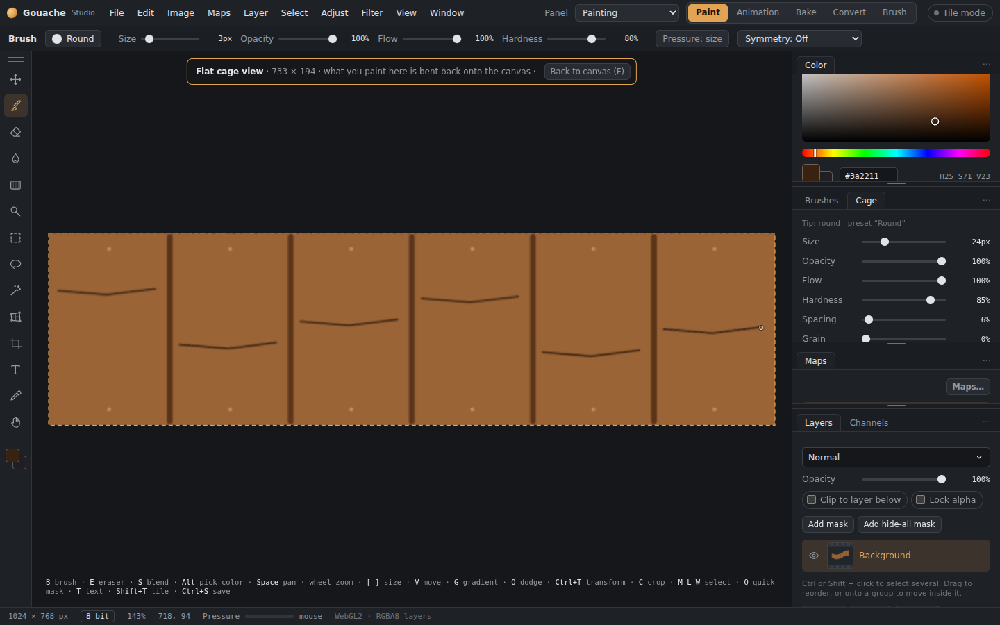
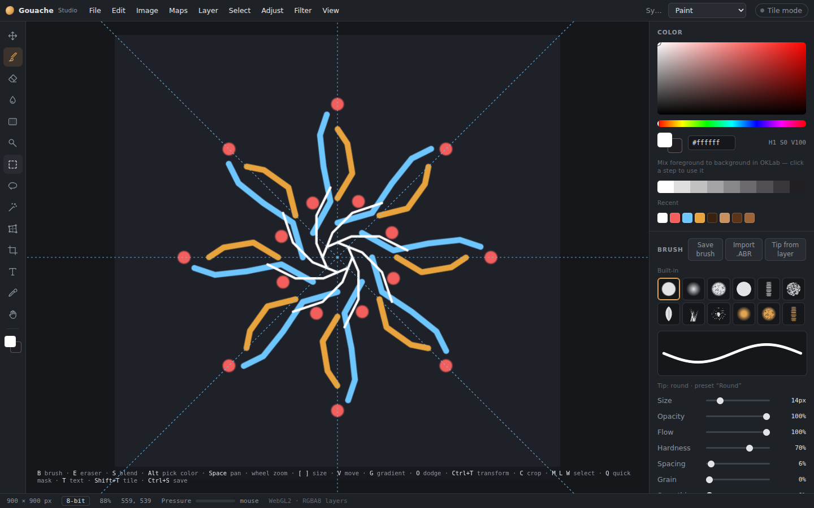

# Cage painting and symmetry

A **cage** is a set of points you lay over part of your texture: a slanted panel, a curved strip, or a door drawn in perspective. Once the cage fits the shape, you can paint *through* it, so your brush work follows that shape. There are two ways to do this, and you can switch between them at any time.

*A grid cage bent into a wave. The planks, nails and wood grain were painted straight in the flat view.

## Drawing a cage
1. Pick the **Cage** tool (**K**).
2. In the panel, choose **4 corners** or **Grid**. For a grid, set the **Columns** and **Rows**.
3. Drag over the area you want to paint on.
4. Drag the cage's points onto the edges of the shape. You can also:
   - drag inside the cage to move the whole thing;
   - drag outside it to draw a new one;
   - nudge the selected point with the arrow keys (Shift nudges 10 px);
   - press Delete to remove the cage.
5. **Fit to selection** and **Fit to layer** place a rectangular cage for you.

A **4-corner** cage with **Perspective** on suits flat surfaces seen at an angle, like walls, doors, crates and signs. A **grid** cage bends smoothly through all of its points, so it can follow curved or wavy shapes. Changing the number of columns and rows keeps the cage's shape.

Every change to a cage can be undone. The cage is saved in your .gouache file.

## Way 1: paint on the canvas, and the brush bends
With **Bend brush strokes inside the cage** on, just paint with the Brush, Eraser, Dodge or Burn:
- **Inside the cage** the brush takes the cage's shape. A round brush becomes a slanted oval on a slanted panel, and its size, spacing and texture shrink where the cage gets smaller.
- **Hold Shift** while you paint to follow the cage's lines. The stroke runs along the cage's rows or columns, whichever way you start moving, so it curves with the shape.
- **Outside the cage** everything paints as normal. A stroke that leaves the cage stops at its edge, and carries on if it comes back in.

The dashed outline on the canvas shows where the cage is while you paint.

## Way 2: the flat view (F)
Press **F** (or **View › Flat cage view**) to see what's inside the cage straightened out into a flat rectangle. Paint there as on any canvas, where straight lines stay straight and round brushes stay round. Everything you paint is bent back onto the texture as you go, and the 3D view updates too.

*The flat view: the same strip laid flat while painting it.

- Zoom and pan work as usual. The Eyedropper picks colours from the real texture.
- Press **F** or **Esc** to go back to the canvas.
- The flat view is sized to match the cage, so brush sizes feel the same as on the canvas.
- The Blend (smudge) brush works on the canvas only.

## Both ways
- Painting through a cage works with every map. "Also paint" (roughness, metallic, height…), selections, masks, Lock alpha and pen pressure all apply.
- Each stroke is one undo step.
- Resizing or cropping the document removes the cage, since it would no longer line up.

## Symmetry
The **Symmetry** buttons are in the brush panel for the Brush, Eraser, Blend, Dodge and Burn:
- **Left–right**, **Top–bottom** or **Both** mirror each dab across the dashed blue guide lines.
- **Radial** repeats the dab around the centre, with 2 to 24 **Copies**.
- **Centre ↔ / ↕** moves the mirror lines. You can also drag the blue centre circle on the canvas; **Centre** resets it.
- **Canvas** turns mirror axes with canvas rotation. **Screen** keeps them upright when you turn or flip the canvas. Bent cages keep their own local axes.
- **Shift+X** turns left–right symmetry on and off.

Mirrored dabs are true mirror images, so shaped and rotated brush tips flip the right way. When you paint through a cage, symmetry works inside the cage: it mirrors across the middle of the cage's flat rectangle, so the two halves of a slanted panel match.

*Radial symmetry with 8 copies.*

In **3D Paint**, the radial control highlights its active copy count and axis. **Show guides** displays spokes and a ring around that axis, using the same centre offsets as your strokes.
