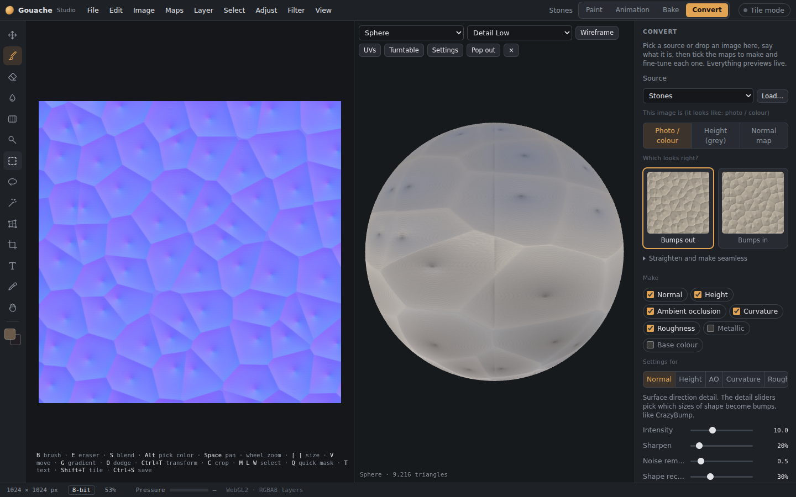
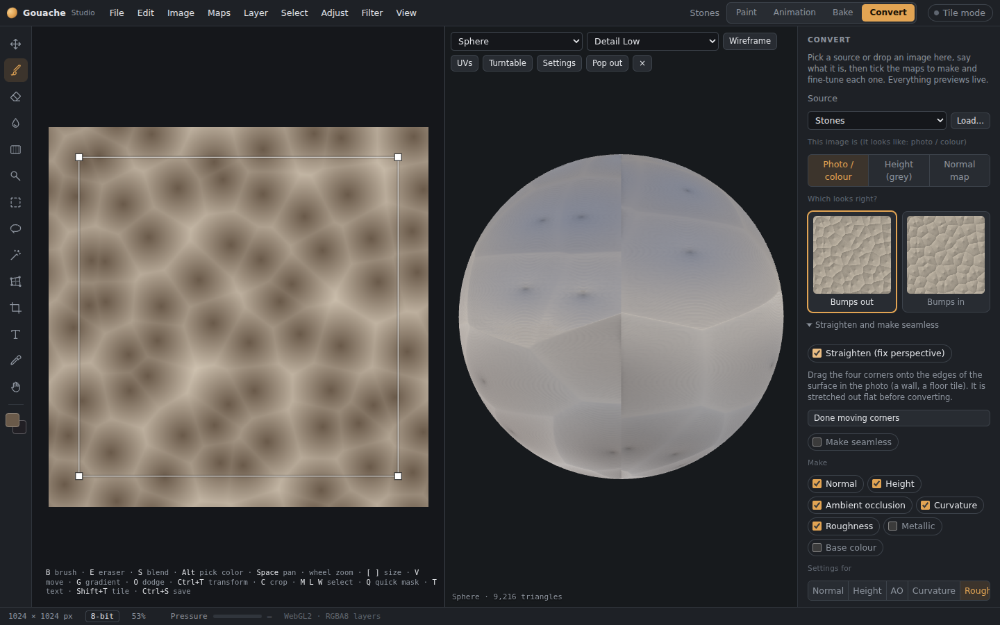
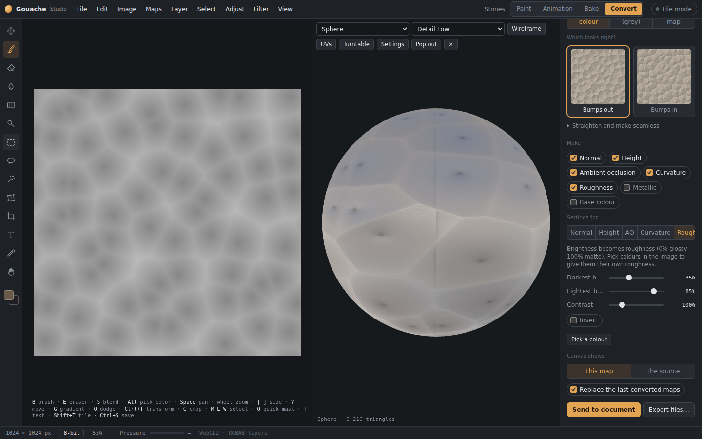

# Convert tab

The **Convert** tab (top right, or **Maps › Convert tab…**) makes texture maps from a photo or from another map, in the spirit of CrazyBump: normal, height, ambient occlusion, curvature, roughness, metallic and a cleaned-up base colour. Every setting previews live, on the canvas and on the 3D model in the middle.

*The Convert tab: the map you're adjusting on the left, all the maps together on the model in the middle, settings on the right.*

## 1. Pick a source
- The **Source** menu takes the document's base colour, height, normal (final), roughness or AO map, or the active layer.
- **Load…**, or drag an image onto the Convert panel or the canvas. Images are fitted to the document size.

## 2. Say what it is
The app guesses and shows its guess, and you can change it:
- **Photo / colour:** any colour image, such as a photo of stones, bark or fabric.
- **Height (grey):** light is high, dark is low.
- **Normal map:** it also works out whether the map is **DirectX** (green down) or **OpenGL**, and you can change that with the tick box.

For photos and heights, **Which looks right?** shows the image as bumps pushed out and pushed in, like CrazyBump. Click the one where the shapes look right.

## 3. Straighten and make seamless (optional)
- **Straighten (fix perspective):** drag the four corners onto the edges of a surface photographed at an angle, such as a wall or a floor tile. It's stretched out flat before converting.
- **Make seamless:** blends the edges so the result tiles. **Blend width** sets how much.

*Straightening: drag the corners onto the surface's edges.*

## 4. Tick the maps to make, and fine-tune each one
| Map | Settings |
|---|---|
| Normal | Intensity, Sharpen, Noise removal, Shape recognition, and **Fine / Medium / Large / Very large / Huge detail** (which sizes of shape become bumps). **DirectX** output for Unreal. **Mix with the document's normal map** combines it with the normal you already have. |
| Height | Intensity, Sharpen, Noise removal, Shape recognition, the same five detail sliders, Smooth. From a normal map, the height is rebuilt from its slopes. |
| Ambient occlusion | Intensity, Spread, Balance (small crevices ↔ large dips), Smooth. |
| Curvature | Width, Strength, Smooth; edges and cavities, edges only or cavities only. |
| Roughness | Darkest becomes, Lightest becomes, Contrast, Invert. **Pick a colour** in the image to give that colour its own roughness, with Tolerance and Softness. |
| Metallic | **Pick a colour** for each metal in the image; everything else takes the "Everything else" value. |
| Base colour | Even out lighting (and its size), Lift shadows, Tame highlights, Saturation. This removes lighting baked into a photo. |

Only the normal map is in colour; everything else is grey. **Canvas shows** switches the canvas between the map you're adjusting and the source.

*Roughness from brightness, with colour picking.*

## 5. Use the results
- **Send to document** puts each map into the matching document map, **one group per map** ("Converted normal", "Converted height"…). Missing maps are added for you. **Replace the last converted maps** swaps the previous conversion's groups for the new ones.
- **Export files…** saves the maps as PNG files (height at 16 bits). On the desktop you choose a folder; in the browser they download as a zip.

The **Maps** menu's converters (Normal from base colour, AO from height…) open this tab with the right source and map already chosen. For a conversion that keeps updating while you paint, add it to a [filter layer](Filter-layers.md) instead.
