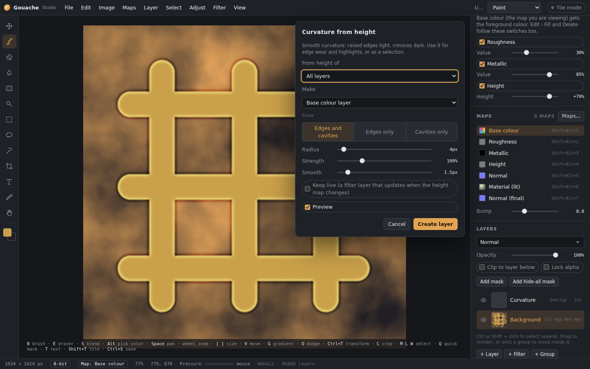
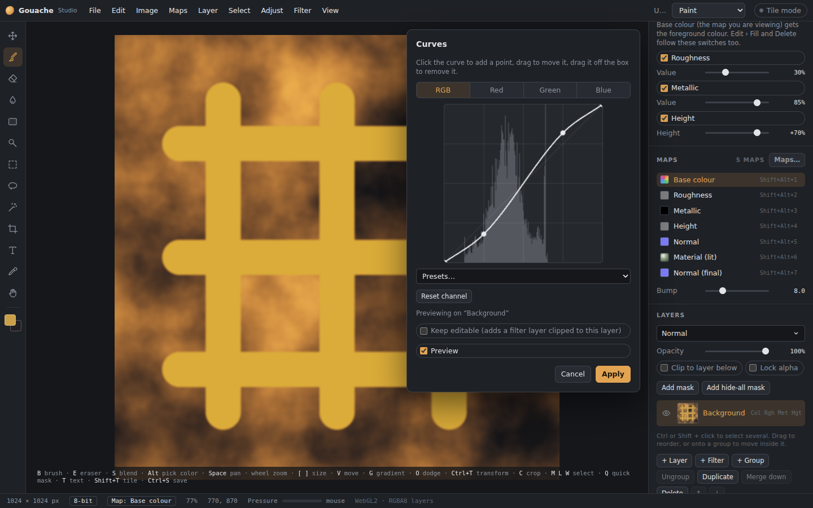
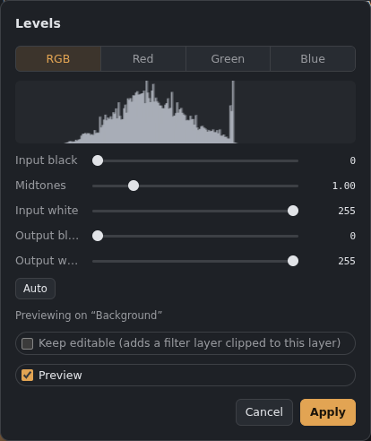
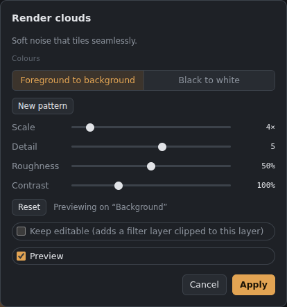
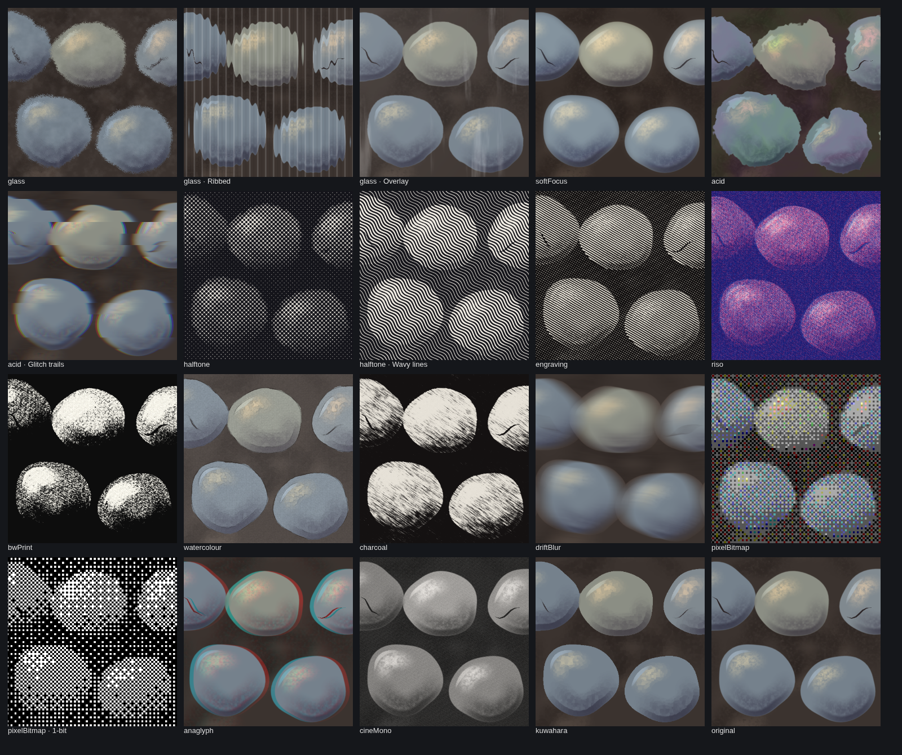

# Converters and filters

Every dialog below **previews live** on the canvas. Turn this off for one dialog with its Preview checkbox, or everywhere in Preferences. Filters work on **the map you're viewing** and stay **inside the selection**. Every filter dialog also has **Keep editable**, which makes a [filter layer](Filter-layers.md) clipped to the layer instead of changing its pixels.

## Maps menu: converters
The Maps menu's converters now open the [Convert tab](Convert-tab.md), which has more settings, straightening, seamless tiling and colour picking. The table below lists what each conversion does; the same conversions work live in [filter layers](Filter-layers.md).

*A converter with live preview: curvature from the height map.*

Each converter makes a **new layer** in the target map and adds that map if it's missing. You can fade, mask or paint over the result. **Keep live** makes a filter layer that updates by itself whenever the source map changes.

| Converter | Result |
|---|---|
| Height from base colour | Lighter areas become raised. Sliders for fine detail, large shapes, shape size, contrast and smoothing, plus invert. |
| Normal from base colour | Height from brightness, turned into normal detail. |
| Roughness from base colour | Brightness mapped into a roughness range. |
| Ambient occlusion from height | Crevices get darker; the layer multiplies over the AO map. |
| Curvature from height | Smooth curvature: edges light, cavities dark. It goes into its own grey **Curvature** map (your colours are not touched), or becomes a **selection**. Put it onto colour with *Filter › Edge wear*. |
| Curvature from normal | The same, read straight from the finished normal. |

Only the Normal map is in colour. Every other converted map is grey and lands in its own map, so a conversion never paints over your base colour.
| Ambient occlusion from normal | Rebuilds the shape from the normal map, then darkens its crevices. |
| Height from normal | Rebuilds the shape a loaded normal map describes. |
| Flip normal green | Switches a normal layer between DirectX and OpenGL. |

## Adjust menu

*Curves.*

*Levels.*

- **Color adjustments** (Ctrl+U): exposure, brightness, contrast, saturation, hue, temperature.
- **Levels** (Ctrl+L): input black, midtones and input white; output black and white; per channel, with a histogram and **Auto**.
- **Curves** (Ctrl+M):
  - click the curve to add a point, drag to move it, drag it off the box to remove it;
  - works per channel;
  - presets: S-curve, lighter, darker, invert, flatten.
- **Hue / Saturation**, with **Colorize**.
- **Gradient map:** each brightness replaced by a colour from a gradient, including six **Y2K** gradients (chrome, cyber pink, holo, lime, ice, sunset).
- **Invert** (Ctrl+I), **Desaturate** (Ctrl+Shift+U), **Threshold**, **Posterize**.
- **Quantize:** reduce to 2–64 colours picked from the image, with optional dithering.

## Filter menu

*A filter dialog (Clouds) with live preview.*

- **Blurs:**
  - Gaussian;
  - Box (flat and even);
  - Radial, which spins around or zooms towards a centre you choose;
  - **Lens blur:** out-of-focus camera look, where bright spots bloom into round or six-sided highlights;
  - Surface blur (smooths but keeps edges);
  - Motion blur;
  - **Drift blur:** streaky motion blur whose direction wanders across the image (**Drift** and **Drift size**), with **Streaks** that let bright parts trail.
- **Sharpen**, **High pass** (keep only fine detail; set the layer to Overlay to sharpen).
- **Artistic:**
  - **Oil paint:** calm, flat dabs;
  - **Painterly:** strokes that follow the shapes;
  - **Cutout:** a few flat colours with simplified edges;
  - **Mosaic:** square tiles, with optional grout and bevel;
  - **Kuwahara:** painterly smoothing that keeps edges sharp;
  - **Watercolour:** soft washes that **bleed** a little, darker pooled **edges**, pigment **granulation** and paper;
  - **Charcoal:** streaky strokes along an **angle** on toothy paper, with **Smudge**; pick the charcoal and paper colours;
  - **Acid:** **Colour flow** (warped, psychedelic colour) or **Glitch trails** (stretched slices with split colour).
- **Photo:**
  - **Soft focus:** a dreamy glow from the bright parts, with contrast and warmth;
  - **Cinematic mono:** black and white through a **lens filter** (red, yellow, green, blue), film curve, faded blacks, grain, vignette and a touch of tone;
  - **Anaglyph:** red and cyan pulled apart like a 3D-glasses picture, optionally deeper where it's brighter.
- **Print:**
  - **Halftone:** **dots**, **lines** or **wavy lines**, in one ink or the image's colours;
  - **Engraving:** fine lines thicker where it's darker that bend with the shapes, cross-hatching in the darkest parts, and **Pop art colour**;
  - **Riso print:** two or three bright inks printed a little out of line, with grain;
  - **B&W print:** hard ink with rough edges on grainy paper;
  - **Pixel / bitmap:** chunky pixels with fewer colours and **pattern** or **diffusion** dithering, or **1-bit** black and white like Photoshop's Bitmap mode.

*The 0.17 filters on the sample tile.*
- **Stylize:** Emboss, Find edges, **Glass** (**Frosted** or **Ribbed** glass seen through, or an **Overlay** of glassy streaks and reflections).
- **Noise and patterns:**
  - Add noise;
  - **Render clouds** and **Render cells** (Voronoi). Both tile seamlessly and can be colour or black and white.
- **Tiling:** **Offset** (slides the image with wrap-around so seams show), **Tile** (repeats the image; with **Uniform scale** on, **Tiles** sets both directions, otherwise **Tiles** (across) and **Down** separately; with **Row offset** for brick patterns, **Random rotation** and **Random flip** per tile, and **New random** for another arrangement), **Make seamless** (blends the edges).

Heavy filters (painterly, oil paint, lens and surface blur, cutout) are drawn in small pieces, so big images don't freeze the graphics driver. They can still take a moment on very large documents.

**Cutout and Quantize** pick their colours once. **Pick colours again** refreshes them.
