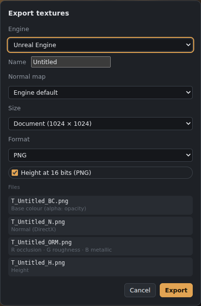

# Files, saving and export

In **New document**, choose **Portrait (vertical)** or **Landscape (horizontal)** beside Width and Height. Existing dimensions swap without changing units or DPI; a square becomes 2:3 or 3:2. Square 3D Paint and Brush workspaces keep their existing texture workflow.

## .gouache documents
For a Paint or Animation canvas, choose **Custom colour** under Background in **New document**, then use the colour picker or enter a hex colour. The background is filled with that colour without changing your foreground paint colour.

**Save** (Ctrl+S) and **Save as** (Ctrl+Shift+S) write a **.gouache** file. It keeps everything:
- layers, groups, masks, blend modes;
- every map;
- filter layers, live gradients, editable text;
- animation;
- 3D view settings and any imported model.

The first save asks where to put the file; after that, Ctrl+S saves in place. **Open recent** lists recent files, and double-clicking a .gouache file in Explorer opens it.

## Opening files
**File › Open** reads **.gouache, PSD** (layers, groups, masks, blend modes), **PNG, JPG, WebP, GIF, BMP, TGA, DDS and TIFF**. Dropping an image onto the canvas places it as a new layer.
- **Place image as layer** adds an image to the current document.
- **Fonts** (TTF, OTF, WOFF) can be opened to add them to the Text tool.

## PSD
**File › Export as PSD…** writes a layered Photoshop file with groups, masks and blend modes.
- **Base colour only:** a PSD holds only the base colour map. Save as .gouache to keep every map.
- **Filter layers** are turned into the pixels they produce.
- **Round-trips:** live gradients, text and animation are stored inside the PSD, so they come back when you reopen it in Gouache Studio.

## Export an image (Ctrl+Shift+E)
Exports the **visible image** or the **active layer** as:
- **PNG** (8 or 16-bit)
- **TGA**
- **DDS**: BC1/DXT1, BC3/DXT5 or uncompressed, with mipmaps
- **TIFF**
- **EXR** (half-float, for HDR work)
- **JPG**
- **WebP**

## Export textures for a game engine

*Export textures, with engine presets.*

**File › Export textures for a game engine…** writes every map as separate files, packed and named for the engine you pick:

| Preset | Files |
|---|---|
| Unreal | `T_Name_BC`, `T_Name_N` (DirectX normal), `T_Name_ORM` (R occlusion, G roughness, B metallic), `T_Name_H`, `T_Name_E` |
| Unity URP | `_Albedo`, `_MetallicSmoothness` (R metallic, A smoothness), `_Normal`, `_Occlusion`, `_Height`, `_Emission` |
| Unity HDRP | `_BaseColor`, `_MaskMap` (R metallic, G occlusion, B detail mask, A smoothness), `_Normal`, `_Height`, `_Emissive` |
| Godot | `_albedo`, `_orm`, `_normal`, `_height`, `_emission` |
| Blender | one file per map |

For **Specular/Gloss** documents (see [Maps and PBR](Maps-and-PBR.md)):

| Preset | Files |
|---|---|
| Unity (Standard, specular) | `_Albedo` (diffuse), `_Specular` (RGB specular, A smoothness = glossiness), `_Normal`, `_Occlusion`, `_Height`, `_Emission` |
| Unreal (specular/gloss) | `T_Name_D` (diffuse), `T_Name_S` (specular), `T_Name_G` (glossiness), `T_Name_N` (DirectX), `T_Name_AO`, `T_Name_H`, `T_Name_E`, for a custom material |
| Separate maps | one file per map |

**Your own presets:** **New preset…** opens an editor where you list the files: each is a **colour map** (base colour, with opacity in its alpha if you like; normal; emissive), a **grey map**, or a **packed** image with one map in each of red, green, blue and alpha (for example metallic, roughness and AO in one file). Choose the normal map style (OpenGL or DirectX) and how files are named (`{name}` is the export name, `{s}` each file's suffix). It starts from whichever preset is chosen. Your presets show with a ★ in the list and are kept on this computer; **Edit preset…** changes or deletes one.

**The model too:** in 3D Paint (or with a model in the 3D view), **Model** exports it along with the textures:
- **.glb:** one file with the textures inside, already connected to the materials (one material per texture set). Blender, Godot and Unreal open it as is; Unity needs the free *glTFast* package.
- **.obj + .mtl:** the model and a material file that points at the texture files.

**Send to** (desktop app): after exporting, the files can go straight into another program:
- **Unity, Godot, Unreal:** choose your project's folder once. The files go to `Assets/Gouache/<name>` (Unity), `res://gouache/<name>` (Godot) or `Content/Gouache/<name>` (Unreal). Unity and Godot import them when you switch back to them; in Unreal turn on *Auto Import* (Editor Preferences › Loading & Saving) or drag the .glb into the Content Browser.
- **Blender:** click **Save the Blender add-on…**, then in Blender go to *Edit › Preferences › Add-ons › Install…*, pick the file and tick **Gouache Studio link**. From then on a running Blender receives the model at once, in a collection called *Gouache - <name>*; sending again replaces it. If Blender isn't running, choose the Blender program and it is started with the model.

Other options:
- **Normal map direction:** the engine default, OpenGL or DirectX.
- **Size:** the document size or 256–8192.
- **Format:** PNG or TGA, with **16-bit height**.
- **Opacity:** goes into the base colour's alpha.

In the desktop app you choose a folder; in the browser the files come as a zip.

## Sprite sheets and flipbooks
See [Animation](Animation.md).

## Brushes
**File › Import brushes (.abr)** loads Photoshop brushes. See [Brushes and painting](Brushes-and-painting.md).

## When a model file changes (desktop app)
If a model you opened with **Import model** or **Load…** is saved again in another program (Blender, Maya…), Gouache Studio notices and asks **Update it here?**. After updating it offers to **bake again** with the last settings (3D Paint's *Bake mesh maps*, or the Bake tab), so masks and materials that use the mesh maps follow the new model. Tick **Always update and bake without asking** (also in *Preferences › Models*) to skip the questions. A changed **high-poly** is never updated without asking. The browser version can't watch files on your computer.

## Autosave
Every open document tab has its own recovery copy, not only the one you are working on. Saving or closing a tab removes its copy.

## Artwork fonts offline

The Text tool now includes Anton, Bebas Neue, Patrick Hand, Kalam, Libre Baskerville, Orbitron, Space Grotesk and Cormorant Garamond. These and the eight existing artwork families are bundled for offline desktop use. Each font's SIL Open Font License is shipped beside it; source links are recorded in assets/fonts/manifest.json.

16-bit PNG data maps retain their source sample values on import, including interlaced PNGs. Very large 16-bit colour images are checked against the renderer's allocation limits before decoding.
