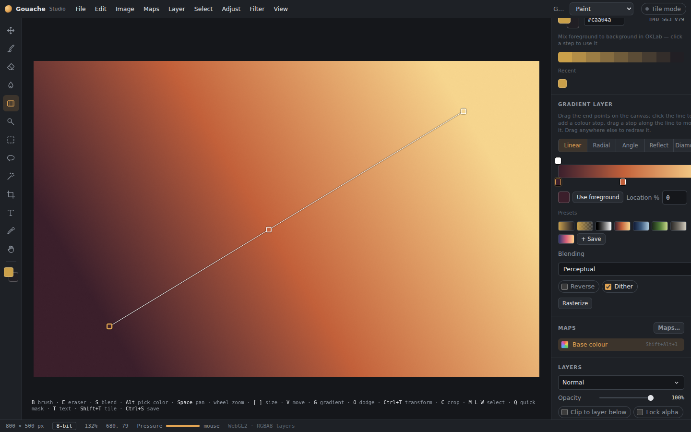

# Fills and gradients

Press **G** for the fill tools; **Shift+G** cycles through them.

## Paint bucket
Fills similar colours with the foreground colour.
- **Settings:** Tolerance, Opacity, Contiguous, Sample all layers, Anti-alias.
- **Selection:** with a selection active, the fill stays inside it.
- **Other maps:** in multi-map documents, it also fills the other maps that are switched on (*Also fill* in the panel).

## Gradient quality

Gradients use a high-precision colour lookup with smooth interpolation, including the Gradient map filter. Keep Dither enabled for 8-bit painting: stable per-pixel rounding breaks up bands even at 8K/16K coordinates and handles transparency and low opacity. The canvas also dithers its final display conversion, helping high-precision and zoomed-out gradients look smooth; this display step does not modify saved or exported pixels. Resolution alone does not increase colour precision. Use 16-bit documents when preserving finer tonal differences in the stored texture matters.

## Gradient tool

*Dragging a gradient.*

Drag to draw a gradient. It becomes a **live gradient layer**: drag its end points later, click the line to add a colour stop, and change the colours any time.
- **Shapes:** linear, radial, angle, reflected, diamond.
- **Blending:**
  - **Perceptual** (OKLab): clean, even steps. This is the default.
  - **Linear light.**
  - **Classic:** like Photoshop.
- **Other options:** opacity stops, **Reverse**, and **Dither**, which stops banding in 8-bit documents.
- **Presets:** foreground to background, foreground to transparent, black to white, and several colour ramps.

Painting on a gradient layer turns it into pixels; **Undo** brings the editable gradient back.

## Gradient bucket
Press inside an area and drag a direction. The gradient fills only that area, found the same way as the paint bucket finds its area.

## Fill and Clear
- **Alt+Backspace** fills with the foreground colour, on the whole layer or inside the selection.
- **Backspace / Del** clears the layer or the selection.
- **Other maps:** in multi-map documents, both follow the brush's *Also paint* switches.
