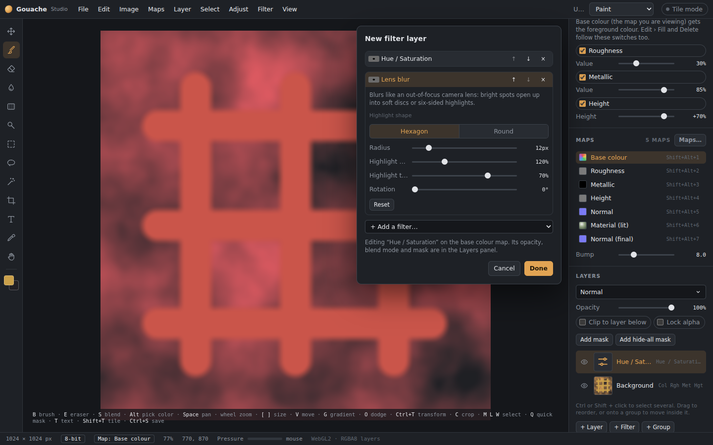
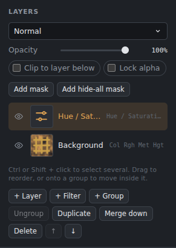

# Filter layers

A filter layer changes **everything below it** in its group, without touching any pixels, and you can change it at any time.

## Making one
- **+ Filter** in the Layers panel, or **Layer › New filter layer…**, adds one above the active layer and opens its editor.
- **Keep editable** in any filter dialog adds a filter layer **clipped** to the layer you were filtering.
- **Keep live** in a converter adds a live converter layer.

## The editor

*The filter layer editor: a stack of filters that stays editable.*

Open it by double-clicking the filter layer's **thumbnail**, or with **Layer › Edit filter layer…**.
- A **stack**: add as many filters as you like with **+ Add a filter…**. They apply from top to bottom.
- Each filter can be **turned off** (eye), moved **up** or **down**, or **removed**. Click a filter's name to open its settings.
- Changes show live. **Done** keeps them as one undo step, and **Cancel** puts everything back.

## Like any layer

*A filter layer in the Layers panel.*

Filter layers have **opacity**, a **blend mode** and a **mask**, can go in groups, and can be hidden. They have no pixels of their own, so the brush won't paint on them.

## Only one layer: clipping
Turn on **Clip to layer below** and the filters change **only that layer**, like Photoshop's smart filters. Painting on that layer shows the filters as you paint.

## Patterns
**Render clouds** and **Render cells** can live in a filter layer as re-editable pattern layers. Their colours are kept with the layer.

## Live converters
Add *Curvature from height*, *AO from height*, *Height from base colour* and others to a filter layer, or tick **Keep live** in the converter. The result **updates by itself** whenever you paint the source map. Example: a curvature layer in base colour that follows your height painting.

## Performance
Slow filters (painterly, oil paint, lens and surface blur, live converters) don't redraw on every frame while you paint below them. They catch up when each stroke ends.

## Baking and saving
- **Merge down** bakes a filter layer into the layer below.
- **.gouache** files keep filter layers editable.
- **PSD export** turns each filter layer into the pixels it produces.
