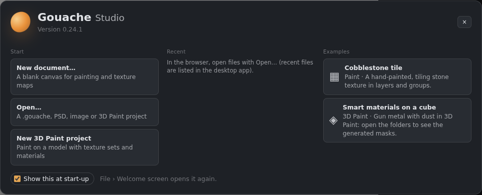

# Getting started

## Installing
1. Open the [latest release](https://github.com/Kenn0090/gouache-studio/releases/latest).
2. Download `Gouache.Studio_x.y.z_x64-setup.exe` and run it. It installs for your Windows user only, so no administrator rights are needed.
3. Start **Gouache Studio** from the Start menu.

Double-clicking a `.gouache` file opens it in the app.

## Updates
A few seconds after it starts, the app checks GitHub for a newer version. If one exists, a banner shows what's new, and **Update now** downloads, installs and restarts. You can also check by hand with **File › Check for updates…**. Updates are signed, and the app refuses any update that isn't.

If an update was published while the app was already open, it won't show until the next check. Use **File › Check for updates…** or restart the app.

## The screen

*The Gouache Studio window: tools on the left, canvas in the middle, panels on the right.*

- **Menu bar** (top): File, Edit, Image, Maps, Layer, Select, Adjust, Filter, View, Window.
- **Workspace** and **tabs** (top right): the Workspace menu (Painting, Texturing, 3D Paint, Minimal or your own), then **Paint**, **Animation** (see [Animation](Animation.md)), **Bake** (see [Baker](Baker.md)), **Convert** (see [Convert tab](Convert-tab.md)) and **Brush** (see [Brush tab](Brush-tab.md)), and **Tile mode**, for seamless textures that wrap at the edges.
- **Options bar** (under the menus): size, opacity, flow, hardness, pressure, symmetry and more for the tool in use.
- **Toolbar** (left): move, selections, brush, eraser, blend, fills and gradients, dodge/burn, crop, text, eyedropper and hand. Small corner marks show buttons that hold more than one tool. It can be two columns wide, or on the right.
- **Canvas** (centre): wheel to zoom, **Space**+drag or the Hand tool to pan.
- **Dock** (right): groups of tabbed panels: **Color**, **Brushes** and **Tool settings**, **Maps**, **Layers** and **Channels**. Drag tabs and the bars between groups to arrange them any way you like (see [Panels and workspaces](Panels-and-workspaces.md)).
- **Status bar** (bottom): size, bit depth, the map you're painting, zoom, cursor position, pen pressure.

## The welcome screen
While the app loads, a splash with its version shows. Then the **welcome screen** opens:
- **Start:** New document…, Open…, or a new 3D Paint project.
- **Recent** (desktop app): the files you opened or saved lately, with their folders.
- **Examples:** the **Cobblestone tile** (a hand-painted tiling texture in layers) and **Smart materials on a cube** (3D Paint).
- If autosave kept unsaved work from last time, it offers it back here: **Recover** or **Discard**.

Untick **Show this at start-up** to go straight to a blank canvas; **File › Welcome screen and examples…** opens it again.

## Your first document

*The New document dialog.*

**File › New document…** (Ctrl+Alt+N):
- **Size:** type it in or pick a preset.
- **Template:**
  - **Hand-painted:** base colour only. Choose this for stylised, unlit art.
  - **PBR:** base colour, roughness, metallic, height and normal.
  - **Custom:** creates the document, then opens Document maps so you choose.
- **Bit depth:** 8-bit, or 16-bit float for smooth gradients and extra precision. Height is always kept at 16-bit when the graphics card supports it.
- **Background:** white, foreground colour or transparent.
- **Seamless tile mode:** strokes wrap across the edges.

You can add or remove maps later with **Maps › Document maps…**.

## Saving
**Ctrl+S** saves a `.gouache` file, which keeps everything: layers, maps, masks, filter layers, text, gradients, animation and the 3D model. The status bar shows where the file is saved (click it to see it in Explorer), and the top of the **File** menu says so too. The File menu also lists your **recent Paint documents** and **recent 3D Paint projects**, each with its folder and when it was saved; **All recent files…** shows the whole list, with **Show in folder**. **Autosave** keeps recovery copies every few minutes (see [Preferences](Preferences-and-performance.md#autosave-and-backups)). See [Files, saving and export](Files-and-export.md) for PSD and other formats.
