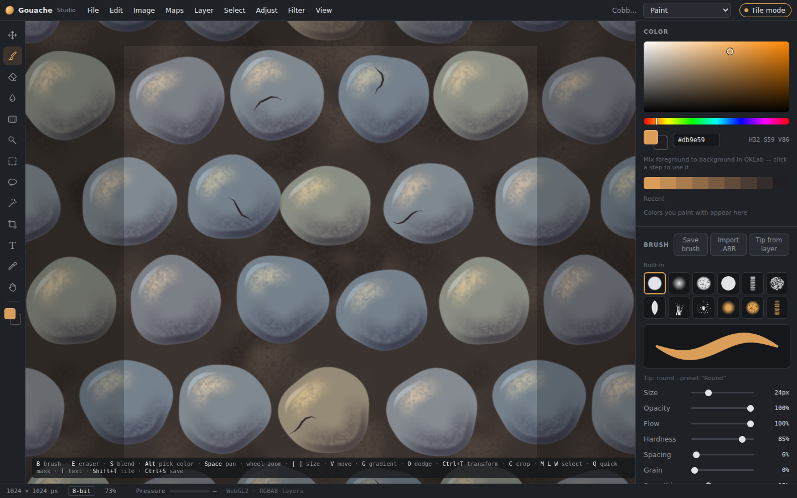
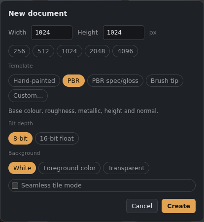

# Getting started

## Installing
1. Open the [latest release](https://github.com/Kenn0090/gouache-studio/releases/latest).
2. Download `Gouache.Studio_x.y.z_x64-setup.exe` and run it. It installs for your Windows user only, so no administrator rights are needed.
3. Start **Gouache Studio** from the Start menu.

Double-clicking a `.gouache` file opens it in the app.

## Updates
A few seconds after it starts, the app checks GitHub for a newer version. If one exists, a banner shows what's new, and **Update now** downloads, installs and restarts. You can also check by hand with **File › Check for updates…**. Updates are signed, and the app refuses any update that isn't.

If an update was published while the app was already open, it won't show until the next check. Use **File › Check for updates…** or restart the app.

## The screen

*The Gouache Studio window: tools on the left, canvas in the middle, panels on the right.*

- **Menu bar** (top): File, Edit, Image, Maps, Layer, Select, Adjust, Filter, View.
- **Tabs** (top right): **Paint**, **Animation** (see [Animation](Animation.md)) **Bake** (see [Baker](Baker.md)) **Convert** (see [Convert tab](Convert-tab.md)) and **Brush** (see [Brush tab](Brush-tab.md)). Next to them is **Tile mode**, for seamless textures that wrap at the edges.
- **Toolbar** (left): move, selections, brush, eraser, blend, fills and gradients, dodge/burn, crop, text, eyedropper and hand. Small corner marks show buttons that hold more than one tool.
- **Canvas** (centre): wheel to zoom, **Space**+drag or the Hand tool to pan.
- **Panels** (right), from top to bottom:
  - **Color**: picker, hex field, mixing strip and recent colours.
  - **Brush**: the settings for whichever tool is active.
  - **Maps**: shown when the document has more than base colour.
  - **Layers**.
  - **Channels**.
- **Status bar** (bottom): size, bit depth, the map you're painting, zoom, cursor position, pen pressure.

## Your first document

*The New document dialog.*

**File › New document…** (Ctrl+Alt+N):
- **Size:** type it in or pick a preset.
- **Template:**
  - **Hand-painted:** base colour only. Choose this for stylised, unlit art.
  - **PBR:** base colour, roughness, metallic, height and normal.
  - **Custom:** creates the document, then opens Document maps so you choose.
- **Bit depth:** 8-bit, or 16-bit float for smooth gradients and extra precision. Height is always kept at 16-bit when the graphics card supports it.
- **Background:** white, foreground colour or transparent.
- **Seamless tile mode:** strokes wrap across the edges.

You can add or remove maps later with **Maps › Document maps…**.

## Saving
**Ctrl+S** saves a `.gouache` file, which keeps everything: layers, maps, masks, filter layers, text, gradients, animation and the 3D model. See [Files, saving and export](Files-and-export.md) for PSD and other formats.
