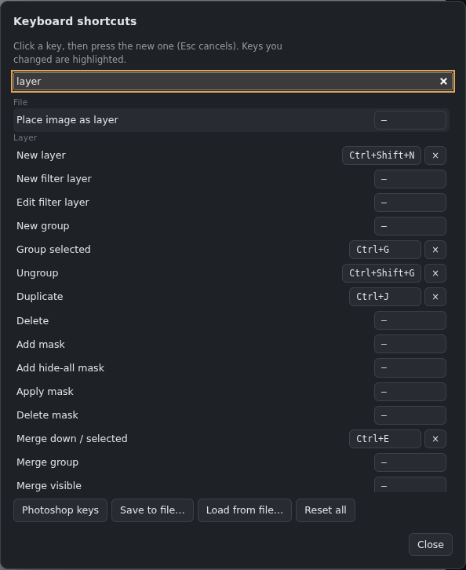

# Keyboard shortcuts

**Help › Search commands** (**Ctrl+Shift+P**) searches tools, filters and menu actions. Choose a result, or use the arrow keys and Enter. Results show your current shortcuts. **Ctrl+Q** clears the active layer's contents without deleting the layer.

**Shift+B** swaps the last two brush presets used, including their individual session sizes.

All of these can be changed in **Edit › Keyboard shortcuts…**. The commands are sorted into **categories** (Painting tools, Selection tools, Other tools, Brush and colour, Files, Edit and history, Layers, Selections, Adjustments, Filters, View and 3D, Panels and workspaces…): pick one on the left, or **search** all of them. Click a command's key, then press the new one (Esc cancels). **×** removes a key and **↺** puts the default back. Keys you changed are highlighted. If the key is already used by another command, you're asked first: **Use it here** moves it (the other command is left without a key). Keys used twice are marked ⚠. **Photoshop keys** sets the keys that differ from Photoshop's (for example Hue/Saturation on Ctrl+U), **Save to file…** and **Load from file…** keep and share your key sets, and **Reset all** goes back to the defaults. The menus and the hint line at the bottom of the canvas always show your keys; **View › Shortcut hints** hides that line.

*Edit › Keyboard shortcuts.*

## Tools
| Key | Tool |
|---|---|
| Shift+B | Swap the last two brush presets, including their session sizes |
| B | Brush |
| E | Eraser |
| S | Blend (smudge) |
| J | Healing brush (Spot or Healing; Alt+click sets the source) |
| Y | Clone stamp (Alt+click sets the source) |
| C (Bake tab) | Step through the baked maps on the model (Shift+C backwards) |
| O | Dodge / Burn (Shift+O switches between them) |
| G | Fill tools: gradient, paint bucket, gradient bucket (Shift+G cycles) |
| V | Move |
| M | Marquee (Shift+M switches rectangle / ellipse) |
| L | Lasso (Shift+L switches freehand / polygon) |
| W | Magic wand |
| C | Crop |
| K | Cage |
| T | Text |
| U | Shape |
| I, or hold Alt | Eyedropper |
| H, or hold Space | Hand (pan) |

## Brush and colour
| Key | Action |
|---|---|
| [ and ] | Smaller / larger brush |
| X | Swap foreground and background colours |
| D | Default colours (black and white) |
| Shift+X | Left–right symmetry on / off |
| Shift (while painting inside a cage) | Follow the cage's lines |
| Alt+Backspace (Alt+Del) | Fill with foreground colour (on the active layer or inside the selection) |
| Backspace / Del | Delete the selected layers; with a selection active, clear the selection's contents. In Animation and the Brush tab it clears the frame or sketch |

## Edit and file
| Key | Action |
|---|---|
| Ctrl+Z / Ctrl+Shift+Z (or Ctrl+Y) | Undo / redo |
| Ctrl+X, Ctrl+C, Ctrl+V | Cut, copy, paste |
| Ctrl+Shift+C | Copy merged (everything visible) |
| Ctrl+T | Free transform (Enter applies, Esc cancels) |
| Ctrl+K | Preferences |
| Ctrl+Alt+N | New document |
| Ctrl+O | Open |
| Ctrl+S / Ctrl+Shift+S | Save / Save as (.gouache) |
| Ctrl+Shift+E | Export an image |
| Ctrl+Shift+R | Reload the app (asks first if something is unsaved) |
| Ctrl+Tab / Ctrl+Shift+Tab | Next / previous document tab |
| Ctrl+W | Close the document (asks to save first) |

## Layers
| Key | Action |
|---|---|
| Ctrl+Shift+N | New layer |
| Ctrl+J | Duplicate the layer (with a selection: layer via copy) |
| Ctrl+Shift+J | Layer via cut (with a selection) |
| Ctrl+G / Ctrl+Shift+G | Group / ungroup |
| Ctrl+E | Merge down (or merge the selected layers) |
| Ctrl+click a thumbnail | Select that layer's pixels |

## Selections
| Key | Action |
|---|---|
| Ctrl+A | Select all |
| Ctrl+D / Ctrl+Shift+D | Deselect / reselect |
| Ctrl+Shift+I | Invert the selection |
| Q | Quick mask |
| Shift / Alt / Shift+Alt as you start selecting | Add / subtract / intersect |
| Arrow keys (selection tools) | Nudge the selection 1 px (Shift: 10 px) |

## Adjustments
| Key | Action |
|---|---|
| Ctrl+U | Color adjustments |
| Ctrl+L | Levels |
| Ctrl+M | Curves |
| Ctrl+I | Invert |
| Ctrl+Shift+U | Desaturate |

## View
| Key | Action |
|---|---|
| Ctrl+0 / Ctrl+1 | Fit on screen / actual pixels |
| Ctrl+R | Rulers |
| Ctrl+; / Alt+Ctrl+; | Show guides / lock guides |
| Hold Ctrl, Alt or Shift | Shortcut helper: shows what that key does |
| Shift+T | Tile mode |
| F3 | 3D view |
| F | Flat cage view (F or Esc to go back) |
| Shift+Alt+1…9 | Switch maps (Maps panel order) |
| Alt+2…6 | Channels: RGB, red, green, blue, alpha |

## Move tool and transforms
| Key | Action |
|---|---|
| Arrow keys | Nudge 1 px (Shift: 10 px) |
| Enter / Esc | Apply / cancel a transform or crop |

## Animation mode
| Key | Action |
|---|---|
| , and . | Previous / next frame |
| Enter | Play / stop |

## Added in 0.28
- **F1**: the user guide (Help menu)
- **C / Shift+C** in 3D Paint: step through the baked mesh maps on the model; **Esc** goes back to the material
- Animation: **Ctrl+F**, **Ctrl+D**, **Delete**, **,** and **.**, **Space**, **Ctrl+Shift+Left/Right** (see [Animation](Animation.md#frame-shortcuts))
- **Alt+click** a tick box in a list: only that one; Alt+click it again: everything else

- **F:** toggle canvas-only view; **Escape** or **Tab** restores panels. **Shift+F** toggles Flat cage view, or frames the model in 3D Paint.
- **Alt:** show the eyedropper cursor temporarily; release it to return to the brush.
- **[ / ]:** shrink/grow the active brush, including Liquify.
