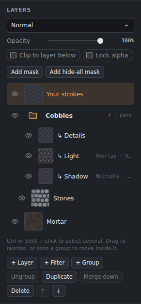
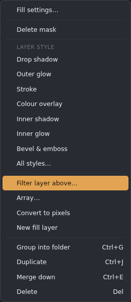
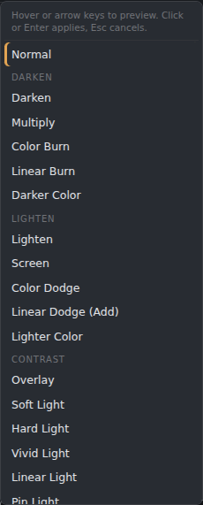

# Layers

## Basics

*The Layers panel, with a fill layer (its mask shows where it is painted) and the icon buttons at the bottom.*

- The icon buttons under the list: **new layer** (Ctrl+Shift+N), **new fill layer**, **new filter layer**, **add mask**, **layer style**, **group**, **ungroup**, **duplicate** (Ctrl+J), **merge**, **move up / down** and **delete**. Hover a button to see its name.
- **Delete** (or Backspace) deletes the selected layers. With a selection active it clears the selection instead, like Photoshop.
- **Right-click a layer** for a menu: add or delete its mask, switch on a layer style (it opens the Layer style dialog on that style), add a filter layer, the Array tool, group, duplicate, merge, convert to pixels and delete.

  
- **Selecting:** click to select a layer; Ctrl or Shift+click selects several. Drag to reorder, or drop onto a group to move a layer inside it.
- **Rename:** double-click a layer's name.
- **Visibility:** the eye button hides or shows a layer.
- **Layer properties** (above the list):
  - **Blend mode:** hover a mode to preview it before choosing.
  - **Opacity.**
  - **Clip to layer below:** the layer only shows where the layer under it has paint.
  - **Lock alpha:** paint only where the layer already has paint.

## Blend modes

*Choosing a blend mode.*

Normal, Multiply, Screen, Overlay, Darken, Lighten, Color dodge, Color burn, Hard light, Soft light, Difference, Exclusion, Linear dodge (Add), Hue, Saturation, Color, Luminosity, Vivid light, Linear light, Pin light and more. Groups can also be **Pass through**.

In documents with several maps, each layer has **a blend mode per map**. The mode button shows the one for the map you're viewing. Height layers default to Linear Light, so mid-grey leaves the height unchanged.

## Masks
**Add mask** starts a mask that shows everything; **Add hide-all mask** starts one that hides everything. If a selection is active, the new mask is made from it.

Click the mask thumbnail to paint the mask. **Shift+click** turns the mask off or on, and **Alt+click** views it (with a bar to paint, fill, invert, select with a box, lasso or polygon, or pick ID colours; see [3D Paint](3D-Paint.md#mask-mode)).

**Right-click › Mask from mesh map** makes the mask from a baked map of the texture set: AO, curvature, thickness or height.

A mask can hold **rows** (paint, mesh maps, ID colours, noise, generators, filters), listed under the layer, and a layer can have **content effects**. See [Masks and effects](Masks-and-effects.md). **Layer › Apply mask** bakes the mask into the layer; **Delete mask** removes it.

**Pictures into a mask** (light shows the layer, dark and see-through parts hide it):
- **Paste:** click the mask thumbnail, then **Ctrl+V**. A copied part (or an image copied in another program) lands in the mask with Free transform on: move or scale it, then press **Enter**. This works in the quick mask (Q) too.
- **Drag a layer** onto another layer's mask thumbnail: its picture becomes that mask. Hold **Alt** and drop onto a row to give a layer without a mask a new one.
- **Drop an image file** from your computer on a mask thumbnail (or **Alt**+drop it on a row): it is stretched to fit the mask. **Filter › Tile** can then repeat it.

## Fill (material) layers
A fill layer is like one in Substance Painter: a material that fills each map with one colour or value, or with a picture. Make one with **Layer › New fill layer…**, the fill button under the layers, or the right-click menu. If a selection is active it becomes the fill layer's mask.

*The Properties panel (beside Colour) edits the selected fill layer, or the selected mask or effect row.*

- For each map (base colour, roughness, metallic, height, normal, emissive, opacity and the others in the document), tick it to fill it and choose **Colour/Value** or **Image**. A value is a slider (for example roughness 80%, metallic 100%). An image is stretched over the canvas; **Tile** repeats it and **Turn** rotates it.
- **Height** images make bump detail (the normal follows the height), with **Bump strength**.
- **Projection:** UV, **Triplanar** (from three sides, no seams), **Planar** (from one direction, for decals) or **Spherical**. The 3D ones need a model in the 3D view or 3D Paint, and get a gizmo there to move, turn and scale them; UV gets a frame on the canvas. See [3D Paint](3D-Paint.md#materials).
- Each channel can also take a **Mesh map**: one of the baked maps of the texture set (AO, curvature…; see [3D Paint](3D-Paint.md#mesh-maps-from-the-bake-tab)).
- The panel offers to add any map the document is missing. **Save to Materials** keeps the material in the Materials tab (see [3D Paint](3D-Paint.md#materials)).
- **Painting on a fill layer paints its mask:** black hides the fill, white shows it. So you can paint where the metal or the rust goes.
- The settings are in the **Properties** panel, a tab beside Colour. It shows the selected fill layer and changes it live; each change becomes one undo step once you pause. **Double-click its thumbnail** (or right-click › Fill settings…) brings the panel forward. **Convert to pixels** makes it a normal layer.
- Fill layers are kept in .gouache files with their images, so they stay editable.

## History
The **History** tab (beside Layers) lists every step you can undo, oldest first. Click a step to go back to it; the greyed steps after it are what Redo brings back.

## Groups
Groups can be nested, and each has its own mode, opacity and mask. **Merge group** flattens a group into one layer.

## Merging
- **Merge down** (Ctrl+E) merges the active layer into the one below. With several layers selected, it merges those.
- **Merge visible** and **Flatten image** (which asks before throwing away hidden layers).
- **Merging a filter layer down** bakes its filters into the layer below.

## Text layers
The **Text tool (T)**: click the canvas to type, click existing text to edit it, drag text to move it. Esc or Ctrl+Enter finishes typing.
- **Font:** hover a font to preview it. **+ Add font file…** loads your own fonts (TTF, OTF, WOFF).
- **Style:** size, bold, italic, alignment, line height, letter spacing.
- **Colour:** fill colour, plus an outline with its own colour and width.
- **Rasterize:** text stays editable until you paint, filter or merge it; then it turns into pixels, and **Undo** brings the editable text back. Rasterize does this by hand.
- **PSD:** PSD files store text layers as pixels.

## Live gradient layers
The Gradient tool makes a layer you can re-edit: drag its ends, change its colours. See [Fills and gradients](Fills-and-gradients.md).

## Layer rows in multi-map documents
Each row lists which maps the layer has content in (Col, Rgh, Met, Hgt, Nrm, AO, Emi, Opa). If the layer is empty in the map you're viewing, the row says **empty in …**.

Sent bakes and conversions hold just one map each (a normal, an AO…). Their group rows show which map (for example **Nrm**), their thumbnails show that map, and **clicking one switches the view to its map**, so you see it straight away.

## Shapes, arrays and layer styles
Shape layers, live arrays (copies in a line, grid or circle) and layer styles (shadows, glows, stroke, overlay, bevel) have a page of their own: [Shapes, arrays and layer styles](Shapes-arrays-and-layer-styles.md).
