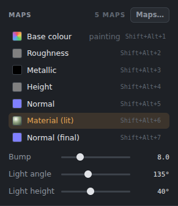
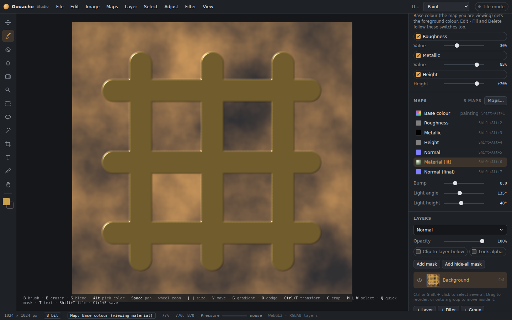
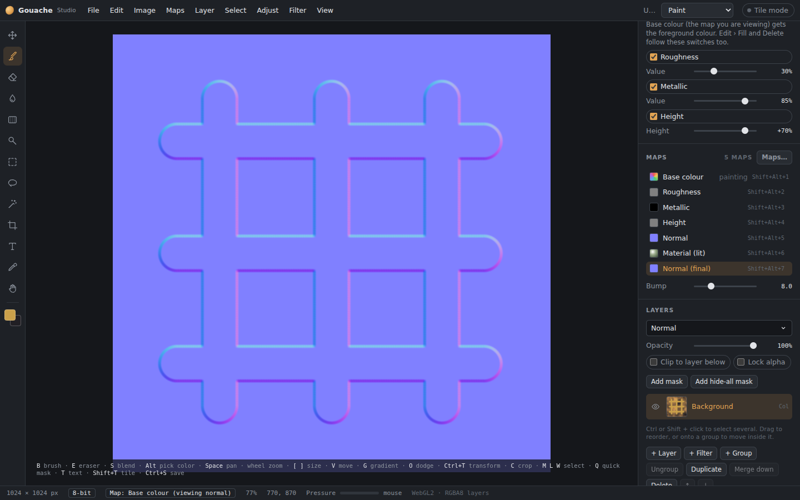
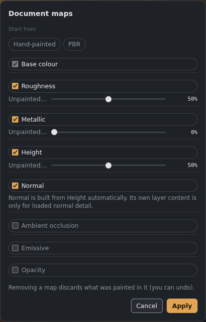

# Maps and PBR

A document can hold several **maps**: images of the same size that together describe a material.

| Map | What it is | Unpainted value |
|---|---|---|
| Base colour | The colour (albedo) | transparent |
| Roughness | 0% glossy … 100% matte | 50% (you can change it) |
| Metallic | 0% not metal … 100% metal | 0% |
| Height | Raised (lighter) or lowered (darker) around mid-grey | 50% (flat) |
| Normal | Surface direction detail (OpenGL: green = up) | flat |
| Ambient occlusion | How much light reaches each spot | 100% (white) |
| Emissive | Glow colour | black |
| Opacity | See-through areas | 100% |

**Templates** in *File › New document* set up the maps for you: **Hand-painted** has base colour only, **PBR** has base, roughness, metallic, height and normal. **Maps › Document maps…** adds or removes maps and sets the "unpainted value" of the grey ones. Removing a map can be undone.

Height is stored at 16 bits even in 8-bit documents, so it stays smooth.

## The Maps panel

*The Maps panel.*

Found above Layers.
- **Switching maps:** click a map, or press Shift+Alt+1…9, to **view and paint it**. The status bar shows which map you're painting.
- **Material (lit):** every map shown together with lighting. Use *Light angle* and *Light height* to turn the light. You keep painting whichever map you picked last.
- **Normal (final):** the finished normal map, meaning the normal made from Height plus any normal detail you painted or loaded.
- **Bump:** how strongly Height turns into normal detail.

## Painting several maps in one stroke

*The Material (lit) view, showing every map together.*

The Brush panel has an **Also paint** section for the other maps: tick a map and give it a value, for example Roughness 20%, Metallic 100%, Height +50%.
- The map you're **viewing** gets the foreground colour.
- The ticked maps get their own values.
- One stroke is **one undo step**.
- The **eraser**, **paint bucket**, **Fill** and **Delete** follow the same switches.
- With **Lock alpha** on, the other maps stay inside the shape of the base colour.
- **Save brush** remembers these switches and values.

## What works on which maps

*The Normal (final) view.*

- **All maps of a layer:** Move, Free transform, Warp, Crop, Image/Canvas size, layer via copy/cut, masks, groups and selections.
- **Only the map you're viewing:** Blend, Dodge/Burn, gradients, filters and adjustments.

## Layers in multi-map documents

*Choosing which maps a document has.*

Layers only store the maps they actually use, so memory isn't wasted. Each layer has its own blend mode per map. Layer rows show which maps have content (Col, Rgh, Met, Hgt, Nrm, AO, Emi, Opa), or "empty in …" for the map you're viewing.

## Exporting
See [Files, saving and export](Files-and-export.md): **Export textures for a game engine** packs and names the maps for Unreal, Unity URP/HDRP, Godot or Blender.
