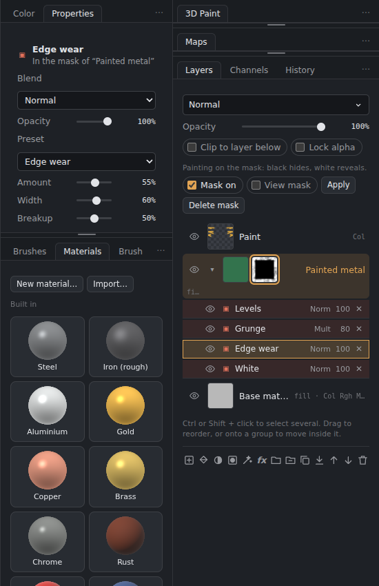
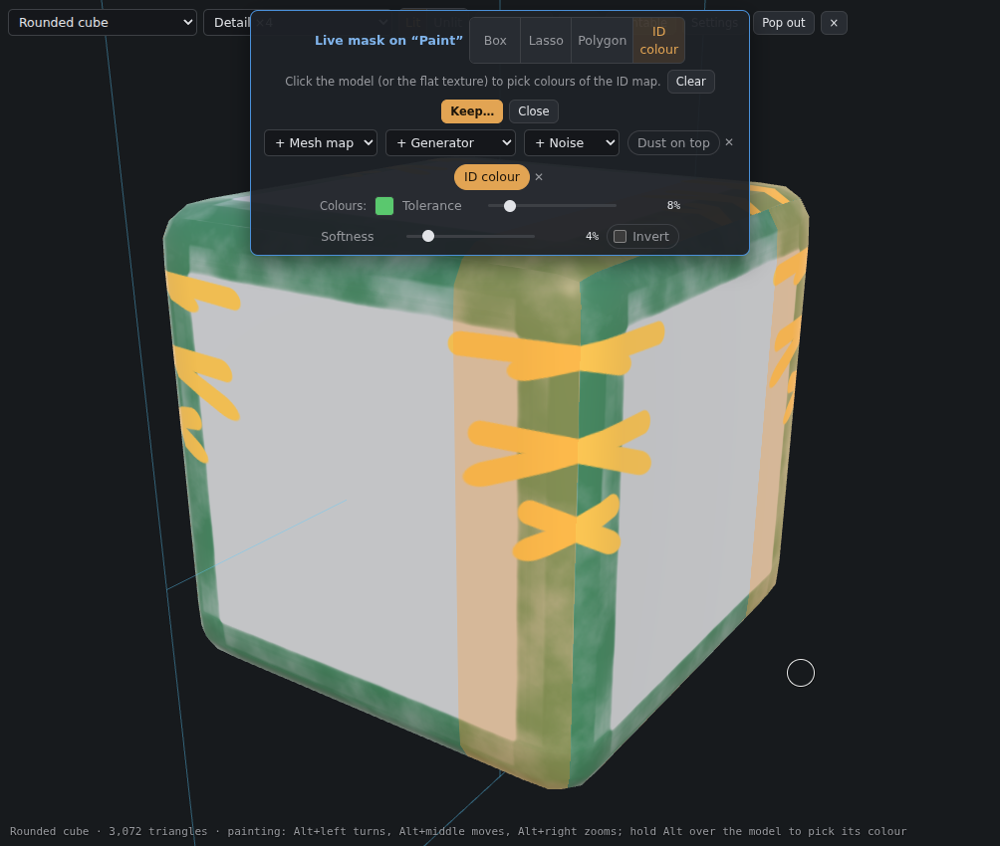
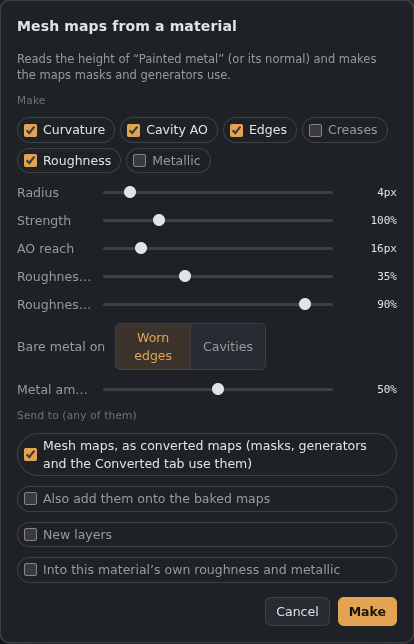

# Masks and effects

A layer's mask can hold **rows of its own**, like Substance Painter's mask effects: paint, fills, baked maps, ID colours, noise, generators and filters, stacked and blended. They sit **under the layer** in the Layers panel. Everything stays live: change a row at any time and the mask follows. The same works in 3D Paint and in the Paint tab.

*“Painted metal” shows through a mask made of a white fill, Edge wear, a grunge noise on Multiply and Levels. Edge wear is selected, so its settings are in Properties.*

## Adding rows
Select the layer, click its **mask thumbnail**, then press **✦** (the effects button under the layers) and pick a row. A layer without a mask gets one.

**Every filter** can go on a mask: the ✦ menu has the usual ones under **Filter**, and **All filters** lists the rest in the Filter Gallery's folders. A filter row changes everything below it in the mask. You can also **right-click a layer › Filter this layer ▸** or **Filter its mask ▸**.

**Generators** have a **Distort** setting: the edges and cavities they find are read a little to the side, following a noise, so wear and dirt break up irregularly instead of following every edge exactly.

Click the layer's own thumbnail instead, and ✦ adds **effects to the layer's content** (blue **fx** rows): filters such as Blur, Levels or Hue/Saturation that change the layer's own maps before it is blended.

## The rows
Rows are listed under the layer, **top first**. Each has an **eye**, its **blend mode** and **opacity**, and **✕** to delete it.
- **Click** a row to change it in **Properties** (the tab beside Colour).
- **Drag** a row up or down to reorder it.
- **▾** on the layer folds its rows away.
- Red **▣** rows are in the mask; blue **fx** rows are on the content.

Blend modes: Normal, Multiply, Add, Subtract, Screen, Min, Max and Overlay. A row covers what is below it where it is white or grey. **Filters change everything below them** in the mask.

## What a mask can hold
| Row | What it does |
|---|---|
| **Paint** | Paint on the model or the canvas: white shows the layer, black hides it. The eraser takes paint away again. A new Paint row changes nothing until you paint on it. |
| **Fill white / black** | The whole mask, flat. |
| **Mesh map** | A baked map of the texture set (AO, curvature, thickness, height…), or a converted one (see below). |
| **ID colour** | Pick colours of the baked ID map (Tolerance, Softness, Invert). |
| **Direction** | Faces pointing up (dust, snow), down, or along an axis, with an angle and softness. |
| **Gradient** | From bottom to top, or side to side, over the model. |
| **Noise** | Clouds, Cells, Grunge, Scratches, Streaks, Dots or Fibres: *World* (in 3D on the model, no seams) or *UV*. |
| **Picture** | Your own image: UV, Triplanar, Planar or Spherical. |
| **Another layer's mask** | Follows that mask, live. |
| **Generator** | The presets: Edge wear, Dirt in cavities, Dust on top, Moss, Rust streaks, Water line, Slime, Crud, Chipped paint, Scratches, Snow on top, Soot, Drips and leaks, Sun-bleached. Each has Amount, Width, Breakup, Contrast, noise size and seed. |
| **Filters** | Levels, Curves, Threshold, Posterize, Invert, Blur, Box blur, Motion blur, Sharpen, High pass, Edges, plus **Grow / shrink**, **Warp** (breaks up clean edges) and **Slope blur** (smears along a noise). |

Pictures, noise and generators can be **moved, turned and scaled**: select the row and use the gizmo on the model (World, Triplanar, Planar, Spherical) or the frame on the canvas (UV), or the fields in Properties.

Generators read the texture set's baked curvature and AO. Without a bake they use curvature worked out from the model, which is rougher, so bake for the best results. On the flat Paint canvas, "up" is the top of the texture.

**Flatten mask** (right-click the layer) keeps the result as a plain mask and drops the rows.

## Mask mode
**Alt + click** the mask thumbnail to see the mask on the model in black and white. The bar has **Paint** (nothing paints until it is on), **Box**, **Lasso**, **Polygon** and **ID colour**; see [3D Paint](3D-Paint.md#mask-mode). Painting goes into the selected Paint row, or the top one, or a new one.

## Live mask (a layer without a mask)
**Right-click a layer › Live mask…** (or ✦ › Live mask) gives a layer without a mask the same tools, as a **live selection**: pick ID colours, add a mesh map, a generator or a noise, or draw a shape with Box, Lasso or Polygon on the model. Painting and fills stay inside it.

**Keep…** asks what to do with it:
- **As a mask stack:** the layer gets a mask made of those rows, still live.
- **Apply to the layer:** the layer is cut to it (what is outside is erased), and no mask is added.

**Close** stops it without keeping anything.

## Light, gradient and comic generators

Select a mask, then choose **✦ › Generator**. **Light** reveals faces pointing towards a chosen direction: adjust Horizontal angle, Elevation, Wrap and Cavity shading. Cavity shading reads baked AO; this is a directional mask rather than a cast-shadow simulation.

**Linear gradient** follows a model's normalized position in one of six directions. **Radial gradient** fades away from an adjustable centre. Both have Start and End controls, Linear, Smooth or Stepped falloff, Offset, Contrast and Invert. Swapping Start and End reverses the fade; equal endpoints make a sharp cutoff. Without a model, these generators use the flat texture.

**Comic shading** offers shading bands with dots, solid ink shadows or halftone dots. Choose the light direction and adjust Bands, Dot density, Dot size and Dot angle. Dots project along the dominant surface direction. All four generators stay live and work in exported smart masks and materials.

## Mesh maps from a material
**Filter › Mesh maps from material…** (or right-click a material layer) reads the material's **height**, or its normal, and makes **Curvature**, **Cavity AO**, **Edges**, **Creases**, **Roughness** (smooth on the tops, rough in the gaps) and **Metallic** (bare metal on worn edges or in cavities).

Tick where they go (any of them):
- **Mesh maps**, as *converted* maps: mask rows, generators and the **Converted** tab of the Properties panel use them.
- **Added onto the baked maps**, so the baked curvature and AO also show the material's bumps.
- **New layers.**
- **Into the material's own roughness and metallic**, linked to the converted maps.

In Properties, each channel of a material can be a colour or value, an **Image**, a **Mesh map** (baked) or a **Converted** map.
