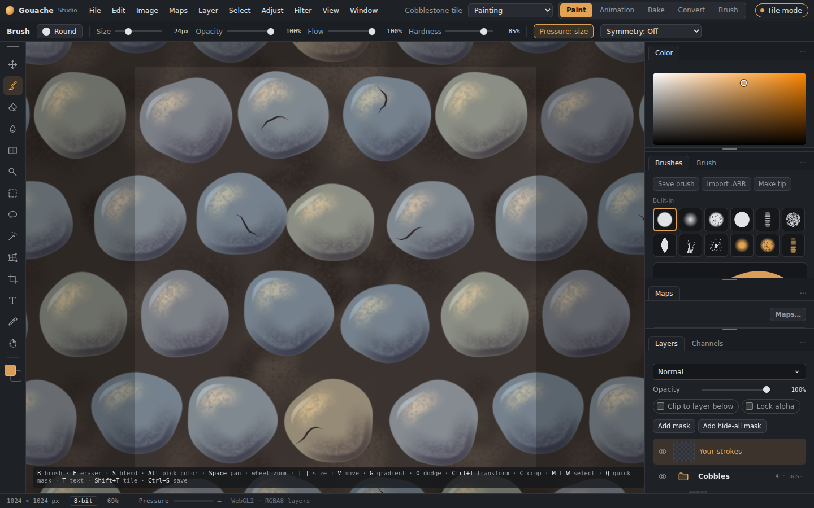
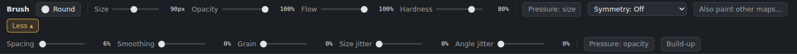
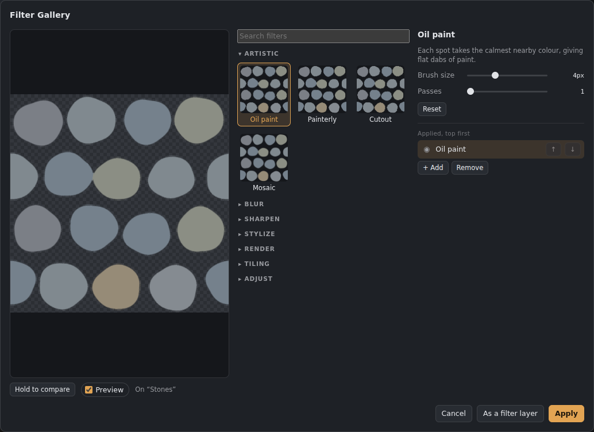

# Panels and workspaces

*The Painting workspace: the options bar on top, the toolbar on the left, the dock of tabbed panels on the right.*

## The options bar
The strip under the menus holds what you change all the time. For the brush, eraser, blend, dodge and burn: the current brush (click it to open **Brushes**), **Size**, **Opacity** (Strength for blend, Exposure for dodge and burn), **Flow**, **Hardness**, **Pressure: size**, **Symmetry** and which other maps the brush paints. **More ▾** at the end opens a second row with spacing, smoothing, grain, size and angle jitter, pressure for opacity, build-up and minimum size; **Less ▴** closes it again (it remembers).

 Other tools show their name; their settings are in **Tool settings**. **Window › Options bar** hides it.

## The dock
The right side is a column of **groups**; each group holds one or more panels as **tabs**: Color, Brushes, Tool settings, Maps, Layers and Channels (plus Bake, Convert, Animation and Brush maker in their tabs of the app).
- **Click a tab** to bring it to the front. **Double-click** it to fold the group down to its tabs (again to unfold).
- **Drag the bars** between groups to make them taller or shorter.
- **Drag the dock's left edge** to make the whole dock wider or narrower. Double-click the edge to go back to the usual width.
- **Drag a tab**:
  - onto another group's tabs: it joins that group;
  - onto the top or bottom edge of a group: it becomes a group of its own there;
  - onto the icon column: it becomes an icon;
  - anywhere else (over the canvas): it **floats** as its own window. Drag a floating panel by its tabs, resize it from the corner, **⤓** puts it back in the dock, **✕** closes it.
  - **⧉** on a floating panel moves it into a **window of its own**, which you can drag to a second monitor. Clicks and shortcut keys there work as in the main window. The window's place and size are remembered, and it opens again next time (in the desktop app). Close it to bring the panel back as a floating panel, or press **⤓** there to put it back in the dock.
- **⋯** on a group: float the panel, keep it as an icon, close it, or fold the group.
- Picking a tool that isn't a brush (selections, gradient, crop…) brings **Tool settings** to the front.

## Icons
Panels kept as **icons** sit in a thin column next to the dock. Click an icon to open its panel beside the column; click elsewhere to close it.

## Window menu
Shows or hides each panel (a closed panel comes back where it was), the options bar, and the toolbar settings: **two columns** and **on the right**. You can also double-click the grip at the top of the toolbar for two columns, or drag the grip to the other side of the window.

## Workspaces
The **Workspace** menu at the top right (and the Window menu) switches between:
- **Painting**: the default.
- **Texturing**: the 3D view open next to the canvas, maps and layers first.
- **3D Paint**: the 3D view big, with painting on the model on.
- **Minimal**: every panel as an icon, for the most canvas.
- **Your own**: *Save workspace…* keeps the current arrangement under a name.

Changes you make are remembered for each workspace; **Reset this workspace** puts the built-in one back, **Delete this workspace** removes one of your own. **Window › Lock panels** stops tabs and bars from being dragged by accident.

## Filter Gallery (Filter › Filter Gallery…, Ctrl+Shift+F)

*The Filter Gallery.*

Every filter in one window:
- **Preview** of the active layer (hold **Hold to compare** to see it without the filters; the canvas previews too).
- **Filters** as thumbnails in folders (Artistic, Blur, Sharpen, Stylize, Render, Tiling, Adjust), with a search box. Clicking a thumbnail changes the selected filter.
- **Settings** of the selected filter.
- **Applied, top first**: the stack of filters. **+ Add** puts another filter on top, **↑ ↓** reorder, **◉** switches one off, **Remove** takes it out.
- **Apply** bakes them into the layer; **As a filter layer** keeps them editable as a filter layer clipped to the layer (see [Filter layers](Filter-layers.md)).
