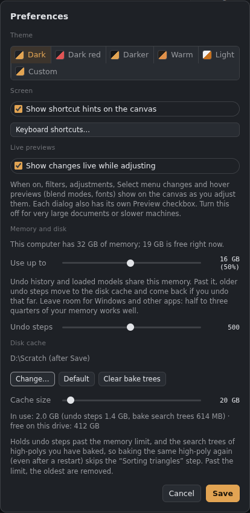
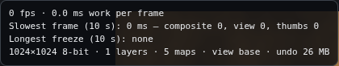

# Preferences and performance

## Preferences (Ctrl+K)

*Preferences, with Memory and disk at the bottom (desktop app).*

- **Theme:** Dark, **Dark red** (the Dark theme with red accents), Darker, Warm and Light, or **Custom**: pick your own Background, Panels, Text, Highlight and Accent colours (**Start from…** copies a preset to begin with). Themes preview as you click; **Cancel** goes back.
- **Show shortcut hints on the canvas:** the line of keys at the bottom of the canvas. **View › Shortcut hints** turns it on and off too.
- **Shape:** **Rounded** (as before) or **Sharp**: square corners and a flatter, more minimal look. It works with every colour theme.
- **Shortcut helper:** hold **Ctrl**, **Alt** or **Shift** for half a second and a card lists what that key does with each other key (your own keys too). Moving the pointer or pressing another key hides it. **View › Shortcut helper** turns it off.
- **Keyboard shortcuts…** opens the shortcut editor (see [Keyboard shortcuts](Keyboard-shortcuts.md)).
- **Largest brush size:** 5000 px by default; 10000 or 20000 px for very big canvases (big brushes paint slowly on large documents).
- **Live previews:** filters, adjustments, Select menu changes and hover previews (blend modes, fonts) show on the canvas as you adjust them. Turn this off for very large documents or slower machines. Each dialog also has its own **Preview** checkbox.

## Autosave and backups
- **Autosave every:** Off, 1, 2, 5 (the default), 10, 15 or 30 minutes. When the painting (or, in 3D Paint, the project) has changed, a **recovery copy** is saved: in the desktop app in an *Autosave* folder beside the app's settings, in the browser in its own storage. It is removed when you save. If the app closes without saving, or crashes, the welcome screen offers it back.
- **Countdown first:** a small popup counts down (3, 5 or 10 seconds, or no warning) before each autosave, so you know the short pause is coming. **Not now** puts it off for a minute; **Save now** saves straight away. It waits for you to finish a stroke.
- **Autosave also saves over the file itself:** when the file has been saved before, autosave saves it there instead of keeping a recovery copy.
- **Keep a backup of the previous save** (desktop app, on by default): before saving over a file, the previous version is kept beside it as *name.backup.gouache* (or *.backup.gouache3d*).

## Memory and disk
Like Photoshop's memory and scratch disk settings.
- **Use up to:** the memory limit. The app shows how much memory your computer has and how much is free. Undo history and loaded models (the 3D view and the Bake tab) share this memory. Past it, the desktop app moves older undo steps to the **disk cache** and reads them back if you undo that far; the browser version drops the oldest steps. It starts at half your memory. Leave room for Windows and other apps: half to three quarters works well.
- **Undo steps:** how many steps the history keeps (10 to 1000). The default is **50** in the desktop app and **30** in the browser: long histories of big documents used a lot of memory and could slow the app down or crash it.
- **Disk cache** (desktop app): the folder for undo steps past the memory limit and for the **search trees** of high-polys you've baked. Press **Change…** to put it on another drive (a fast SSD with plenty of space is best), or **Default** to go back. The app only writes inside a *Gouache Studio cache* folder there. Moving it takes the undo steps already on disk along.
- **Cache size:** the most the disk cache may hold. Past it, the oldest undo steps and the least recently used search trees are removed. The line below shows what's in it and how much space the drive has left. **Clear bake trees** deletes the saved search trees; they're rebuilt when needed.

Everything takes effect when you press **Save**. The performance monitor's last line shows the memory in use.

## Tile mode (Shift+T)
For seamless textures: strokes, blurs and patterns wrap across the edges, and the canvas shows neighbouring copies so seams are easy to spot. See also *Filter › Offset* and *Make seamless*.

## Bit depth
**Image › 8 bits / 16 bits per channel**, or click **8-bit / 16-bit** in the status bar. 16-bit (half float) avoids banding in smooth gradients and heavy adjustments, but needs twice the graphics memory (a 16k × 16k layer is 2 GB). If there isn't enough, the switch stops and tells you, and the picture stays as it was. The Height map is always 16-bit when the graphics card supports it.

## Performance monitor

*The performance monitor.*

**View › Performance monitor** shows the frame rate, the slowest recent frame, the longest freeze, and what the app was doing then: compositing, the view or thumbnails. It also shows:

- Undo and model memory, plus tracked texture storage and the scratch storage available for reuse. Texture figures are estimates; they exclude driver overhead, mesh buffers and the 3D view's own buffers. The Preferences memory limit applies to undo and models, not to graphics memory.
- Graphics-card frame time when supported. **Unavailable** means this browser or graphics driver does not expose that measurement. CPU work per frame and GPU time measure different parts of rendering.
- Partial redraws, full redraws and reused layer/group composites, counted since startup.
- The last document's save preparation time, including waiting for image readbacks and packing images. File writing and preparation of a whole multi-set 3D project are separate from these figures.

Frame rate can be low when the app is idle because it draws on demand. Compare measurements while repeating the same painting or camera movement.

Large save images are packed in a background worker, and their GPU readbacks are collected asynchronously. While the document is captured, editing is briefly held so the saved settings and pixels belong to the same state. If workers are unavailable, the app uses its local packing path. Existing Gouache files stay compatible.

Released scratch textures are trimmed when work has been idle for about ten seconds. The cache keeps at most two spare images per pool within a shared 256 MiB budget. Layer images, undo history and working results are not trimmed, including documents kept in other tabs.

## Tips for big documents
Painting on big canvases (8k, 16k) only redraws the parts your brush touches, and symmetry paints each side's area separately, so custom and textured brushes stay quick.

Unchanged layers underneath the brush can also be reused inside nested groups. Effects below that cached part no longer force a full redraw of each plain stroke. Filters above the brush, live converters, document-driven masks and anchor/reference dependencies keep a conservative redraw path; wrapping still redraws the full texture region to preserve seams.

- **Hide the 3D view** or the Material view when you don't need them. They add work to every change.
- **Use cheaper filters while painting:** slow filters (painterly, lens and surface blur, live converters) catch up after each stroke. If painting under them still drags, hide their filter layers.
- **Stay at 8-bit** unless you need 16-bit.

## Models
**When a model file is saved again elsewhere, update it and bake again without asking** (desktop app): see [Files, saving and export](Files-and-export.md#when-a-model-file-changes-desktop-app). A changed high-poly always asks first.

## Engine quality
Preferences › **Engine quality**: Low, Medium, High (the normal setting) or Ultra. Lower settings help slower computers: the canvas and 3D view draw fewer pixels, the model's edges and textures are less smooth, Detail makes fewer triangles, the 3D view catches up less often while you paint, and the ray-traced view stops sooner. Ultra is for fast graphics cards and sharp screens.

## Smaller files
Every picture in documents, 3D Paint projects, autosaves and materials is packed without losing anything, so files are much smaller than before. **Smaller files** (Preferences › Files, on by default) also keeps colour and grey maps as high-quality WebP when that is smaller; the difference is too small to see. Normal maps, Height, masks and baked maps always stay exact. Turn it off if you need every colour pixel exact.
