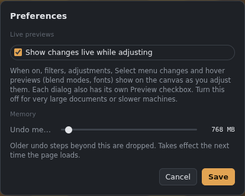

# Preferences and performance

## Preferences (Ctrl+K)

*Preferences.*

- **Live previews:** filters, adjustments, Select menu changes and hover previews (blend modes, fonts) show on the canvas as you adjust them. Turn this off for very large documents or slower machines. Each dialog also has its own **Preview** checkbox.
- **Undo memory:** how much memory undo steps may use. In the desktop app, older steps beyond this move to a temporary file on disk, so undo history can be long. The change takes effect the next time the app starts.

## Tile mode (Shift+T)
For seamless textures: strokes, blurs and patterns wrap across the edges, and the canvas shows neighbouring copies so seams are easy to spot. See also *Filter › Offset* and *Make seamless*.

## Bit depth
**Image › 8 bits / 16 bits per channel.** 16-bit (half float) avoids banding in smooth gradients and heavy adjustments. The Height map is always 16-bit when the graphics card supports it.

## Performance monitor

*The performance monitor.*

**View › Performance monitor** shows the frame rate, the slowest recent frame, the longest freeze, and what the app was doing then: compositing, the view or thumbnails. If you notice a hitch, turn it on and note what it says.

## Tips for big documents
- **Hide the 3D view** or the Material view when you don't need them. They add work to every change.
- **Use cheaper filters while painting:** slow filters (painterly, lens and surface blur, live converters) catch up after each stroke. If painting under them still drags, hide their filter layers.
- **Stay at 8-bit** unless you need 16-bit.
