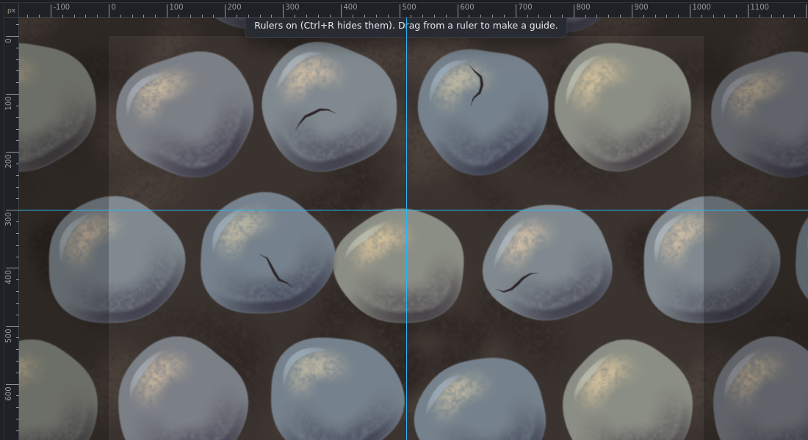

# Rulers and guides

*Rulers (Ctrl+R) with a vertical guide.*

## Rulers
- **Ctrl+R** (or **View › Rulers**) shows rulers along the top and left of the canvas. A small mark follows the pointer.
- **Units:** right-click a ruler, or click the corner where they meet: **pixels, inches, centimetres, millimetres or points**. **Resolution…** in the same menu sets the document's DPI (how many pixels make an inch). It only changes how inches and centimetres are measured; the pixels stay the same. New documents made from a paper preset start at 300 DPI.

## Guides
- **Make a guide:** drag out of a ruler. From the top ruler you get a **horizontal** guide, from the left ruler a **vertical** one. Hold **Shift** to snap it to the ruler's marks; a label shows where it is.
- **Exact position:** **View › New guide…** asks for vertical or horizontal and the position, in the ruler's units.
- **Move a guide:** with the **Move tool** (V), or hold **Ctrl** with any tool, and drag it.
- **Delete a guide:** drag it back onto a ruler. **View › Clear guides** removes them all.
- **Ctrl+;** shows or hides the guides; **Alt+Ctrl+;** locks them (locked guides are dashed and can't be moved).
- Guides are part of the document: they're saved in `.gouache` files, and adding, moving or deleting one can be undone.

## Snapping
With **View › Snap to guides** on (the default), selections, crop, shapes, gradients and arrays snap to the guides and to the canvas edges when you come within a few pixels. Painting never snaps. Hold **Alt** to place something without snapping.
