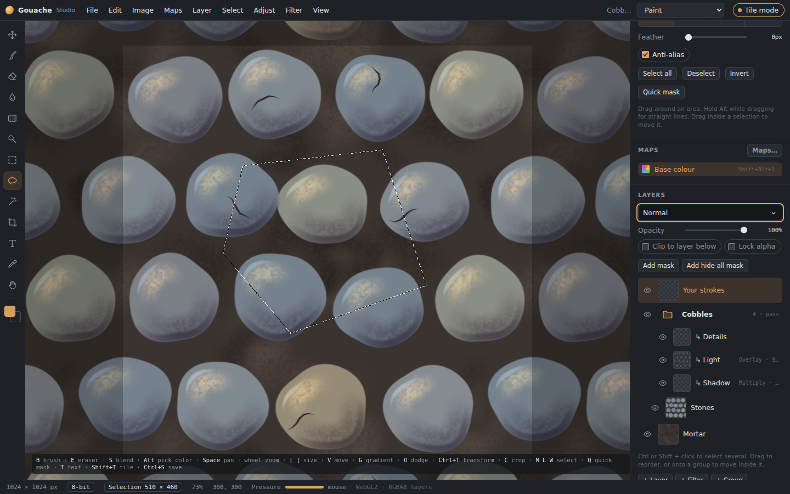
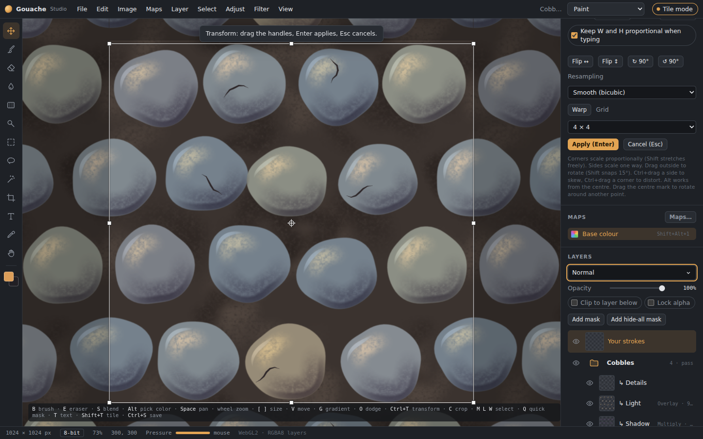

# Selections, transforms and crop

## Selection tools

*A selection with marching ants.*

- **Marquee (M):** rectangle or ellipse (Shift+M switches). Pressing **Shift** after you start dragging keeps it square or circular.
- **Lasso (L):** freehand, or polygonal (Shift+L switches). In polygonal mode:
  - click to place points;
  - to close, click the first point, double-click, or press Enter;
  - **Backspace** removes the last point, **Esc** cancels, and **Shift** keeps lines at 45°.
- **Magic wand (W):** picks similar colours. The panel has Tolerance, Contiguous, Sample all layers and Anti-alias.
- **Feather:** every selection tool has a Feather setting in its panel.

Modes are **new, add, subtract and intersect**. Use the buttons in the panel, or hold Shift (add), Alt (subtract) or both (intersect) as you start selecting. The selection shows as marching ants. Arrow keys nudge it.

## Select menu
- **All**, **Deselect**, **Reselect**, **Invert**.
- **Feather, Expand, Contract, Smooth:** these preview live while you adjust them.
- **Select layer pixels** (or Ctrl+click a layer thumbnail).
- **Load selection…:** from a layer's transparency, a mask, a colour channel or brightness.
- **Quick mask (Q):** paint the selection with brushes, then press Q again.

Painting, fills, filters and adjustments all stay inside the selection.

## Copy and paste
- **Ctrl+C** copies the selected part of the active layer. **Ctrl+Shift+C** copies everything visible.
- **Ctrl+V** pastes as a new layer.
- **Ctrl+J** (layer via copy) and **Ctrl+Shift+J** (layer via cut) make a new layer from the selection. They work on every map.

## Move tool (V)
Drag to move the layer, or the selected part of it. Arrow keys nudge it. All maps of the layer move together.

## Free transform (Ctrl+T)

*Free transform, with its handles and options.*

- **Handles:** drag them to scale; drag outside the box to rotate; **Ctrl+drag** a corner to distort it freely.
- **Panel:** exact X, Y, width %, height %, angle and skew; **Flip ↔ / ↕**; resampling (smooth, bilinear, or nearest for pixel art).
- **Warp:** bend the layer with a grid of handles.
- **Finishing:** **Enter** applies and **Esc** cancels.
- Every map of the layer, and its mask, transform together.

## Crop (C)
Drag the box or type a size, rotate it if needed, then press **Enter**. **Image › Crop to selection** crops to the selection. Crop affects every layer, map, mask and animation frame, and it can be undone.

## Canvas and image size
- **Image › Canvas size:** adds or trims canvas around the image, with an anchor.
- **Image › Image size:** resamples the whole document on the graphics card.
