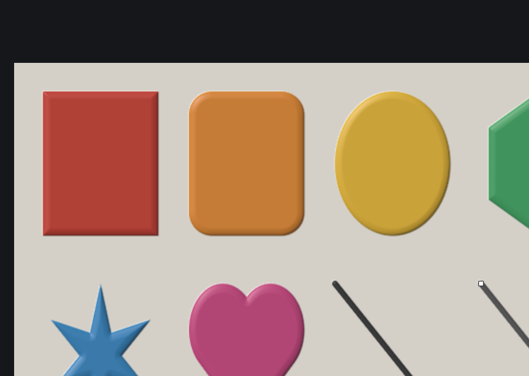
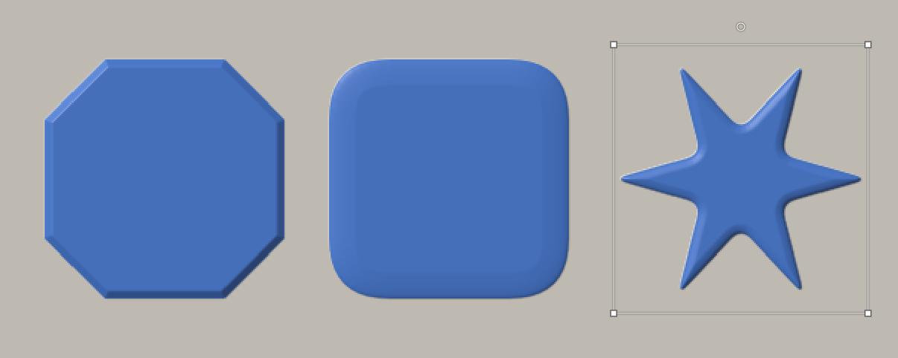
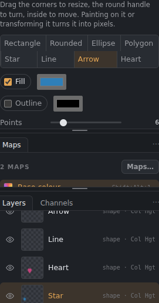
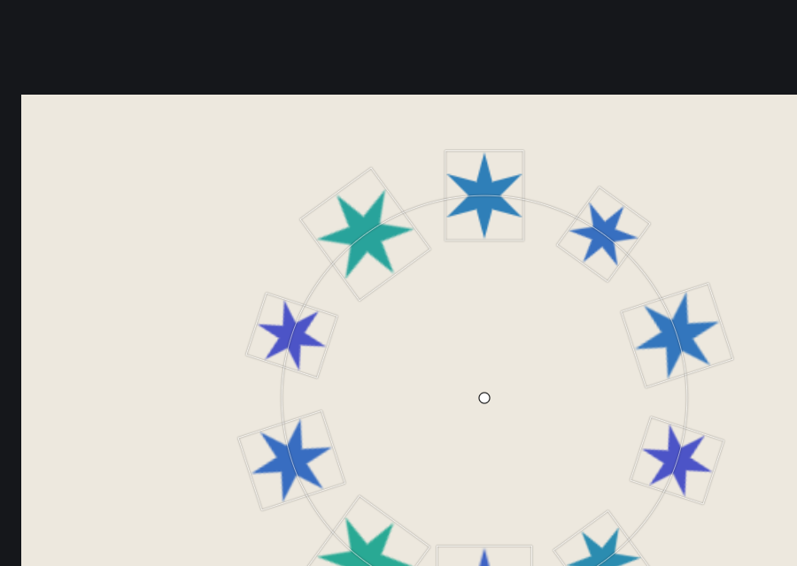
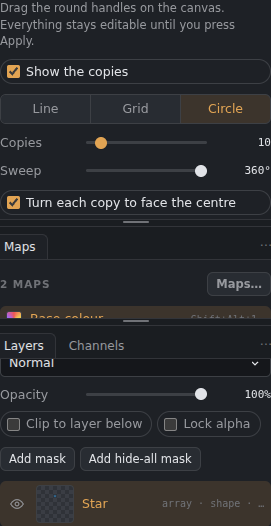
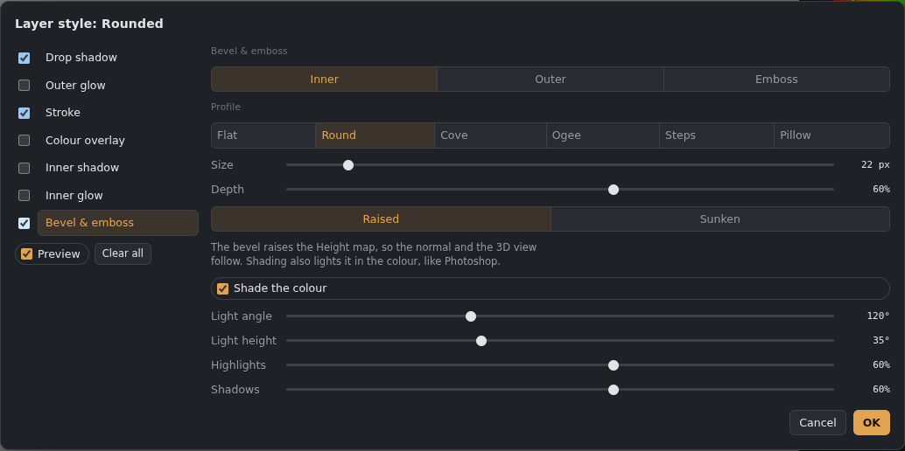
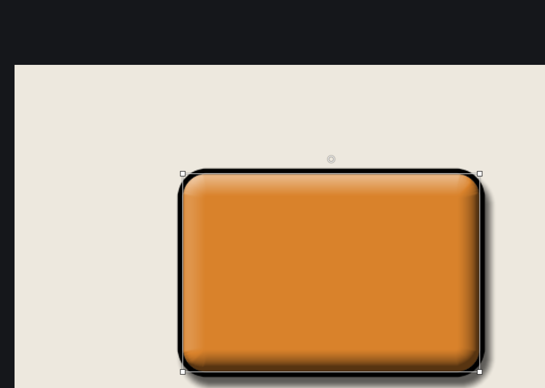

# Shapes, arrays and layer styles

Three tools for building up game-art elements (panels, trims, badges, bolts, runes) that stay editable, and that feed the Height map as well as the colours.

## Shapes (U)

*The eight shapes, bevelled, in the Material view.*

Pick the **Shape** tool (U), choose a shape in the Tool settings panel, and drag on the canvas. Each shape goes on a **layer of its own** and fills with the foreground colour.
- **Shapes:** Rectangle, Rounded, Ellipse, Polygon, Star, Line, Arrow and Heart.
- **While dragging:** Shift makes a square or circle (or keeps a line straight at 45° steps); Alt draws from the centre.
- **Editing:** with the shape's layer selected and the Shape tool on, drag a **corner** to resize, the **round handle** above it to turn it (Shift snaps to 15°), or **inside** it to move it. Lines and arrows have a handle at each end.
- **Fill** and **Outline**, each with its own colour; outline thickness. Rounded has **Corners**, Polygon **Sides**, Star **Points** and **Inner radius**, Arrow **Head size**.
- **Bevel** raises the shape in the **Height map** (so the normal and the 3D view follow). Choose a **profile**: Flat, Round, Cove, Ogee, Steps or Pillow; its **Size** (how far in from the edge it rises), **Depth**, and **Raised** or **Sunken**. The Height map is added to the document if it doesn't have one.
  - **Segments** makes the bevel faceted, in flat steps, like a bevel with few segments in 3D software; *smooth* is a continuous curve.
  - **Round the whole shape** makes the height rise all the way to the middle (a dome or pillow), not just along the edges.
- **Corner bevel** (Rectangle, Polygon and Star): cuts the corners like a bevel in 3D software. **Amount** is how far along each edge the cut starts; **Segments** is how many steps it has: **1** is a flat cut, more make the corner rounder. It works together with the height bevel.

  
  *Left: 1-segment corner cut with a 3-segment height bevel. Middle: 10-segment rounded corners, whole shape rounded. Right: a star with softened points.*
- A shape stays editable until you paint on it, transform it, or press **Convert to pixels**. Undo brings the editable shape back.

## Array: repeat a layer

*A circle array: the handle in the middle is the centre. Each copy's outline shows where it goes.*

Select a layer, pick the **Array** tool (in the toolbar, or **Layer › Array…**), and press **Add line array**, **Add grid array** or **Add circle array**. The copies are **live**: paint on the layer and every copy follows, and you can change the array any time.
- **Line:** how many **Copies**, and the **Step** between them. Drag the round handle on the canvas to set the step (Shift keeps it straight).
- **Grid:** **Columns**, **Rows**, and the **Gap** across and down (two handles).
- **Circle:** **Copies**, how far round they go (**Sweep**), and whether each copy **turns to face the centre**. Drag the centre handle to move the circle.
- **Vary each copy at random:** **Rotation**, **Size**, **Hue** and **Brightness**, each by up to the amount you set. **Shuffle** picks a different random variation.
- **Apply** turns the copies into pixels. **Remove array** takes them away. Undo works for both.

The array copies every map of the layer (colour, height, roughness and so on) the same way. Layer styles go on top of the whole array.

## Layer styles

On a layer with a **mask** (including material layers), the styles follow the masked shape, and effects such as a drop shadow or outer glow can reach outside the mask, as in Photoshop.

**Layer › Layer style…** (or click the **fx** badge on a layer that has styles). Tick a style on the left to turn it on, click its name to change its settings. The canvas shows the changes as you adjust them (**Preview**); **OK** keeps them as one undo step, **Cancel** puts things back.

- **Drop shadow:** colour, opacity, angle, distance, size, spread.
- **Outer glow:** colour, opacity, size, spread.
- **Stroke:** colour, opacity, size, and **Outside**, **Inside** or **Centre** of the edge. **Height** raises (or sinks) the stroke in the Height map, for a rim or a groove.
- **Colour overlay:** colour and opacity.
- **Inner shadow:** colour, opacity, angle, distance, size.
- **Inner glow:** colour, opacity, size.
- **Bevel & emboss:** **Inner**, **Outer** or **Emboss**; the same **profiles** as shapes; size, depth, raised or sunken. It raises the **Height map** (so the normal follows), and **Shade the colour** also lights it in the base colour like Photoshop (light angle, light height, highlights, shadows).
- **Stroke** and **Colour overlay** can also set **Roughness** and **Metallic** where they paint (*Also set roughness and metallic here*): a gold trim, a painted metal plate.

Maps a style needs (Height, Roughness, Metallic) are added to the document when you press OK. Styles are measured on the shape of the layer's base colour, so they follow whatever you paint on the layer. They stay live and are saved in .gouache files; PSD files get the layer's own pixels without the styles.
