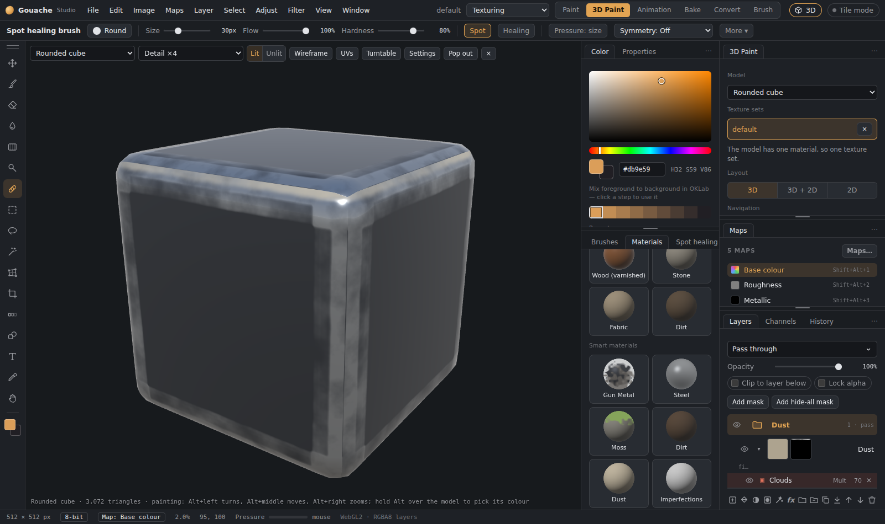

# Smart materials, smart masks and anchor points

## Smart materials
A **smart material** is a whole folder of layers saved as one: material layers, their masks with all their rows (generators, noise, mesh maps, filters…), content effects and anchors. Drop one on a model and it fits itself to that model, because its masks read the texture set's own mesh maps (curvature, AO…), like Substance Painter's.

**Using one:** open the **Materials** tab and click a tile under **Smart materials**. It arrives as a folder above the selected layer. Open the folder to change any layer or mask row; everything stays live.

**Built in:** Gun metal, Moss, Dirt, Dust, Imperfections, Skin, Steel, Wood and Leather.

**Your own:** right-click a folder (or a single layer) › **Save as smart material…** and give it a name. Pictures used by its layers and masks are saved with it.

## Smart masks
A **smart mask** is just a mask stack, saved: the rows of a layer's mask. Click a tile under **Smart masks** to give the selected layer that mask (it replaces the mask it had).

**Built in:** Worn edges, Dirty cavities, Dusty top, Scratched and Chipped paint.

**Your own:** right-click a layer with a mask › **Save mask as smart mask…**

Both kinds show **⤓** (export as a **.gmat** file to share) and **×** (delete) on your own tiles; **Import…** in the Materials tab brings them in.

## Anchor points
An **anchor point** lets masks higher up follow what you painted lower down, like Substance Painter's anchors. Paint some raised rivets or panel lines into a layer's height, and the rust, dirt or edge wear above them follows those details, even though they are not in the baked mesh maps.

1. Select the layer whose painting should be followed, click its own thumbnail, then **✦ › ⚓ Anchor point**. A blue anchor row appears under the layer; its name is the anchor's name (rename it in Properties).
2. On a layer above, click its mask thumbnail, then **✦ › From anchor** and pick the anchor. Choose what to read:
   - **Height:** raised parts white.
   - **Shape:** where the anchored layer has paint.
   - **Colour:** its brightness.
   
   **Invert** swaps black and white.
3. Generators (Edge wear, Dirt in cavities…) can also **follow an anchor**: in the generator's settings, pick the anchor under *Also follow anchor*. The generator then finds edges and cavities in the painted height as well as in the baked maps.

Everything stays live: paint more on the anchored layer and the masks above follow.
