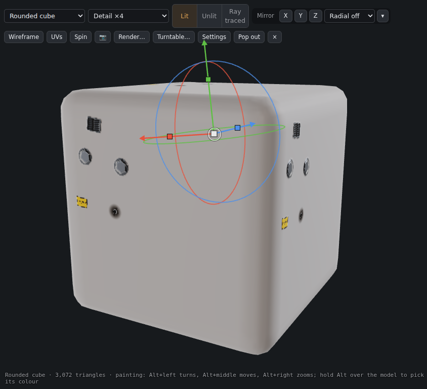
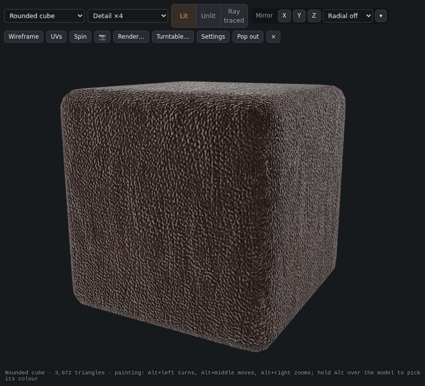

# Textures, decals and the material library

## Projects and Mesh maps

In 3D Paint, the Material Library shelf includes **Projects**, for live layer materials, source textures and assets created in the current document, and **Mesh maps**, for the maps attached to the active texture set. Projects is available only in 3D Paint. It supports search, texture/material filters and thumbnail sizing. Click or drag an asset onto the layers to reuse it. Created project assets are included in `.gouache` and `.gouache3d` saves; they are kept compressed until used.

Assign mesh maps through the **Maps** panel's labeled drop slots. Imported maps retain their source size and are available to masks, generators and material channels. See [3D Paint](3D-Paint.md) for setup and assignment.

Placing or dropping a **PSD** on the painting canvas now imports a folder of layers rather than its flattened preview. Names, folders, visibility, opacity, supported blend modes and pixel masks carry over, and the import undoes in one step. **File › Open** also keeps layers. Texture-library, mask and conversion imports still use the PSD's composite because those operations need a single texture. Adjustment layers, vector masks and Photoshop layer effects are reported as unsupported; text and smart objects use raster images.

## Textures panel
The **Textures** panel (next to Materials) holds grunge maps and textures you can use anywhere.

- **Photo grunge:** 75 real scans: streaks, water rings, specks, stains, drips, splotches, spatter, scratches, micro scratches, chips, dirt, dust, grime, speckle, fingerprints, a hand print, smudges, oily marks, smears, wipes and swipes, eight kinds of leak streaks, and (new) brushed and tangled scratches, ink smears and greasy swirls, bubble stains, eight kinds of running drips (**Runs**), cracks (**Cracks**, crazed, dry, cracked and broken plates), rust pits, worn paint and frost veins. They are grey pictures where white shows the marks.
- **Generated:** 12 seamless patterns made by the app: Clouds, Cells, Cracks, Grain, Ridges, Streaks, Fine scratches, Blotches, Dots, Weave, Bricks and Pits.
- **Yours:** **Import…** pictures (PNG, JPG, WebP, TGA…) or a **.gtex** pack. They are kept on this computer. **Export pack…** saves all of yours in one .gtex file to share.

Click a texture to see what it can do:
- **Add to the mask:** a Picture row in the selected layer's mask. Its size, turn and invert are in Properties.
- **Material channel:** with a material layer selected, use it as the base colour, roughness, metallic, height, AO, emissive or opacity.
- **New layer:** a layer filled with the texture. Try Multiply or Overlay.
- **Stencil** (3D Paint): paint through it onto the model.
- **Brush tip:** a custom brush tip made from it.

## Decals (3D Paint)
The **Decals** panel has bolts, rivets, cross and slot screws, a vent grille, a round vent, a warning label, hazard stripes, a serial plate, a crack, a bullet hole and scratches.

1. Click a decal. It lights up.
2. Click the model. The decal lands there, facing the surface. Keep clicking to place more; press **Esc** to stop.

Each decal carries colour, height (so the normal shows its shape), roughness and metal. It is its own layer, a sticker projected onto the model, so you can move, turn and scale it with the gizmo. Right-click › **Convert to pixels** fixes it in place.

- **Size** sets how big new decals are, compared with the model.
- **Tint with the foreground colour** colours new decals.
- **Import your own…** turns a PNG with transparency (a logo, a label) into a decal.

## Materials library
The Materials panel's **Library** has 200 ready-made materials, mostly for characters and weapons (plus 50 calm, evenly toned base materials: plain leathers, cotton, linen and denim, clean and lightly brushed metals, dust, dry earth and sand, made to sit under smart masks and grunge), split into categories you pick with the buttons above it: **Metal** (steels, satin and brushed steels, gunmetal, blued gun metal, titanium, brushed aluminium, chrome, gold, brass, copper, bronze, nickel, cobalt, platinum, damaged and rusty iron, oxidised copper, chainmail, diamond plate, sci-fi panels, corrugated steel, a carbon-look weave, knurled grip…), **Leather** (from red, cream, tan, chestnut and black to snakeskin, tufted, padded, perforated, stitched and diamond-stitched), **Fabric** (denim, linen, wool, tartan, plaid, velvet, knit, felt, stripes, carbon cloth…), **Plastic & rubber** (gun polymer, grip rubber, coloured plastics, gym rubber…), **Wood** (walnut, cherry, birch, planks, bamboo, wicker and more), **Ground & nature** (dirt, dust, ash, dry earth, mud, clay, gravel, pebbles, fine, beach, dune and dark sand, snow, grass, moss, bark, lava…), **Stone & tile** (rock, limestone, cast concrete, plaster, marble, old bricks, terrazzo) and **Paint & ceramic** (painted and chipped-paint metals, porcelain, glazed terracotta).

Click one to add it as a material layer, or drag it between layers. Each loads the first time you use it. (The browser version downloads it from the internet.)

**Your own built-in materials:** any .gmat file (Materials › ⤓ export) placed in the app's `materials` folder shows in the Library too. To ship one with the app, put it in `assets/materials` in the project.

## Credits
The photo grunge and the library materials come from **[ambientCG](https://ambientcg.com)** and are CC0 (free to use for anything, no credit required). We credit them gladly:
- Grunge: Surface Imperfections 003–020 (003, 004, 005, 006, 007, 008, 009, 010, 011, 012, 013, 014, 015, 016, 017, 018, 019, 020); Fingerprints 001–009 (001, 002, 003, 004, 005, 006, 007, 008, 009); Smear 001, 002, 003, 004, 005; Leaking 012A, 013A, 014A, 015A, 016A, 017A, 018A, 019A.
- Materials: Leather037, Leather030, Leather026, Leather034C, Metal055A, Metal046B, Metal048A, Metal032, Metal009, Metal053C, Rust009, Ground112, Ground103, Gravel043, Fabric061, Fabric030, Fabric083, Carpet016, Wood051, Wood092, Concrete034, Rubber004, Plastic013A, Metal049A, Metal034, Metal047B, Metal035, Metal058A, MetalPlates013, Chainmail004, Bark014, Grass005, Ground080, Snow015, Moss002, Ground037, Fabric028, Fabric023, Leather038, Leather039, Plastic010, Rubber001, Leather033A, Leather033C, Leather032, Leather011, Leather012, Leather008, Leather021, Fabric081A, Fabric080, Fabric079, Fabric026, Fabric063, Fabric039, Fabric022, Fabric054, Fabric034, Metal061B, Metal050A, Metal046A, Metal062C, Metal038, Metal052C, Metal027, Metal053B, Metal030, Metal059A, Metal051A, MetalPlates006, DiamondPlate009, Plastic006, Plastic018B, Rubber002, Wood067.
- More materials: Metal041A, Metal045A, Metal061A, Metal062A, Metal054B, Metal056A, Metal055B, Metal058B, Metal043B, Metal050C, Metal051B, Metal049C, Metal013, Metal028, Metal063, Chainmail001, MetalPlates015A, DiamondPlate004, CorrugatedSteel009, Leather006, Leather014, Leather015, Leather016, Leather024, Leather027, Leather036A, Leather035A, Leather034A, Fabric004, Fabric005, Fabric016, Fabric031, Fabric051, Fabric052, Fabric068, Fabric082A, Plastic001, Plastic007, Plastic008, Plastic016A, Plastic017A, Rubber003, Wood008, Wood035, Wood049, Wood073, Wood080, Wood090A, Bamboo001B, Wicker001, Bark008, Moss003, Grass002, Snow005, Gravel016, Ground025, Ground012, Lava001, Rock028, Rock031, Rock017, Concrete027, Concrete036, Marble001, Marble006, Bricks003, Terrazzo001, PaintedMetal001, PaintedMetal002, PaintedMetal004, PaintedMetal009, Porcelain001, Porcelain003, GlazedTerracotta001, PaintedMetal006.
- Calm base materials: Leather001, Leather002, Leather003, Leather004, Leather005, Leather022, Leather025, Leather028, Leather029, Leather031, Leather034D, Leather035D, Fabric036, Fabric037, Fabric040, Fabric042, Fabric003, Fabric066, Fabric032, Fabric060, Fabric069, Fabric077, Fabric075, Fabric019, Metal010, Metal011, Metal053A, Metal052A, Metal033, Metal044B, Metal044A, Metal042A, Metal047A, Metal043A, Metal057A, Metal060A, Ground010, Ground006, Ground099, Ground101, Ground026, Ground066, Ground091, Ground009, Ground057, Ground061, Ground093C, Ground055L, Ground089, Ground088.

## Bumps under a material
A material covers the bumps (height and normal detail) of the layers under it, so a smooth metal on top of leather looks smooth. To let the bumps add up instead, untick **Hide the bumps below** in the Material panel. Decals only cover what is under their outline.

## Turn the canvas into a texture (0.38)

In Paint, use File › **Turn canvas into a texture…**, the **From canvas…** button in Textures, or right-click a layer › **Turn layer into a texture…**. Choose Grunge, Decal, Material, Brush tip or Stencil. Transparency is kept, and with a selection only that area is used. Decal and Material open the Convert tab: make the maps and press **Turn into material**. A decal keeps its cut-out.

## Texture workshop

The Textures shelf has **Scratches**, **Grunge**, **Fabric** and **Patterns** categories, alongside All, Yours, Photo grunge and Generated. Search narrows the current category. **S / M / L** changes thumbnail size independently of Materials. Category and thumbnail size are remembered.

Twenty-four additional grayscale textures include photographed gashes, scraped paint, chipped coatings, ragged scratch brush marks and scanned grunge. Four **Mixed** presets combine scored paint, gashed coating, grime with gashes and extreme chipped damage. Individual source textures remain available. Search for **Mixed** to find the combinations.

Sources are [Public Domain Pictures](https://www.publicdomainpictures.net/en/view-image.php?image=20754), [Poly Haven](https://polyhaven.com/license), [ambientCG](https://docs.ambientcg.com/license/) and ElDuderino's [scratch and damaged paint brushes on OpenGameArt](https://opengameart.org/content/scratch-damaged-paint-brush). All selected assets are CC0. Source authors, original links, processing notes and source/output hashes are recorded per texture in `assets/grunge/workshop-sources.json`. Textures are cropped and contrast-adjusted; the brush layouts and Mixed presets are derived compositions.

These are grayscale masks, rather than complete PBR material sets. Right-click to use one in a mask or material channel. Bright scratches reveal a masked material; use Invert when dark cuts are needed. In a Height channel, adjust the layer's height strength to control the depth.

Generated patterns include twill, herringbone, knit and basket weave, plus checkerboard, chevron, hexagons and scales. These are procedural grayscale patterns that repeat, and can be used in masks, height or other channels.

## Shelf loading (0.46.8)

Browsing uses small previews. The 99 bundled photo textures have separate previews; generated patterns use a small temporary preview. Full textures load when you apply them, with repeated requests sharing the same load.

Your imported textures stay packed on this computer. The shelf loads names and previews first. New imports save a preview immediately; older imports create one the first time they are shown and reuse it afterward. Export pack still reads the full originals.

Unused full textures leave the shelf cache after about ten idle seconds. The cache also trims older entries when it passes 128 MiB or 16 textures. Picture guides used by filters stay available while referenced, including by undo history. Masks, material channels, layers and stencils own their images independently of the shelf cache.

For contributors: `python scripts/texture-previews.py` (Pillow required) regenerates `assets/grunge/previews.json`. The build verifies source hashes, so new or changed images without an up-to-date preview use a small resized decode instead.

## Mesh maps in engine exports

Tick **Mesh maps** in Export textures to include each exported texture set's assigned maps. Names use a separate **Mesh** suffix, such as T_Hero_Mesh_Curvature.png, so a baked normal or height cannot overwrite the finished material channel. At **Document / source size**, mesh maps retain their imported dimensions; choosing an export size resamples them. Height PNG exports preserve 16-bit data. Normal-map green channels follow the selected engine convention.

The model format list includes **FBX**: a static binary mesh with positions, normals, UVs, material slots and external texture-file links. Renamed texture sets supply the exported material names. Rigging, animation and embedded texture images are not exported.
